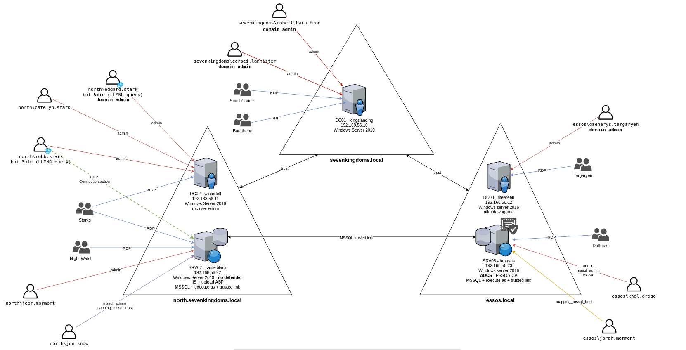

```bash
Created by: Dcyberguy 
Created time: October 31, 2025 8:31 PM
Last edited by: Dcyberguy 
Last updated time: December 11, 2025 10:11 PM
Status: Done
```

## GOAD VM Status

```bash
GOAD/vmware/local/10.10.10.X (280025-goad-vmware) > status
[*] CWD: /workspace/280025-goad-vmware/provider
[*] Running command : vagrant.exe status
Current machine states:

GOAD-DC01                 running (vmware_desktop)
GOAD-DC02                 running (vmware_desktop)
GOAD-DC03                 running (vmware_desktop)
GOAD-SRV02                running (vmware_desktop)
GOAD-SRV03                running (vmware_desktop)

This environment represents multiple VMs. The VMs are all listed
above with their current state. For more information about a specific
VM, run `vagrant status NAME`.
```


## GOAD - Architecture Diagram



Using `nxc` can enumerate briefly what hosts are online, hostname and machine build

```bash
nxc smb 10.10.10.0/24                                                                                                                                                 ─╯
SMB         10.10.10.12     445    MEEREEN          [*] Windows 10 / Server 2016 Build 14393 x64 (name:MEEREEN) (domain:essos.local) (signing:True) (SMBv1:True) 
SMB         10.10.10.10     445    KINGSLANDING     [*] Windows 10 / Server 2019 Build 17763 x64 (name:KINGSLANDING) (domain:sevenkingdoms.local) (signing:True) (SMBv1:False)
SMB         10.10.10.11     445    WINTERFELL       [*] Windows 10 / Server 2019 Build 17763 x64 (name:WINTERFELL) (domain:north.sevenkingdoms.local) (signing:True) (SMBv1:False)
SMB         10.10.10.22     445    CASTELBLACK      [*] Windows 10 / Server 2019 Build 17763 x64 (name:CASTELBLACK) (domain:north.sevenkingdoms.local) (signing:False) (SMBv1:False)
SMB         10.10.10.23     445    BRAAVOS          [*] Windows 10 / Server 2016 Build 14393 x64 (name:BRAAVOS) (domain:essos.local) (signing:False) (SMBv1:True) 
Running nxc against 256 targets ━━━━━━━━━━━━━━━━━━━━━━━━━━━━━━━━━━━━━━━━ 100% 0:00:00

```

For efficiency, add the below Hostnames and IP's to your host file @ `/etc/hosts`. __Change the Ip Address to fit your current setup.__
```bash
10.10.10.10   sevenkingdoms.local kingslanding.sevenkingdoms.local kingslanding
10.10.10.11   winterfell.north.sevenkingdoms.local north.sevenkingdoms.local winterfell
10.10.10.12   essos.local meereen.essos.local meereen
10.10.10.22   castelblack.north.sevenkingdoms.local castelblack
10.10.10.23   braavos.essos.local braavos
```

### kingslanding.sevenkingdoms.local

```bash
Nmap scan report for 10.10.10.10
Host is up (0.00083s latency).
Not shown: 988 filtered tcp ports (no-response)
PORT     STATE SERVICE       VERSION
53/tcp   open  domain        Simple DNS Plus
80/tcp   open  http          Microsoft IIS httpd 10.0
|_http-title: IIS Windows Server
|_http-server-header: Microsoft-IIS/10.0
| http-methods: 
|_  Potentially risky methods: TRACE
88/tcp   open  kerberos-sec  Microsoft Windows Kerberos (server time: 2025-11-01 00:36:17Z)
135/tcp  open  msrpc         Microsoft Windows RPC
139/tcp  open  netbios-ssn   Microsoft Windows netbios-ssn
389/tcp  open  ldap          Microsoft Windows Active Directory LDAP (Domain: sevenkingdoms.local0., Site: Default-First-Site-Name)
| ssl-cert: Subject: commonName=kingslanding.sevenkingdoms.local
| Subject Alternative Name: othername: 1.3.6.1.4.1.311.25.1::<unsupported>, DNS:kingslanding.sevenkingdoms.local
| Not valid before: 2025-10-18T19:21:29
|_Not valid after:  2026-10-18T19:21:29
|_ssl-date: 2025-11-01T00:36:39+00:00; 0s from scanner time.
445/tcp  open  microsoft-ds?
464/tcp  open  kpasswd5?
593/tcp  open  ncacn_http    Microsoft Windows RPC over HTTP 1.0
636/tcp  open  ssl/ldap      Microsoft Windows Active Directory LDAP (Domain: sevenkingdoms.local0., Site: Default-First-Site-Name)
|_ssl-date: 2025-11-01T00:36:39+00:00; 0s from scanner time.
| ssl-cert: Subject: commonName=kingslanding.sevenkingdoms.local
| Subject Alternative Name: othername: 1.3.6.1.4.1.311.25.1::<unsupported>, DNS:kingslanding.sevenkingdoms.local
| Not valid before: 2025-10-18T19:21:29
|_Not valid after:  2026-10-18T19:21:29
3268/tcp open  ldap          Microsoft Windows Active Directory LDAP (Domain: sevenkingdoms.local0., Site: Default-First-Site-Name)
|_ssl-date: 2025-11-01T00:36:39+00:00; 0s from scanner time.
| ssl-cert: Subject: commonName=kingslanding.sevenkingdoms.local
| Subject Alternative Name: othername: 1.3.6.1.4.1.311.25.1::<unsupported>, DNS:kingslanding.sevenkingdoms.local
| Not valid before: 2025-10-18T19:21:29
|_Not valid after:  2026-10-18T19:21:29
3389/tcp open  ms-wbt-server Microsoft Terminal Services
| rdp-ntlm-info: 
|   Target_Name: SEVENKINGDOMS
|   NetBIOS_Domain_Name: SEVENKINGDOMS
|   NetBIOS_Computer_Name: KINGSLANDING
|   DNS_Domain_Name: sevenkingdoms.local
|   DNS_Computer_Name: kingslanding.sevenkingdoms.local
|   DNS_Tree_Name: sevenkingdoms.local
|   Product_Version: 10.0.17763
|_  System_Time: 2025-11-01T00:36:24+00:00
|_ssl-date: 2025-11-01T00:36:39+00:00; 0s from scanner time.
| ssl-cert: Subject: commonName=kingslanding.sevenkingdoms.local
| Not valid before: 2025-10-17T18:46:35
|_Not valid after:  2026-04-18T18:46:35
Service Info: Host: KINGSLANDING; OS: Windows; CPE: cpe:/o:microsoft:windows

Host script results:
| smb2-time: 
|   date: 2025-11-01T00:36:24
|_  start_date: N/A
| smb2-security-mode: 
|   3:1:1: 
|_    Message signing enabled and required
|_nbstat: NetBIOS name: KINGSLANDING, NetBIOS user: <unknown>, NetBIOS MAC: 00:0c:29:49:3d:bd (VMware)

```

### winterfell.north.sevenkingdoms.local

```bash
Nmap scan report for 10.10.10.11
Host is up (0.0012s latency).
Not shown: 988 closed tcp ports (conn-refused)
PORT     STATE SERVICE       VERSION
53/tcp   open  domain        Simple DNS Plus
88/tcp   open  kerberos-sec  Microsoft Windows Kerberos (server time: 2025-11-01 01:19:44Z)
135/tcp  open  msrpc         Microsoft Windows RPC
139/tcp  open  netbios-ssn   Microsoft Windows netbios-ssn
389/tcp  open  ldap          Microsoft Windows Active Directory LDAP (Domain: sevenkingdoms.local0., Site: Default-First-Site-Name)
|_ssl-date: 2025-11-01T01:20:39+00:00; -1s from scanner time.
| ssl-cert: Subject: commonName=winterfell.north.sevenkingdoms.local
| Subject Alternative Name: othername: 1.3.6.1.4.1.311.25.1::<unsupported>, DNS:winterfell.north.sevenkingdoms.local
| Not valid before: 2025-10-18T19:53:39
|_Not valid after:  2026-10-18T19:53:39
445/tcp  open  microsoft-ds?
464/tcp  open  kpasswd5?
593/tcp  open  ncacn_http    Microsoft Windows RPC over HTTP 1.0
636/tcp  open  ssl/ldap      Microsoft Windows Active Directory LDAP (Domain: sevenkingdoms.local0., Site: Default-First-Site-Name)
|_ssl-date: 2025-11-01T01:20:39+00:00; -1s from scanner time.
| ssl-cert: Subject: commonName=winterfell.north.sevenkingdoms.local
| Subject Alternative Name: othername: 1.3.6.1.4.1.311.25.1::<unsupported>, DNS:winterfell.north.sevenkingdoms.local
| Not valid before: 2025-10-18T19:53:39
|_Not valid after:  2026-10-18T19:53:39
3268/tcp open  ldap          Microsoft Windows Active Directory LDAP (Domain: sevenkingdoms.local0., Site: Default-First-Site-Name)
|_ssl-date: 2025-11-01T01:20:39+00:00; -1s from scanner time.
| ssl-cert: Subject: commonName=winterfell.north.sevenkingdoms.local
| Subject Alternative Name: othername: 1.3.6.1.4.1.311.25.1::<unsupported>, DNS:winterfell.north.sevenkingdoms.local
| Not valid before: 2025-10-18T19:53:39
|_Not valid after:  2026-10-18T19:53:39
3269/tcp open  ssl/ldap      Microsoft Windows Active Directory LDAP (Domain: sevenkingdoms.local0., Site: Default-First-Site-Name)
| ssl-cert: Subject: commonName=winterfell.north.sevenkingdoms.local
| Subject Alternative Name: othername: 1.3.6.1.4.1.311.25.1::<unsupported>, DNS:winterfell.north.sevenkingdoms.local
| Not valid before: 2025-10-18T19:53:39
|_Not valid after:  2026-10-18T19:53:39
|_ssl-date: 2025-11-01T01:20:39+00:00; -1s from scanner time.
3389/tcp open  ms-wbt-server Microsoft Terminal Services
| ssl-cert: Subject: commonName=winterfell.north.sevenkingdoms.local
| Not valid before: 2025-10-17T19:07:41
|_Not valid after:  2026-04-18T19:07:41
|_ssl-date: 2025-11-01T01:20:39+00:00; -1s from scanner time.
| rdp-ntlm-info: 
|   Target_Name: NORTH
|   NetBIOS_Domain_Name: NORTH
|   NetBIOS_Computer_Name: WINTERFELL
|   DNS_Domain_Name: north.sevenkingdoms.local
|   DNS_Computer_Name: winterfell.north.sevenkingdoms.local
|   DNS_Tree_Name: sevenkingdoms.local
|   Product_Version: 10.0.17763
|_  System_Time: 2025-11-01T01:20:31+00:00
Service Info: Host: WINTERFELL; OS: Windows; CPE: cpe:/o:microsoft:windows

Host script results:
| smb2-security-mode: 
|   3:1:1: 
|_    Message signing enabled and required
|_clock-skew: mean: -1s, deviation: 0s, median: -1s
| smb2-time: 
|   date: 2025-11-01T01:20:30
|_  start_date: N/A
|_nbstat: NetBIOS name: WINTERFELL, NetBIOS user: <unknown>, NetBIOS MAC: 00:0c:29:02:cb:41 (VMware)

```

### castelblack.north.sevenkingdoms.local

```bash
Nmap scan report for 10.10.10.22
Host is up (0.00087s latency).
Not shown: 994 filtered tcp ports (no-response)
PORT     STATE SERVICE       VERSION
80/tcp   open  http          Microsoft IIS httpd 10.0
| http-methods: 
|_  Potentially risky methods: TRACE
|_http-title: Site doesn't have a title (text/html).
|_http-server-header: Microsoft-IIS/10.0
135/tcp  open  msrpc         Microsoft Windows RPC
139/tcp  open  netbios-ssn   Microsoft Windows netbios-ssn
445/tcp  open  microsoft-ds?
1433/tcp open  ms-sql-s      Microsoft SQL Server 2019 15.00.2000.00; RTM
|_ms-sql-ntlm-info: ERROR: Script execution failed (use -d to debug)
|_ms-sql-info: ERROR: Script execution failed (use -d to debug)
|_ssl-date: 2025-11-01T00:36:39+00:00; 0s from scanner time.
| ssl-cert: Subject: commonName=SSL_Self_Signed_Fallback
| Not valid before: 2025-11-01T00:02:43
|_Not valid after:  2055-11-01T00:02:43
3389/tcp open  ms-wbt-server Microsoft Terminal Services
|_ssl-date: 2025-11-01T00:36:39+00:00; 0s from scanner time.
| rdp-ntlm-info: 
|   Target_Name: NORTH
|   NetBIOS_Domain_Name: NORTH
|   NetBIOS_Computer_Name: CASTELBLACK
|   DNS_Domain_Name: north.sevenkingdoms.local
|   DNS_Computer_Name: castelblack.north.sevenkingdoms.local
|   DNS_Tree_Name: sevenkingdoms.local
|   Product_Version: 10.0.17763
|_  System_Time: 2025-11-01T00:36:25+00:00
| ssl-cert: Subject: commonName=castelblack.north.sevenkingdoms.local
| Not valid before: 2025-10-17T19:20:10
|_Not valid after:  2026-04-18T19:20:10
Service Info: OS: Windows; CPE: cpe:/o:microsoft:windows

Host script results:
| smb2-time: 
|   date: 2025-11-01T00:36:24
|_  start_date: N/A
|_nbstat: NetBIOS name: CASTELBLACK, NetBIOS user: <unknown>, NetBIOS MAC: 00:0c:29:65:b7:c5 (VMware)
| smb2-security-mode: 
|   3:1:1: 
|_    Message signing enabled but not required
```

### meereen.essos.local

```bash
Nmap scan report for 10.10.10.12
Host is up (0.0014s latency).
Not shown: 988 closed tcp ports (conn-refused)
PORT     STATE SERVICE       VERSION
53/tcp   open  domain        Simple DNS Plus
88/tcp   open  kerberos-sec  Microsoft Windows Kerberos (server time: 2025-11-01 01:19:50Z)
135/tcp  open  msrpc         Microsoft Windows RPC
139/tcp  open  netbios-ssn   Microsoft Windows netbios-ssn
389/tcp  open  ldap          Microsoft Windows Active Directory LDAP (Domain: essos.local, Site: Default-First-Site-Name)
|_ssl-date: 2025-11-01T01:20:39+00:00; -1s from scanner time.
| ssl-cert: Subject: commonName=meereen.essos.local
| Subject Alternative Name: othername: 1.3.6.1.4.1.311.25.1::<unsupported>, DNS:meereen.essos.local
| Not valid before: 2025-10-18T19:21:41
|_Not valid after:  2026-10-18T19:21:41
445/tcp  open  microsoft-ds  Windows Server 2016 Standard Evaluation 14393 microsoft-ds (workgroup: ESSOS)
464/tcp  open  kpasswd5?
593/tcp  open  ncacn_http    Microsoft Windows RPC over HTTP 1.0
636/tcp  open  ssl/ldap      Microsoft Windows Active Directory LDAP (Domain: essos.local, Site: Default-First-Site-Name)
| ssl-cert: Subject: commonName=meereen.essos.local
| Subject Alternative Name: othername: 1.3.6.1.4.1.311.25.1::<unsupported>, DNS:meereen.essos.local
| Not valid before: 2025-10-18T19:21:41
|_Not valid after:  2026-10-18T19:21:41
|_ssl-date: 2025-11-01T01:20:39+00:00; -1s from scanner time.
3268/tcp open  ldap          Microsoft Windows Active Directory LDAP (Domain: essos.local, Site: Default-First-Site-Name)
| ssl-cert: Subject: commonName=meereen.essos.local
| Subject Alternative Name: othername: 1.3.6.1.4.1.311.25.1::<unsupported>, DNS:meereen.essos.local
| Not valid before: 2025-10-18T19:21:41
|_Not valid after:  2026-10-18T19:21:41
|_ssl-date: 2025-11-01T01:20:39+00:00; -1s from scanner time.
3269/tcp open  ssl/ldap      Microsoft Windows Active Directory LDAP (Domain: essos.local, Site: Default-First-Site-Name)
|_ssl-date: 2025-11-01T01:20:39+00:00; -1s from scanner time.
| ssl-cert: Subject: commonName=meereen.essos.local
| Subject Alternative Name: othername: 1.3.6.1.4.1.311.25.1::<unsupported>, DNS:meereen.essos.local
| Not valid before: 2025-10-18T19:21:41
|_Not valid after:  2026-10-18T19:21:41
3389/tcp open  ms-wbt-server Microsoft Terminal Services
| ssl-cert: Subject: commonName=meereen.essos.local
| Not valid before: 2025-10-17T18:46:33
|_Not valid after:  2026-04-18T18:46:33
| rdp-ntlm-info: 
|   Target_Name: ESSOS
|   NetBIOS_Domain_Name: ESSOS
|   NetBIOS_Computer_Name: MEEREEN
|   DNS_Domain_Name: essos.local
|   DNS_Computer_Name: meereen.essos.local
|   DNS_Tree_Name: essos.local
|   Product_Version: 10.0.14393
|_  System_Time: 2025-11-01T01:20:30+00:00
|_ssl-date: 2025-11-01T01:20:39+00:00; -1s from scanner time.
Service Info: Host: MEEREEN; OS: Windows; CPE: cpe:/o:microsoft:windows

Host script results:
| smb-os-discovery: 
|   OS: Windows Server 2016 Standard Evaluation 14393 (Windows Server 2016 Standard Evaluation 6.3)
|   Computer name: meereen
|   NetBIOS computer name: MEEREEN\x00
|   Domain name: essos.local
|   Forest name: essos.local
|   FQDN: meereen.essos.local
|_  System time: 2025-10-31T18:20:30-07:00
| smb-security-mode: 
|   account_used: guest
|   authentication_level: user
|   challenge_response: supported
|_  message_signing: required
|_nbstat: NetBIOS name: MEEREEN, NetBIOS user: <unknown>, NetBIOS MAC: 00:0c:29:b4:1b:88 (VMware)
|_clock-skew: mean: 46m39s, deviation: 2h20m00s, median: -1s
| smb2-time: 
|   date: 2025-11-01T01:20:30
|_  start_date: 2025-10-31T23:50:21
| smb2-security-mode: 
|   3:1:1: 
|_    Message signing enabled and required

```

### braavos.essos.local

```bash
Nmap scan report for 10.10.10.23
Host is up (0.00069s latency).
Not shown: 994 filtered tcp ports (no-response)
PORT     STATE SERVICE       VERSION
80/tcp   open  http          Microsoft IIS httpd 10.0
| http-methods: 
|_  Potentially risky methods: TRACE
|_http-title: IIS Windows Server
|_http-server-header: Microsoft-IIS/10.0
135/tcp  open  msrpc         Microsoft Windows RPC
139/tcp  open  netbios-ssn   Microsoft Windows netbios-ssn
445/tcp  open  microsoft-ds  Windows Server 2016 Standard Evaluation 14393 microsoft-ds
1433/tcp open  ms-sql-s      Microsoft SQL Server 2019 15.00.2000.00; RTM
|_ms-sql-info: ERROR: Script execution failed (use -d to debug)
|_ms-sql-ntlm-info: ERROR: Script execution failed (use -d to debug)
|_ssl-date: 2025-11-01T00:36:39+00:00; 0s from scanner time.
| ssl-cert: Subject: commonName=SSL_Self_Signed_Fallback
| Not valid before: 2025-11-01T00:01:29
|_Not valid after:  2055-11-01T00:01:29
3389/tcp open  ms-wbt-server Microsoft Terminal Services
| rdp-ntlm-info: 
|   Target_Name: ESSOS
|   NetBIOS_Domain_Name: ESSOS
|   NetBIOS_Computer_Name: BRAAVOS
|   DNS_Domain_Name: essos.local
|   DNS_Computer_Name: braavos.essos.local
|   DNS_Tree_Name: essos.local
|   Product_Version: 10.0.14393
|_  System_Time: 2025-11-01T00:36:25+00:00
| ssl-cert: Subject: commonName=braavos.essos.local
| Not valid before: 2025-10-17T19:20:05
|_Not valid after:  2026-04-18T19:20:05
|_ssl-date: 2025-11-01T00:36:39+00:00; 0s from scanner time.
Service Info: OSs: Windows, Windows Server 2008 R2 - 2012; CPE: cpe:/o:microsoft:windows

Host script results:
| smb-security-mode: 
|   account_used: guest
|   authentication_level: user
|   challenge_response: supported
|_  message_signing: disabled (dangerous, but default)
|_clock-skew: mean: 1h09m59s, deviation: 2h51m28s, median: 0s
|_nbstat: NetBIOS name: BRAAVOS, NetBIOS user: <unknown>, NetBIOS MAC: 00:0c:29:66:b9:e5 (VMware)
| smb2-time: 
|   date: 2025-11-01T00:36:24
|_  start_date: 2025-11-01T00:00:32
| smb2-security-mode: 
|   3:1:1: 
|_    Message signing enabled but not required
| smb-os-discovery: 
|   OS: Windows Server 2016 Standard Evaluation 14393 (Windows Server 2016 Standard Evaluation 6.3)
|   Computer name: braavos
|   NetBIOS computer name: BRAAVOS\x00
|   Domain name: essos.local
|   Forest name: essos.local
|   FQDN: braavos.essos.local
|_  System time: 2025-10-31T17:36:25-07:00

```