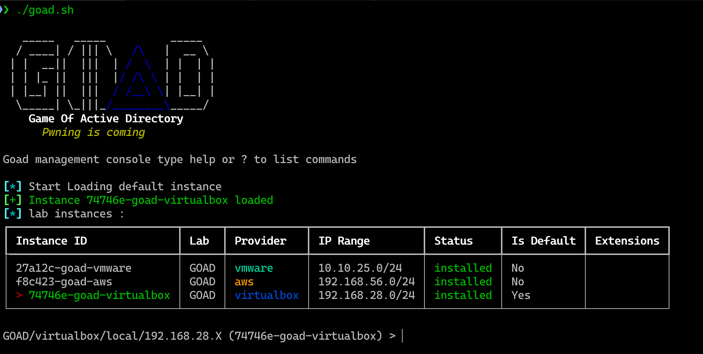

## Requirements:

- VMWare workstation:

Click below to install VMWare workstaion, if you don't already have it installed (Account needed to download)

[VM-Workstation](https://support.broadcom.com/group/ecx/productdownloads?subfamily=VMware+Workstation+Pro)

- Vagrant:

[Install | Vagrant | HashiCorp Developer](https://developer.hashicorp.com/vagrant/install#linux)
<div class="iframely-embed"><div class="iframely-responsive" style="height: 140px; padding-bottom: 0;"><a href="https://developer.hashicorp.com/vagrant/install" data-iframely-url="https://iframely.net/9huwoN2J?card=small&theme=dark"></a></div></div><script async src="https://iframely.net/embed.js"></script>


- Vagrant VMware utility:

[Install | Vagrant | HashiCorp Developer](https://developer.hashicorp.com/vagrant/install/vmware#linux)
<div class="iframely-embed"><div class="iframely-responsive" style="height: 140px; padding-bottom: 0;"><a href="https://developer.hashicorp.com/vagrant/docs/providers/vmware/vagrant-vmware-utility" data-iframely-url="https://iframely.net/n3Rha6Ua?card=small&theme=dark"></a></div></div><script async src="https://iframely.net/embed.js"></script>

- Clone the GOAD (Game of Active Directory GitHub Repo)

[GOAD](https://github.com/Orange-Cyberdefense/GOAD)
<div class="iframely-embed"><div class="iframely-responsive" style="height: 140px; padding-bottom: 0;"><a href="https://github.com/Orange-Cyberdefense/GOAD" data-iframely-url="https://iframely.net/vqnuYmSG?card=small&theme=dark"></a></div></div><script async src="https://iframely.net/embed.js"></script>

- Install the below vagrant plugins:

```bash
vagrant plugin install vagrant-reload vagrant-vmware-desktop winrm winrm-fs winrm-elevated
```

## VMWare: Installation

??? Success "VMWare-Installation"

    ### Clone the GitHub repository

    ```bash
    git clone https://github.com/Orange-Cyberdefense/GOAD.git
    cd GOAD
    ```
    
    ### Python3 Virtual env Install

    I will be using a python virtual environment `venv` on the Debian WSL to deploy GOAD

    ```bash
    python3 -m venv venv
    source venv/bin/activate
    ```

        Uncomment `ansible/roles/child_domain/tasks/main.yml`

    ```bash
    # line 26 -28
    DNSCHANGE
    - name: "disable interface {{nat_adapter}} before join domain"
         win_shell: netsh interface set interface "{{nat_adapter}}" disable
    
    # line 87 - 92
    - name: "enable interface {{nat_adapter}} after domain joined"
       win_shell: netsh interface set interface "{{nat_adapter}}" enable
       register: enable_interface
       until: "enable_interface is not failed"
       retries: 3
       delay: 120
    ```

    ### Check for dependencies

    ```bash
    ./goad.sh -p vmware
    GOAD/vmware/local/192.168.56.X > check
    ```

    ### Installation

    - To install run the goad script and launch install or use the goad script arguments

    ```bash
    ./goad.sh -p vmware
    # here choose the lab you want (GOAD/GOAD-Light/NHA/SCCM)
    GOAD/vmware/local/192.168.56.X > set_lab <lab> 

    # here choose the  ip range you want to use ex: 192.168.56 (only the first three digits)
    GOAD/vmware/local/192.168.56.X > set_ip_range <ip_range> 

    # Install
    GOAD/vmware/local/192.168.56.X > install
    ```

## VirtualBox: Installation
??? Success "VirtualBox Installation"

    ### Clone the GitHub repository

    ```bash
    git clone https://github.com/Orange-Cyberdefense/GOAD.git
    cd GOAD
    ```
    
    ### Python3 Virtual env Install

    I will be using a python virtual environment `venv` on the Debian WSL to deploy GOAD

    ```bash
    python3 -m venv venv
    source venv/bin/activate
    ```

    Uncomment `ansible/roles/child_domain/tasks/main.yml`

    ```bash
    # line 26 -28
    DNSCHANGE
    - name: "disable interface {{nat_adapter}} before join domain"
         win_shell: netsh interface set interface "{{nat_adapter}}" disable
    
    # line 87 - 92
    - name: "enable interface {{nat_adapter}} after domain joined"
       win_shell: netsh interface set interface "{{nat_adapter}}" enable
       register: enable_interface
       until: "enable_interface is not failed"
       retries: 3
       delay: 120
    ```

    ### Check for dependencies

    ```bash
    ./goad.sh -p vmware
    GOAD/vmware/local/192.168.56.X > check
    ```

    ### Installation

    - To install run the goad script and launch install or use the goad script arguments

    ```bash
    ./goad.sh -p virtualbox
    # here choose the lab you want (GOAD/GOAD-Light/NHA/SCCM)
    GOAD/virtualbox/local/192.168.56.X > set_lab GOAD

    # here choose the  ip range you want to use ex: 192.168.56 (only the first three digits)
    GOAD/virtualbox/local/192.168.56.X > set_ip_range 192.168.28 

    # Install
    GOAD/virtualbox/local/192.168.28.X > install
    ```

## AWS: Installation
??? Success " AWS Installation"

    ### Clone the Github Repo

    ```bash
    git clone https://github.com/Orange-Cyberdefense/GOAD.git
    cd GOAD
    ```

    ### Add AWS Credentials to PATH

    ```bash
    # Profile name MUST be named 'goad'
    aws configure --profile goad
    AWS Access Key ID [****************J6DK]:
    AWS Secret Access Key [****************t2Fz]:
    Default region name [None]:
    Default output format [None]


    ```

    ### Check for dependencies
    ```
    ./goad.sh -t check -p aws -l GOAD

    _____   _____          _____
    / ____| / ||| \   /\   |  __ \
    | |  __||  |||  | /  \  | |  | |
    | | |_ ||  |||  |/ /\ \ | |  | |
    | |__| ||  |||  / /__\ \| |__| |
    \_____| \_|||_/________\_____/
        Game Of Active Directory
        Pwning is coming

    Goad management console type help or ? to list commands

    [-] provisioner method local is not allowed for provider aws
    [*] automatic changing provisioner method local to default for this provider : remote
    [*] lab instances :
    ┏━━━━━━━━━━━━━━━━━━━━━━━━┳━━━━━━┳━━━━━━━━━━━━┳━━━━━━━━━━━━━━━━━┳━━━━━━━━━━━┳━━━━━━━━━━━━┳━━━━━━━━━━━━┓
    ┃ Instance ID            ┃ Lab  ┃ Provider   ┃ IP Range        ┃ Status    ┃ Is Default ┃ Extensions ┃
    ┡━━━━━━━━━━━━━━━━━━━━━━━━╇━━━━━━╇━━━━━━━━━━━━╇━━━━━━━━━━━━━━━━━╇━━━━━━━━━━━╇━━━━━━━━━━━━╇━━━━━━━━━━━━┩
    │ 27a12c-goad-vmware     │ GOAD │ vmware     │ 10.10.25.0/24   │ installed │ No         │            │
    │ 74746e-goad-virtualbox │ GOAD │ virtualbox │ 192.168.28.0/24 │ installed │ Yes        │            │
    └────────────────────────┴──────┴────────────┴─────────────────┴───────────┴────────────┴────────────┘
    [+] terraform found in PATH
    [+] rsync found in PATH
    [+] aws found in PATH
    [+] Connected to AWS using profile 'goad'
    [*] User Information:
    [*]   Account: 1234567890
    [*]   User ARN: arn:aws:iam::1234567890:user/goad_user
    [*]   User ID: AIDAZI2LCH5YUJMN5VWUU
    ```

    ### Edit `~/.goad/goad.ini`

    Choose your preferred Region. I changed mine to `us-east-1`

    ```bash
    [aws]
    aws_region = us-east-1
    aws_zone = us-east-1b
    ```
    On the jumpbox.tf change to our appropriate AWS region ami ID

    ```bash
    resource "aws_instance" "goad-vm-jumpbox" {
    ami                    = "ami-00de3875b03809ec5" # Change this
    instance_type          = "t2.medium"
    ```

    Same with the Windows.tf file

    ```bash
    "dc02" = {
    name               = "dc02"
    domain             = "north.sevenkingdoms.local"
    windows_sku        = "2019-Datacenter"
    ami                = "ami-075309a66c5dedf22" # Change this
    instance_type      = "t2.medium"
    private_ip_address = "192.168.56.11"
    password           = "NgtI75cKV+Pu"
    }
    "dc03" = {
    name               = "dc03"
    domain             = "essos.local"
    windows_sku        = "2016-Datacenter"
    ami                = "ami-0d99de470a2818d2b" # Change this
    instance_type      = "t2.medium"
    private_ip_address = "192.168.56.12"
    password           = "Ufe-bVXSx9rk"
    }
    ```
    ### Installation

    ```bash
    ./goad.sh -p aws -t install -l GOAD -ip 192.168.56
    ```

At the end of your install, you have something like this:

```
./goad.sh

   _____   _____          _____
  / ____| / ||| \   /\   |  __ \
 | |  __||  |||  | /  \  | |  | |
 | | |_ ||  |||  |/ /\ \ | |  | |
 | |__| ||  |||  / /__\ \| |__| |
  \_____| \_|||_/________\_____/
    Game Of Active Directory
      Pwning is coming

Goad management console type help or ? to list commands

[*] Start Loading default instance
[+] Instance 74746e-goad-virtualbox loaded
[*] lab instances :
┏━━━━━━━━━━━━━━━━━━━━━━━━━━┳━━━━━━┳━━━━━━━━━━━━┳━━━━━━━━━━━━━━━━━┳━━━━━━━━━━━┳━━━━━━━━━━━━┳━━━━━━━━━━━━┓
┃ Instance ID              ┃ Lab  ┃ Provider   ┃ IP Range        ┃ Status    ┃ Is Default ┃ Extensions ┃
┡━━━━━━━━━━━━━━━━━━━━━━━━━━╇━━━━━━╇━━━━━━━━━━━━╇━━━━━━━━━━━━━━━━━╇━━━━━━━━━━━╇━━━━━━━━━━━━╇━━━━━━━━━━━━┩
│ 27a12c-goad-vmware       │ GOAD │ vmware     │ 10.10.25.0/24   │ installed │ No         │            │
│ f8c423-goad-aws          │ GOAD │ aws        │ 192.168.56.0/24 │ installed │ No         │            │
│ > 74746e-goad-virtualbox │ GOAD │ virtualbox │ 192.168.28.0/24 │ installed │ Yes        │            │
└──────────────────────────┴──────┴────────────┴─────────────────┴───────────┴────────────┴────────────┘
```

