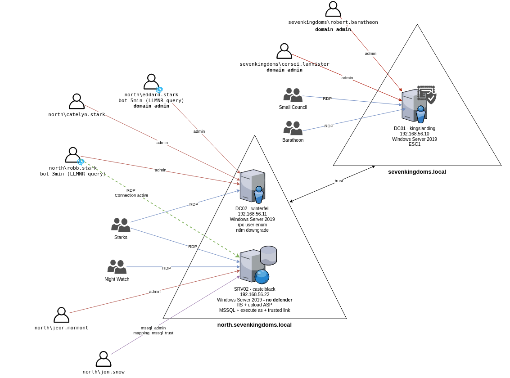
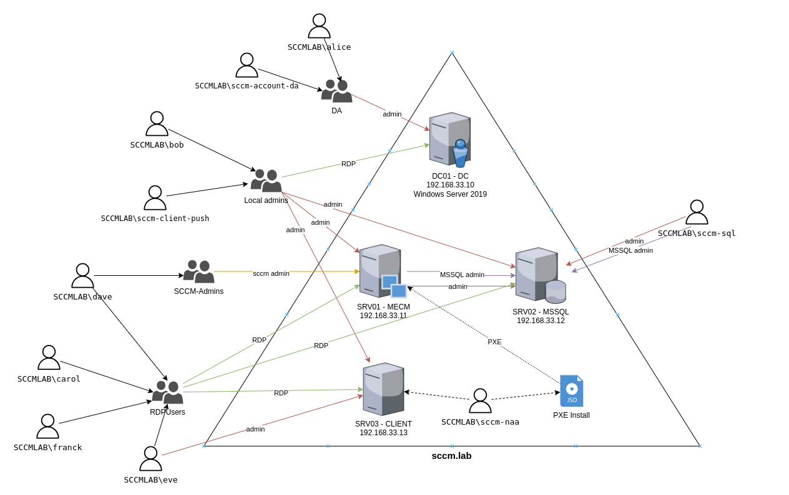

# GOAD: Overview

```bash
Created by: Dcyberguy 
Created time: October 31, 2025 7:23 PM
Last edited by: Dcyberguy 
Last updated time: October 31, 2025 9:33 PM
Status: Done
```

## **Description**

GOAD is a pentest active directory LAB project. The purpose of this lab is to give pentesters a vulnerable Active directory environment ready to use to practice usual attack techniques.

> `Warning` This lab is extremely vulnerable, do not reuse recipe to build your environment and do not deploy this environment on internet without isolation (this is a recommendation, use it as your own risk).
> 
> 
> This repository was build for pentest practice.
> 

## **Licenses**

This lab use free windows VM only (180 days). After that delay enter a license on each server or rebuild all the lab (may be it's time for an update ;))

## Available labs

[GOAD](https://orange-cyberdefense.github.io/GOAD/labs/GOAD/): 5 vms, 2 forests, 3 domains (full goad lab


GOAD-Light: 3 vms, 1 forest, 2 domains (smaller goad lab for those with a smaller pc)



[MiniLAB:](https://orange-cyberdefense.github.io/GOAD/labs/MINILAB/) 2 vms, 1 forest, 1 domain (basic lab with one DC (windows server 2019) and one Workstation (windows 10))

• [SCCM](https://orange-cyberdefense.github.io/GOAD/labs/SCCM/) : 4 vms, 1 forest, 1 domain, with Microsoft configuration manager installed



• [NHA](https://orange-cyberdefense.github.io/GOAD/labs/NHA/) : A challenge with 5 vms and 2 domains. no schema provided, you will have to find out how break it.