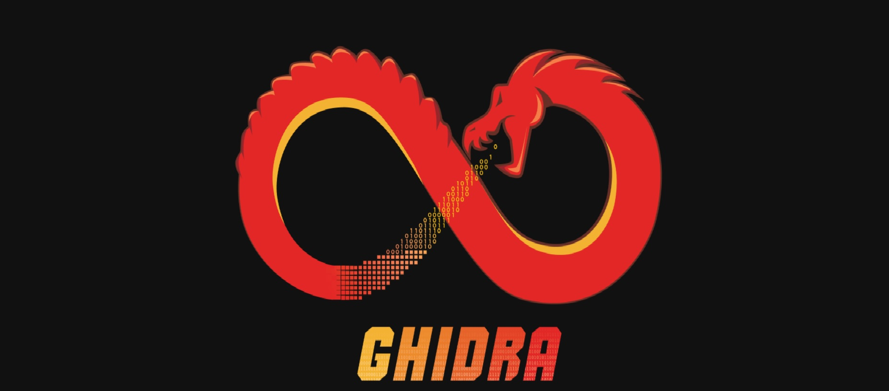

---
date:
  created: 2026-04-27
authors:
  - dcyberguy
  - playroom
---
# Ghira

## Overview

Ghidra is a sophisticated, open-source software reverse engineering (SRE) suite developed by the National Security Agency (NSA). Since its public release in 2019, it has become a staple for security researchers, malware analysts, and enthusiasts due to its professional-grade feature set and the fact that it is completely free.

<!-- more -->

## Introduction

Unlike many other disassemblers, Ghidra is a framework. It is highly extensible and designed for collaboration.

- The Decompiler: Its standout feature is a high-quality decompiler that converts assembly back into human-readable C code.

- Multi-Platform: It runs on Windows, macOS, and Linux.

- Collaboration: It includes a client-server architecture that allows multiple analysts to work on the same binary simultaneously, seeing each other's comments and changes in real-time.

- Processor Support: It supports a massive array of instruction sets (x86, ARM, PowerPC, MIPS, Sparc, etc.).

## System Requirements

As of 2026, Ghidra remains relatively lightweight but benefits significantly from extra memory when analyzing large binaries.

| **Component** | Minimum                | Recommended                                      |
| ------------- | ---------------------- | ------------------------------------------------ |
| RAM           | 4GB                    | 16GB+                                            |
| Storage       | 1GB (for installation) | 10GB+ (for project files/databases)              |
| Display       | 1024x768               | Dual Monitors (highly recommended for UI layout) |
| Java          | JDK 21 (64-bit)        | Latest LTS JDK                                   |
| Python        | Python 3.9 - 3.14      | For PyGhidra and Debugger support                |

---

## Installation Guide

Ghidra does not use a standard "Installer.exe." It is a portable application.

- Install Java: Download and install a supported JDK 21+ (e.g., Amazon Corretto or Adoptium Temurin). Ensure the bin folder is added to your system's PATH.

- Download Ghidra: Get the latest release .zip or .tar.gz from the official GitHub.

- Extract: Unzip the folder to a permanent location (e.g., C:\Tools\Ghidra or /opt/ghidra).

  Note: On macOS, you may need to run xattr -d com.apple.quarantine <zip_file> before extracting to bypass Gatekeeper.

- Launch:
  - Windows: Double-click ghidraRun.bat.

  - Linux/macOS: Run ./ghidraRun from the terminal.

## Workflow: From Binary to Analysis

The workflow in Ghidra follows a specific hierarchy: =Project > File > Analysis= .

- ****Phase 1****: Creating a Project.
  Ghidra organizes work into projects.
  - Go to File > New Project.
  - Select Non-Shared Project (unless you are setting up a server for a team).
  - Choose a project directory and give it a name. This creates a .gpr file and a .rep folder to store your data.

- ****Phase 2****: Importing Files.
  - Press I or go to File > Import File.
  - Select your target binary (e.g., an .exe, .elf, or .bin).
  - Ghidra will attempt to auto-detect the Format and Language (Processor architecture). Review these carefully; if Ghidra misidentifies the architecture, the disassembly will be gibberish.

****Phase 3****: The Analysis ProcessOnce imported, double-click the file in the project window to open the CodeBrowser.

- _Auto-Analysis_: Ghidra will ask: "XYZ has not been analyzed. Would you like to analyze it now?" Click Yes.

- _Analysis Options_: A list of "Analyzers" appears. For most users, the default settings are perfect. They handle:
  - Finding function entries.
  - Identifying strings and constants.
  - Applying "Stack" analysis to track local variables.

- Click **Analyze** and watch the progress bar in the bottom right.

## Navigating the Analysis Interface

Once analysis is complete, you will primarily use these four windows:

- Program Tree: Used to navigate the different segments of the file (.text, .data, .rsrc).

- Symbol Tree: Lists all Functions, Imports, and Exports. This is usually where you find the main or entry point.

- Listing (Disassembly): Shows the raw assembly instructions ($MOV$, $PUSH$, $CALL$).

- Decompiler: The "magic" window that shows the reconstructed C code.

  _Pro Tip: You can click on a variable or function in the Decompiler and press L to rename it. This "re-labeling" is the core of reverse engineering—turning sub_14001 into process_network_packet._