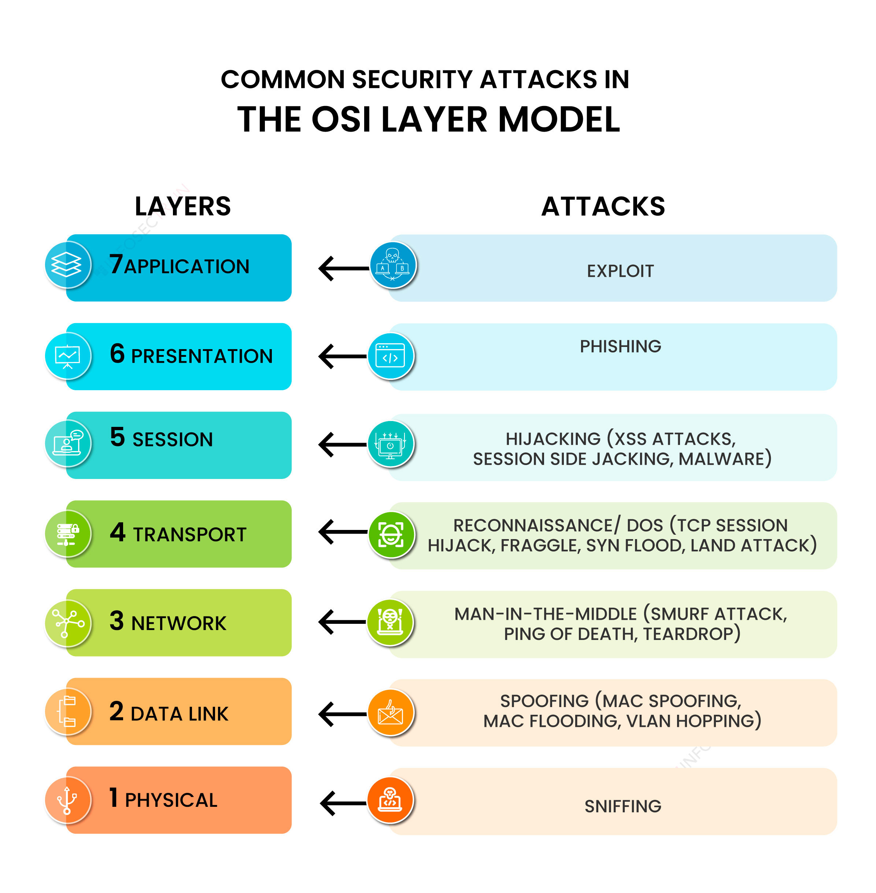

## OSI Model: The Seven Layers of Networking
The OSI (Open Systems Interconnection) model is a conceptual framework used to understand and implement network protocols in seven distinct layers. Each layer serves a specific function and communicates with the layers directly above and below it. Here are the seven layers of the OSI model: 

??? note "**Physical Layer (Layer 1)**" 
    This layer is responsible for the physical connection between devices, including cables, switches, and other hardware. It deals with the transmission and reception of raw bit streams over a physical medium.

??? note "**Data Link Layer (Layer 2)**" 
    This layer provides error detection and correction for data transmitted over the physical layer. It is responsible for framing, addressing (using MAC addresses), and managing access to the physical medium.

??? note "**Network Layer (Layer 3)**" 
    The network layer is responsible for routing data packets between devices across different networks. It uses logical addressing (such as IP addresses) to determine the best path for data transmission.

??? note "**Transport Layer (Layer 4)**" 
    This layer ensures reliable data transfer between devices. It manages end-to-end communication, error recovery, and flow control. Common protocols at this layer include TCP (Transmission Control Protocol) and UDP (User Datagram Protocol).

??? note "**Session Layer (Layer 5)**" 
    The session layer manages sessions or connections between applications. It establishes, maintains, and terminates connections, ensuring that data is properly synchronized and organized.

??? note "**Presentation Layer (Layer 6)**" 
    This layer is responsible for data translation, encryption, and compression. It ensures that data is presented in a format that the application layer can understand, regardless of the underlying system architecture.

??? note "**Application Layer (Layer 7)**" 
    The application layer is the closest to the end user and provides network services directly to applications. It includes protocols such as HTTP, FTP, SMTP, and DNS, which facilitate various types of communication over the network.
Understanding the OSI model is essential for network design, troubleshooting, and security, as it provides a structured approach to analyzing and managing network interactions.   

# Diagram

