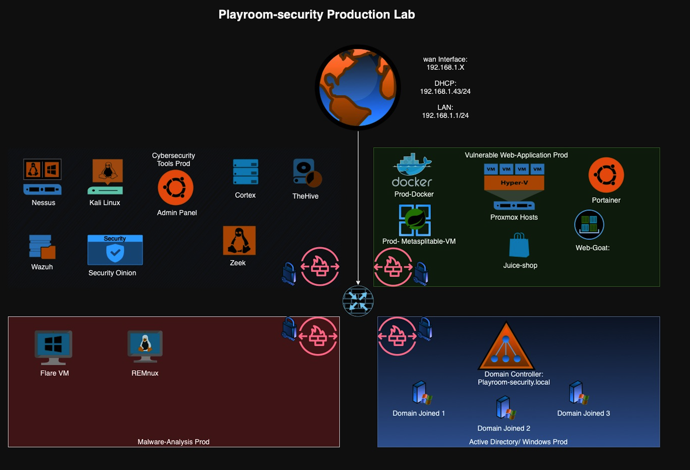

# Building a Proxmox Cybersecurity Home Lab

This guide provides step-by-step instructions to set up a Proxmox home lab tailored for cybersecurity enthusiasts. It covers the installation of Proxmox VE, configuration of virtual machines, and best practices for creating a secure and efficient lab environment.



## Table of Contents
- [Introduction](#introduction)
- [Prerequisites](#prerequisites)
- [Installing Proxmox VE](#installing-proxmox-ve)
- [Configuring Proxmox VE](#configuring-proxmox-ve)
- [Creating Virtual Machines](#creating-virtual-machines)
- [Networking Setup](#networking-setup)     
- [Security Best Practices](#security-best-practices)
- [Conclusion](#conclusion)

## Introduction
A Proxmox home lab provides a versatile platform for learning and experimenting with various cybersecurity tools and techniques. By leveraging virtualization, users can create isolated environments to test vulnerabilities, practice penetration testing, and simulate attacks without risking their primary systems.   
## Prerequisites
Before starting, ensure you have the following:
- A computer with at least 8GB of RAM and a multi-core processor.
- A minimum of 100GB of free disk space.
- A USB drive (at least 4GB) for Proxmox installation media.
- A stable internet connection for downloading Proxmox VE and updates.
- Basic knowledge of networking and virtualization concepts.
## Installing Proxmox VE
1. Download the latest Proxmox VE ISO from the [official Proxmox website](https://www.proxmox.com/en/downloads).
2. Create a bootable USB drive using tools like Rufus or Etcher.
3. Boot your computer from the USB drive and follow the on-screen instructions to install Proxmox VE.
4. After installation, access the Proxmox web interface by navigating to `https://<your-server-ip>:8006` in your web browser.
5. Log in using the root account and the password you set during installation.
## Configuring Proxmox VE
1. Update Proxmox VE to the latest version by running the following commands in the terminal:
   ```
   apt update
   apt upgrade -y
   ```
2. Configure storage by adding local or network storage options in the Proxmox web interface.
3. Set up backups to ensure your virtual machines and configurations are safe.
## Creating Virtual Machines
1. In the Proxmox web interface, click on "Create VM" to start the virtual machine creation wizard.
2. Choose a name for your VM and select the appropriate OS type (e.g., Linux, Windows).
3. Allocate resources such as CPU, RAM, and disk space based on your requirements.
4. Install the operating system by mounting an ISO image or using a network installation method.
5. Repeat the process to create multiple VMs for different cybersecurity tools and environments.
## Networking Setup
1. Configure virtual networks to isolate different VMs and simulate real-world network scenarios.
2. Use Proxmox's built-in firewall to create rules that control traffic between VMs.
3. Set up NAT or bridged networking based on your lab requirements.     
## Security Best Practices
1. Regularly update Proxmox VE and all installed VMs to patch vulnerabilities.
2. Use strong passwords and enable two-factor authentication for Proxmox access.
3. Limit access to the Proxmox web interface by configuring firewall rules.
4. Monitor logs and network traffic for any suspicious activity.
5. Create snapshots of VMs before making significant changes to easily revert if needed.
## Conclusion
Setting up a Proxmox cybersecurity home lab is an excellent way to enhance your skills and knowledge in a controlled environment. By following this guide, you can create a versatile and secure lab that allows you to experiment with various cybersecurity tools and techniques safely. Happy learning!  